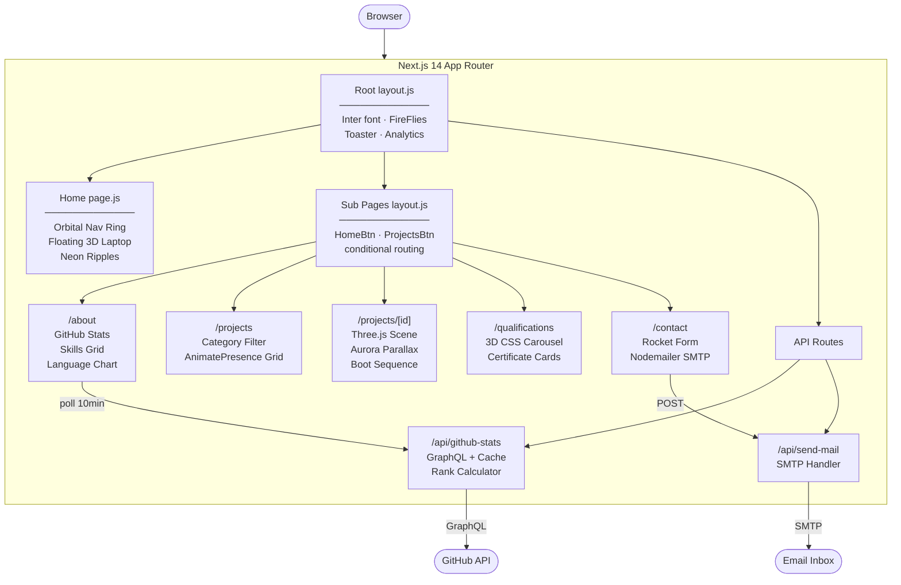
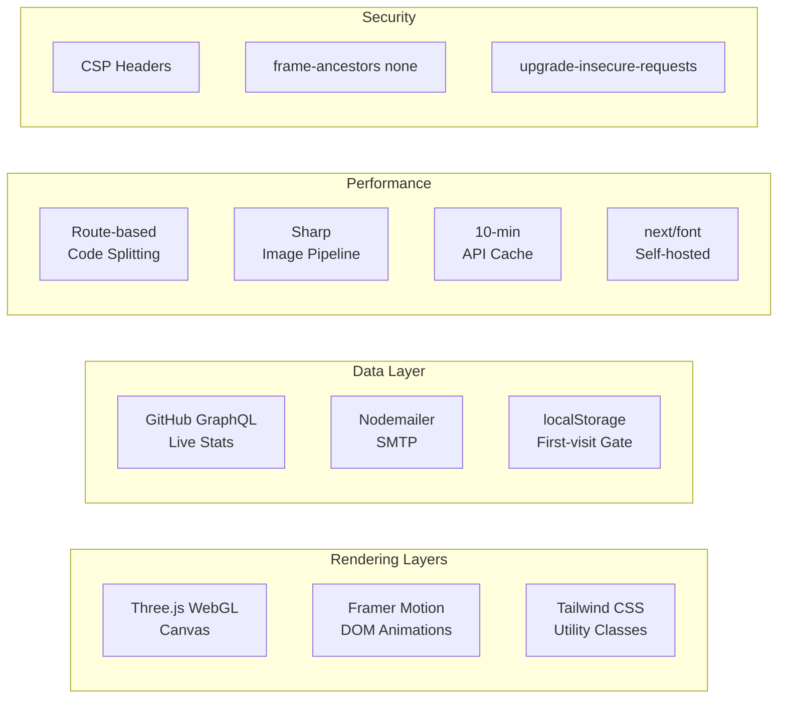

<a id="top"></a>

<div align="center">
  
  <h1>theabdullahfolio</h1>
  <p><em>A cinematic, 3D-powered developer portfolio built with Next.js 14</em></p>
</div>

<!-- HERO-BADGES:START -->
<p align="center">
  
  
  
  
  
  
</p>
<!-- HERO-BADGES:END -->

<!-- QUALITY-BADGES:START -->
<p align="center">
  
  
  
  
  
  
</p>
<!-- QUALITY-BADGES:END -->

---

<div align="center">
  <a href="https://ma.codes/">
    
  </a>
</div>

---

## ✨ Overview

**theabdullahfolio** is a cinematic developer portfolio that blends **Three.js 3D scenes**, **Framer Motion orchestration**, and **Next.js 14 App Router** into a single, performance-tuned experience. Every page tells a story — from the trigonometric orbital navigation ring on the home screen to the procedurally generated laptop keyboard in each project detail view.

Built without a UI template or design kit, this project demonstrates deep frontend engineering: generative 3D graphics, real-time GitHub data via GraphQL, physics-based spring animations, and hardened Content Security Policy headers — all deployed on the edge.

---

## 🎯 Highlights

| Feature | Detail |
|---------|--------|
| **Orbital Navigation** | Trigonometric button ring with 5-breakpoint responsive layout, staggered reveal, infinite rotation loop |
| **3D Project Viewer** | Interactive Three.js scene — procedural laptop model with canvas-generated keyboard texture, 40+ mesh objects, auto-rotate orbit controls |
| **Aurora Parallax** | Multi-layer scroll + mouse-tilt parallax with `useScroll()` / `useTransform()` depth mapping |
| **Cinematic Boot Sequence** | Typewriter-style terminal messages with `clipPath` chunk reveals and sequential timing |
| **Animated GitHub Stats** | Live GraphQL API → animated SVG ring progress, `requestAnimationFrame` counters, diff-based change detection with 10-min polling |
| **Interactive Language Breakdown** | Most-used-languages card with two-way bar↔list spotlight, rank + `PRIMARY` labelling, and a per-repo breakdown popover — opened by hover, keyboard focus, or tap — showing each repo's share of the language with a fast-start/slow-finish count-up |
| **Rocket Contact Form** | Multi-phase submit animation — shake → flame flicker → fly-up trail → checkmark spring, integrated with Nodemailer SMTP |
| **3D Qualifications Carousel** | CSS perspective transforms, `translateZ` depth, `rotateY`, sepia overlay, category filtering |
| **Ambient Fireflies** | Generative particle system with randomised spawn, duration, and drift paths |
| **Cinematic Loader** | SVG `stroke-dashoffset` progress ring, percentage counter, `localStorage` first-visit gate |
| **Security Headers** | Full CSP policy, `frame-ancestors 'none'`, `upgrade-insecure-requests` via `next.config.mjs` |

---

## 🛠 Tech Stack

### Core

<!-- STACK-CORE:START -->
<p>
  
  
  
</p>

| Technology | Version | Role |
|------------|---------|------|
| [Next.js](https://nextjs.org/) | `^14.2` | App Router, server components, API routes, metadata API |
| [React](https://react.dev/) | `^18` | UI primitives, hooks, concurrent features |
| [Tailwind CSS](https://tailwindcss.com/) | `^3.3` | Utility-first styling, custom ember / amethyst / night theme |
<!-- STACK-CORE:END -->

### 3D & Animation

<!-- STACK-3D:START -->
<p>
  
  
  
  
</p>

| Technology | Version | Role |
|------------|---------|------|
| [Three.js](https://threejs.org/) | `^0.162` | WebGL 3D scene rendering |
| [@react-three/fiber](https://docs.pmnd.rs/react-three-fiber) | `^8.18` | React reconciler for Three.js |
| [@react-three/drei](https://github.com/pmndrs/drei) | `^9.122` | OrbitControls, Environment presets, HTML overlays |
| [Framer Motion](https://www.framer.com/motion/) | `^11.18` | AnimatePresence, scroll transforms, spring physics, stagger orchestration |
<!-- STACK-3D:END -->

### Data & Integration

<!-- STACK-DATA:START -->
| Technology | Version | Role |
|------------|---------|------|
| GitHub GraphQL API | — | Live stats, language breakdown, contribution data |
| [Nodemailer](https://nodemailer.com/) | `^7.0` | SMTP email delivery for the contact form |
| [react-hook-form](https://react-hook-form.com/) | `^7.61` | Form state management and validation |
| [@vercel/analytics](https://vercel.com/analytics) | `^2.0` | Real-user performance monitoring |
| [@vercel/speed-insights](https://vercel.com/docs/speed-insights) | `^2.0` | Core Web Vitals tracking |
<!-- STACK-DATA:END -->

### UI & Utilities

<!-- STACK-UI:START -->
| Technology | Version | Role |
|------------|---------|------|
| [Lucide React](https://lucide.dev/) | `^0.344.0` | Primary icon system |
| [React Icons](https://react-icons.github.io/react-icons/) | `^5.5` | Extended icon library |
| [Sonner](https://sonner.emilkowal.ski/) | `^1.7` | Toast notification system |
| [clsx](https://github.com/lukeed/clsx) | `^2.1` | Conditional class name utility |
| [Sharp](https://sharp.pixelplumbing.com/) | `^0.34` | Server-side image optimisation pipeline |
<!-- STACK-UI:END -->

---

## 🏗 Architecture





---

## 📁 Project Structure

```text
theabdullahfolio/
├── public/
│   └── background/logo.png
├── src/
│   ├── app/
│   │   ├── layout.js                   # Root layout — Inter font, FireFlies, Toaster, Analytics
│   │   ├── page.js                     # Home — orbital nav, floating laptop, neon ripples
│   │   ├── data.js                     # Central data store — projects array, nav button config
│   │   ├── globals.css                 # Custom keyframes, glow utilities, CSS theme vars
│   │   ├── (sub pages)/
│   │   │   ├── layout.js               # Sub-page shell — conditional HomeBtn / ProjectsBtn
│   │   │   ├── about/page.js           # GitHub stats, skills grid, language breakdown
│   │   │   ├── projects/page.js        # Category-filtered project list with stagger
│   │   │   ├── projects/[id]/page.js   # 3D scene — laptop model, aurora, boot sequence
│   │   │   ├── contact/page.js         # Rocket-animated contact form + Nodemailer
│   │   │   └── qualifications/page.js  # 3D carousel with certificate cards
│   │   └── api/
│   │       ├── github-stats/route.js   # GraphQL → cached stats + rank + per-repo language breakdown
│   │       └── send-mail/route.js      # SMTP email handler
│   ├── components/
│   │   ├── navigation/                 # Orbital ring — trig positioning, 5 breakpoints
│   │   ├── project-detail/             # 3D laptop, aurora parallax, boot sequence, lantern sweep
│   │   ├── about/                      # Animated counters, SVG progress ring, diff tracking
│   │   ├── projects/                   # Filtered grid with AnimatePresence transitions
│   │   ├── contact/                    # Multi-phase rocket form, react-hook-form
│   │   ├── qualifications/             # 3D CSS carousel with category tabs
│   │   ├── loaderWrapper/              # SVG progress ring, first-visit gate
│   │   ├── FireFliesBackground.jsx     # Ambient generative particle system
│   │   ├── HomeBtn.jsx                 # Fixed, mobile-safe navigation control
│   │   └── ProjectsBtn.jsx             # Back button for dynamic project routes
│   ├── hooks/
│   │   └── useLanguagesUpdateSignal.js # Per-device language-change banner signal
│   └── utils/
│       ├── rankCalculator.js           # GitHub developer rank algorithm
│       ├── diffChanges.js              # State diff detection for live stat updates
│       ├── languageDiff.js             # Language fingerprint + diff (client-computed)
│       └── emoji.js                    # Emoji name-to-symbol resolution
├── .github/
│   ├── workflows/
│   │   ├── ci.yml                      # Lint + build check on every push / PR
│   │   └── sync-readme.yml             # Auto-sync README versions on merge to main
│   └── scripts/
│       └── update-readme.js            # README automation script
├── .env.example                        # Placeholder environment variables
├── next.config.mjs                     # CSP headers, image config
├── tailwind.config.js                  # Custom ember / amethyst / night palette
└── package.json
```

---

## 🚀 Getting Started

### Prerequisites

- **Node.js** ≥ 18.17
- **npm** / **yarn** / **pnpm**
- A [GitHub Personal Access Token](https://github.com/settings/tokens) — see [GitHub Stats Integration](#github-stats-integration) below for the exact scopes required
- SMTP credentials — Gmail [App Password](https://support.google.com/accounts/answer/185833) recommended

### Installation

```bash
# 1. Clone
git clone https://github.com/MA1002643/theabdullahfolio.git
cd theabdullahfolio

# 2. Install dependencies
npm install

# 3. Configure environment
cp .env.example .env.local
# Open .env.local and fill in your tokens
```

### Environment Variables

```env
# GitHub Stats API
GITHUB_TOKEN=your-github-personal-access-token
NEXT_PUBLIC_GITHUB_USERNAME=MA1002643

# Contact Form (Nodemailer SMTP)
SMTP_HOST=smtp.gmail.com
SMTP_PORT=587
SMTP_USER=your-email@gmail.com
SMTP_PASS=your-app-password
RECEIVER_EMAIL=recipient@example.com
# Optional
# SMTP_SECURE=true                # force TLS on/off (auto when SMTP_PORT=465)
# ABSTRACT_API_KEY=...            # email reputation check via abstractapi.com
```

### GitHub Stats Integration

The `/about` page (Most Used Languages, GitHub Stats, Streaks, Repository card) is powered by `/api/github-stats`, a single GraphQL aggregator that runs against your own PAT instead of public unauthenticated requests.

**1. Create the token** — [github.com/settings/tokens](https://github.com/settings/tokens). Either:
- **Fine-grained PAT** (recommended) scoped to your account with *read-only* access to `Public repositories` (Metadata) and `Contents`.
- **Classic PAT** with the `public_repo` scope.

Set it as `GITHUB_TOKEN` in `.env.local`. The token is server-only — it is never exposed to the browser bundle (no `NEXT_PUBLIC_` prefix).

**2. Most-active-repo selection** — the repository card is no longer hardcoded. `/api/github-stats` scores every repo the user contributed to in the last year (PRs/reviews × 5, commits × 4, issues × 3, ambient history × 1) and features the highest-scoring one, including externally-owned repos where you've done significant OSS work. The profile-README repo (the one named the same as the username) is always excluded because every push there is a meta-edit of the about page itself. Selection lives behind its own 24-hour `unstable_cache` layer since the scoring query is expensive and the answer changes slowly.

**3. Username allowlist** — `/api/github-stats` only serves data for `NEXT_PUBLIC_GITHUB_USERNAME` (case-insensitive). Any other `?username=` returns `403 Username not allowed`, closing a token / rate-limit exhaustion vector where an attacker could vary the query param to flood the server's `GITHUB_TOKEN` quota with arbitrary lookups.

**4. Caching behavior** — four layers protect the GitHub API from being hit on every request:

| Layer | TTL | Where |
|---|---|---|
| Most-active-repo `unstable_cache` | 24 hr | The expensive scoring query is computed at most once per day per user |
| Display-data `unstable_cache` | 10 min | The cheaper user/stats/streaks/repo-detail query refreshes every 10 minutes against the selected repo |
| CDN `s-maxage` / `stale-while-revalidate` / `stale-if-error` | 10 min / 5 min / 24 hr | Edge caches the response and serves stale on upstream errors |
| `localStorage` last-good payload | until next successful fetch | Hydrates the stat cards on cold page loads so they never render empty |

**5. Fallback on total failure** — if GitHub returns errors, the route serves the bundled snapshot at [src/data/github-stats-fallback.json](src/data/github-stats-fallback.json) with `X-Cache-Status: FALLBACK` (HTTP 200, `_fallback: true`). The client preserves whatever real data it already had on screen rather than overwriting it with the snapshot. (A narrower **languages-only** fallback covers the case where just the languages query times out while the rest succeeds — see point 9.) To refresh the snapshot, run the dev server, hit the API, and overwrite the file:

```bash
# Write to a tempfile first, then atomically move into place. A direct
# `curl ... > src/data/github-stats-fallback.json` redirect truncates the
# target file to 0 bytes *before* curl produces any output — `next dev`'s
# HMR picks up the empty file and the route's `import fallbackStats` then
# fails to parse it, so the very curl that was supposed to refresh the
# snapshot starts hitting a broken endpoint and scrapes a 500 page back
# into the file. The two-step form below avoids that race entirely.
curl "http://localhost:3000/api/github-stats?username=YOUR_USERNAME" -o /tmp/fallback.json
python3 -m json.tool /tmp/fallback.json > src/data/github-stats-fallback.json
rm /tmp/fallback.json
```

(Note: the `repo` query parameter no longer exists — the most-active repo is selected server-side.)

**6. Cache invalidation** — both `unstable_cache` layers expire automatically (10 min and 24 hr). To force a refresh sooner, you can either redeploy or call `revalidateTag("github-stats")` / `revalidateTag("most-active-repo")` from a Server Action. There's also a daily cron at `/api/daily-warmup` (defined in [vercel.json](vercel.json), schedule `0 1 * * *` UTC) — a thin orchestrator that calls `/api/repo-refresh` (which invalidates both tags and warms the cache by hitting `/api/github-stats` with a cache-busting query param) and `/api/work-status?bust=1` (which forces a fresh GitHub poll for the live-status header). Consolidated into a single cron because Hobby plans cap daily cron-job count; the two endpoints remain individually invokable with the bearer token for manual triggers.

**7. Cron and warm-up env vars** — `/api/daily-warmup`, `/api/repo-refresh`, and `/api/work-status?bust=1` are all authenticated against `Authorization: Bearer ${CRON_SECRET}`, which Vercel Cron Jobs attaches automatically when `CRON_SECRET` is set in the project's environment variables. The optional `BASE_URL` env var (server-only — *not* `NEXT_PUBLIC_BASE_URL`, which would leak into client bundles) overrides the URL the cron's internal warm-up fetches hit; falls back to `https://${VERCEL_URL}` then `http://localhost:3000`.

**8. Most Used Languages card & per-repo breakdown** — the language card is more than a static list. Each row links two-ways with the stacked bar (hover or keyboard-focus a row to spotlight its segment and dim the rest, and vice-versa), is rank-numbered with a `PRIMARY` tag on the top language, and carries a `· live from GitHub` meta label that disappears whenever the displayed data is stale and returns once a live fetch lands (see point 9). `/api/github-stats` embeds a per-repo breakdown on every language — a `repos: [{ name, url, percentage }]` array giving each repo's share of *that language's* bytes (sorted biggest-first, capped at 12). Activating a row opens a "Career snapshot"-themed popover listing those repos, with the same fast-start/slow-finish count-up the card numbers use on each percentage. It opens by **hover** on a fine pointer, by **keyboard focus** (detected via input modality, so an attached keyboard behaves like hover even on a touch device), or by **tap** on touch (re-tap / tap-outside / Escape to close). The popover is portaled to `<body>` to escape the card's clip, clamps so it never overflows the viewport, and scrolls its repo list internally when a breakdown is taller than the available height.

**9. Languages-only fallback** — distinct from the whole-payload fallback in point 5: when the languages GraphQL aborts mid-fetch but the user/stats/streaks queries succeed, the route substitutes the bundled snapshot's languages and flags them `languagesFallback: true` (HTTP 200, no `_fallback`) instead of serving an empty list that would blank the card and lock in for the 10-min TTL. The client treats those as a **soft default** — used to populate a cold card for a first-time visitor, but never allowed to overwrite a returning visitor's own (possibly fresher) `localStorage` last-good. In both the stale and partial cases the card keeps showing the last good breakdown and drops its `live from GitHub` label until a genuine live fetch returns. The per-language change-detection fingerprint is computed **client-side** from this list (`src/utils/languageDiff.js`), so it keeps working on the fallback and the two sides can't drift — there is no `languagesFingerprint` field on the wire.

### Commands

```bash
npm run dev      # Dev server → http://localhost:3000
npm run build    # Production build
npm run start    # Serve production build locally
npm run lint     # ESLint check
```

---

## ⚡ Performance & Security

<details>
<summary><strong>Content Security Policy</strong> — applied to every route via <code>next.config.mjs</code></summary>
<br />

```text
default-src         'self'
script-src          'self' 'unsafe-eval' 'unsafe-inline'
style-src           'self' 'unsafe-inline' https://fonts.googleapis.com
font-src            'self' https://fonts.gstatic.com data:
img-src             'self' data: blob: https:
connect-src         'self' https:
frame-src           'self'
object-src          'none'
base-uri            'self'
form-action         'self'
frame-ancestors     'none'
upgrade-insecure-requests
```

</details>

<details>
<summary><strong>Performance Optimisations</strong></summary>
<br />

| Optimisation | Implementation |
|---|---|
| **Image pipeline** | Sharp — automatic WebP / AVIF conversion |
| **Font loading** | `next/font` self-hosted Inter, zero layout shift |
| **Code splitting** | Route-based automatic splitting; Three.js loaded only on `/projects/[id]` |
| **API caching** | `/api/github-stats` wrapped in two `unstable_cache` layers — 24-hr for the most-active-repo selection, 10-min for the display-data refresh; both invalidated by tag on demand via the daily `/api/repo-refresh` cron. CDN response is also `s-maxage=10min` / `stale-while-revalidate=5min` / `stale-if-error=24hr`, with a bundled JSON snapshot served on total upstream failure |
| **Analytics** | Vercel Speed Insights + Web Analytics for real-user Core Web Vitals |

</details>

---

## 🎨 Design System

| Token | Value | Usage |
|-------|-------|-------|
| `night-950` | `#01050b` | Page backgrounds |
| `night-900` | `#030c18` | Card backgrounds |
| `ember-neon` | `#eab53e` | Primary neon accent, borders, glows |
| `ember-core` | `#b16612` | Inner glow core |
| `neon-700` | `#ff6d05` | Firefly radial, CTA highlights |
| `amethyst-neon` | `#fc83ff` | Subtitle glow, secondary accent |
| `ember-halo` | `#fcf699` | Outer glow halos |
| `foreground` | `rgb(225 225 225)` | Body text |
| `muted` | `rgb(115 115 115)` | Secondary / placeholder text |

**Custom CSS utilities:** `text-glow-stroke-neon` · `text-glow-stroke-purple` · `custom-bg` · `custom-bg-abt` · `glitter-text` · `icon-glow` · `behind-glow` · `borderline` · `control-island`

---

## 🎬 Animation Inventory

<details>
<summary><strong>View all 14 custom animations</strong></summary>
<br />

| Animation | Technique | Location |
|-----------|-----------|----------|
| Orbital rotation | `requestAnimationFrame` + trigonometry | `navigation/index.jsx` |
| Floating laptop | `useFrame` sin-wave (Three.js render loop) | `project-detail/laptop-model.jsx` |
| Aurora parallax | `useScroll` + `useTransform` + mouse tilt | `project-detail/aurora-bg.jsx` |
| Boot sequence | Sequential `clipPath` chunk reveals | `project-detail/boot-on-sequence.jsx` |
| Rocket launch | Multi-phase: shake → flame → fly → checkmark | `contact/Form.jsx` |
| Stat counters | `requestAnimationFrame` interpolation | `about/StatsCard.jsx` |
| SVG rank ring | `stroke-dashoffset` spring animation | `about/StatsCard.jsx` |
| Language count-up & bar sheen | `animate()` fast-start/slow-finish curve + one-shot shimmer sweep on viewport entry | `about/LanguagesCard.jsx` |
| Firefly drift | `@keyframes` with randomised duration + paths | `FireFliesBackground.jsx` |
| Loader progress | SVG `stroke-dashoffset` + percentage counter | `loaderWrapper/index.jsx` |
| Stagger reveals | `staggerChildren` Framer Motion variants | Multiple components |
| 3D carousel | CSS `perspective` + `translateZ` + `rotateY` | `qualifications/Carousel.jsx` |
| Glowing project name | Bloom ring scale + random flicker interval | `project-detail/glowing-project-name.jsx` |
| Neon ripples | `animate-ripple-neon` on `rotateX(80deg)` plane | `app/page.js` |

</details>

---

## 📦 Deployment

Optimised for **Vercel** — zero additional configuration required.

```bash
# Via Vercel CLI
npx vercel --prod
```

Or connect the GitHub repository to [vercel.com](https://vercel.com) for automatic preview + production deployments on every push.

> **Required:** Set all environment variables in the Vercel dashboard under **Settings → Environment Variables** before your first production deploy.

### Function bundling notes — `/api/experience-summary`

The Experience Summary route reads the resume PDF at `public/Muhammad_Abdullah_CV.pdf` and parses it with `pdf-parse` (which itself uses `pdfjs-dist`). Both run fine locally, but two Vercel-specific bundling gotchas have to stay handled or the deployed function silently returns `employment: null` and the Years in the Craft / Career Snapshot panels render `0+ months` of employment with `No software-engineering roles detected yet`:

1. **Static asset under `public/`.** Vercel ships `public/` to the static asset layer, **not** into the serverless function's filesystem. `next.config.mjs` therefore lists the resume PDF in `experimental.outputFileTracingIncludes["/api/experience-summary"]` so `@vercel/nft` copies the file into the function bundle. On the function the route reads it via `process.cwd()`-relative `fs.readFile`, which resolves identically in dev and prod once the file is bundled.
2. **`@napi-rs/canvas` for `pdfjs-dist`'s DOM polyfill.** `pdfjs-dist` polyfills `DOMMatrix` / `ImageData` / `Path2D` by calling `createRequire(import.meta.url)("@napi-rs/canvas")` at runtime. `@vercel/nft` can't statically follow a runtime-created `require`, so without explicit help the JS shim and its platform-specific binary (`@napi-rs/canvas-linux-x64-gnu` on Vercel's Amazon Linux 2 build target) never ship with the function. The fix lives in three coordinated spots:
   - `package.json` `overrides` pins `@napi-rs/canvas` to `0.1.80`. This eliminated the duplicated `node_modules/pdf-parse/node_modules/@napi-rs/canvas` install entirely, but npm did **not** flatten `pdfjs-dist`'s own copy — the committed lockfile still ships `node_modules/pdfjs-dist/node_modules/@napi-rs/canvas` at `0.1.100`. That nested copy is the one `pdfjs-dist`'s runtime require resolves first (Node walks up from its own directory), so the override alone is necessary but not sufficient.
   - `next.config.mjs` `experimental.serverComponentsExternalPackages` lists `pdf-parse` and `@napi-rs/canvas` so Next leaves them as runtime requires rather than webpack-bundling them.
   - `next.config.mjs` `experimental.outputFileTracingIncludes["/api/experience-summary"]` deliberately globs **both** the root install (`node_modules/@napi-rs/canvas/**/*`) and the surviving `pdfjs-dist` nest (`node_modules/pdfjs-dist/node_modules/@napi-rs/canvas/**/*`), plus the matching `linux-x64-gnu` binary paths under each. Tracing only the root would skip the file `createRequire` actually loads on the function; tracing both is belt-and-braces against whatever resolution order npm reproduces on Vercel.

When the function is healthy the deployed preview's `/api/experience-summary?username=<allowed>` response carries `employment: { months, display, roles }` and `pdfStatus: null`. If the response shows `pdfStatus: { message: "DOMMatrix is not defined" }` after a fresh deploy, the canvas binary glob isn't catching the install path npm produced on Vercel — inspect `node_modules` on the build (Vercel dashboard → Deployment → Functions → `experience-summary` → Source), extend `outputFileTracingIncludes` to cover the new path, and redeploy. The same diagnostic also fires if the `overrides` block is removed and a third nested copy (e.g. `pdf-parse`'s 0.1.80) reappears.

---

## 🛰️ Live Maintenance Header

The home page renders a real-time development status header that reads activity from this repository **and** the linked Projects v2 board (`MA1002643/theabdullahfolio` and `users/MA1002643/projects/3` only — never any other repo or project).

### What the header shows

The chip displays one of five states, ordered by precedence:

| State | Chip label | When it fires |
| --- | --- | --- |
| `SHIPPING` | **SHIPPING** + green pulsing dot | Items moved to the project board's **Done** column whose underlying issue/PR was closed in the last 48h |
| `LIVE` | **LIVE** + green pulsing dot | Any commit, PR, or issue updated in the last 2 hours |
| `IN_PROGRESS` | **IN PROGRESS** | Project board has cards in **In Progress**, or there are open PRs |
| `PLANNING` | **PLANNING** | Open issues exist but no open PRs and no recent activity |
| `IDLE` | **MAINTENANCE** | No active `SHIPPING`/`LIVE` signal, no open PRs or issues, and no cards in **In Progress** |

When `SHIPPING` is active **and** there's also active In Progress work, the message rotates between "Just shipped #X …" and "Actively working on N tasks — #Y …" every 10 seconds (Pattern D).

### Required environment variables

Add these to `.env.local` for local development and to your Vercel project for production:

| Variable | Required | Purpose |
| --- | --- | --- |
| `GITHUB_TOKEN` | yes | Read-only PAT used by `/api/work-status` to query open PRs, open issues, and recent commits. Fine-grained or classic both work. Without this, the header falls back to the deterministic maintenance message. |
| `GITHUB_PROJECT_TOKEN` | recommended | Optional separate **classic** PAT with `read:project` + `public_repo` used only for the Projects v2 query. Falls back to `GITHUB_TOKEN` if unset. Needed because fine-grained PATs don't currently expose user-owned project read access. |
| `GITHUB_WEBHOOK_SECRET` | yes (in production) | HMAC secret used by `/api/github-webhook` to validate `X-Hub-Signature-256`. Webhook deliveries with a missing or invalid signature are rejected. |
| `CRON_SECRET` | yes (in production) | Bearer token required to invoke the cron-protected routes `/api/daily-warmup` (the scheduled entrypoint), `/api/work-status?bust=1`, and `/api/repo-refresh` (both individually invokable for manual triggers). Vercel Cron Jobs automatically include `Authorization: Bearer ${CRON_SECRET}` on scheduled requests. Without it the routes return 401 (or 500 in the case of `/api/daily-warmup` and `/api/repo-refresh`, which refuse to start if the secret is unset) — preventing unauthenticated callers from amplifying GitHub / OpenAI traffic or triggering cache rebuilds. |
| `BASE_URL` | no | Optional. URL the `/api/daily-warmup` orchestrator and `/api/repo-refresh` use for their internal warm-up fetches. Server-only — **not** the `NEXT_PUBLIC_` prefix, which would inline the value into client bundles. Falls back to `https://${VERCEL_URL}` (Vercel's auto-injected per-deployment URL) and finally `http://localhost:3000` in dev. |
| `WORK_STATUS_AI_ENABLED` | no | When set to `true`, the API attempts to rewrite the deterministic message via OpenAI before returning it. Default: disabled. |
| `OPENAI_API_KEY` | only if AI is enabled | Required when `WORK_STATUS_AI_ENABLED=true`. The AI path always falls back to the deterministic message on error. |

### Token scopes

- **Fine-grained PAT for `GITHUB_TOKEN`**: Repository permissions → Contents: Read, Issues: Read, Pull requests: Read, Metadata: Read. Scope to `theabdullahfolio` only.
- **Classic PAT for `GITHUB_PROJECT_TOKEN`**: `read:project` + `public_repo` (or `repo` if the repo is private). User-owned Projects v2 boards aren't accessible via fine-grained PATs today, hence the second token.

### GitHub webhook setup

In `Settings → Webhooks` on the `theabdullahfolio` repository:

1. **Payload URL:** `https://<your-domain>/api/github-webhook`
2. **Content type:** `application/json` *(critical — `application/x-www-form-urlencoded` breaks HMAC verification)*
3. **Secret:** must match `GITHUB_WEBHOOK_SECRET` byte-for-byte
4. **Events:** `push`, `pull_request`, `issues` (optionally `issue_comment`)

The webhook validates the signature, ignores events from any other repository, and busts the in-memory cache so the next client poll receives fresh data.

> **Note:** GitHub Projects v2 column moves don't fire repository webhooks (they fire `projects_v2_item` events at the org level only). Column moves are picked up via the 30-second cache TTL + client polling instead — see *Refresh strategy* below.

### Refresh strategy

Four layers keep the header fresh on Vercel:

- **Server cache** — in-memory cache holds responses for 30 seconds. Bounds GitHub API calls regardless of traffic; one fetch per 30s window per Vercel region.
- **Webhook** — invalidates the cache immediately on real GitHub events (`push`, `pull_request`, `issues`).
- **Client polling** — the component re-fetches every 30 seconds while the tab is visible, and every 15 minutes when hidden (Page Visibility API). The 30s rate aligns with the server cache so column-board moves become visible within ~30s.
- **Cron fallback** — `vercel.json` schedules `/api/daily-warmup` once daily; the orchestrator's first step hits `/api/work-status?bust=1` as a backstop in case webhook delivery is delayed. (Vercel Hobby plans cap cron jobs at one execution per day and limit total cron count; both jobs are consolidated under one schedule for that reason. Pro plans can split them back out or use a tighter cadence if desired.)

Worst-case GitHub API usage with these settings is ~120 GraphQL calls per token per hour — about 7–12 % of the 5,000-point/hour rate limit per token, leaving plenty of headroom.

If the GitHub API is unreachable or returns an error, the endpoint serves the most recent successful payload (`X-Cache-Status: STALE`) before degrading to the deterministic maintenance message.

### UI choreography

The header is a single status bar at the top of the home page (above the hero) and uses three layered animation systems:

- **Container entrance** — `whileInView` 0 → 1 scale pop-in (matching the About page's ItemLayout). Re-fires when the section enters the viewport, so navigating back to `/` from another page replays the entrance.
- **Loading skeleton** — shimmer-sweep placeholder with the same dimensions as the live content, so there's no layout shift on data load. Crossfades to real content via `AnimatePresence`.
- **Pulsing dot** — a green `live-dot` (`#22c55e`) that fades in and out every 2.8s with timed holds at both extremes for a "lazy breathing" feel. Active during `SHIPPING` and `LIVE` states.

Counter values (PRs / Issues / Pushes 24h) animate from 0 to the target on mount with a piecewise curve: linear "fast tick" to 75% of the value, then a cubic ease-out for the final 25%. Total duration scales with the delta (1.1–2.2s).

The "Updated Xs ago" stamp uses an adaptive tick rate — 1s while showing seconds, 30s for minutes, 1 min for hours, 1 hour for days — so the seconds counter ticks up smoothly without wasting renders on stale displays.

All looping animations stop under `prefers-reduced-motion: reduce`.

## 🙏 Acknowledgements

- [Poimandres](https://github.com/pmndrs) — `@react-three/fiber` & `@react-three/drei`
- [Framer](https://www.framer.com/motion/) — animation engine
- [Lucide](https://lucide.dev/) — icon system
- [Shields.io](https://shields.io/) — README badges
- [Mermaid](https://mermaid.js.org/) — architecture diagrams

## 📄 Licence

This project is proprietary software. All rights reserved by **Muhammad Abdullah**. See [LICENSE](LICENSE) for full terms. No part of this codebase may be copied, reused, or redistributed without express written permission.

---

<p align="center">
  <strong>© 2026 Muhammad Abdullah</strong><br>
  Developed with 💙 using Next.js, React and JavaScript<br>
  <a href="#top"></a>
</p>
