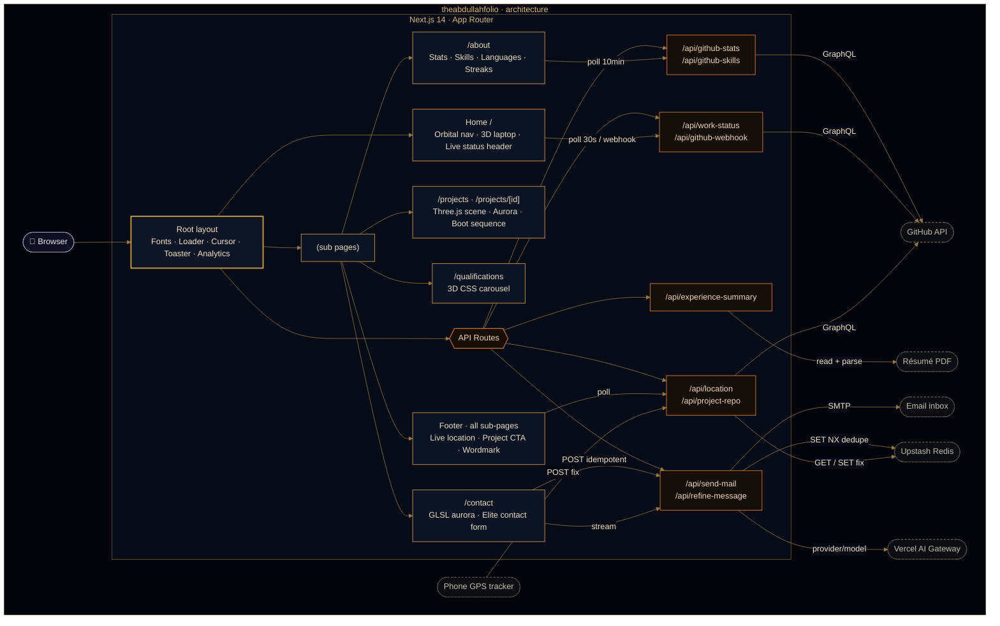

<a id="top"></a>

<div align="center">
  
  <h1>theabdullahfolio</h1>
  <p><em>A cinematic, 3D-powered developer portfolio built with Next.js 14</em></p>
</div>

<!-- HERO-BADGES:START -->
<p align="center">
  
  
  
  
  
  
</p>
<!-- HERO-BADGES:END -->

<!-- QUALITY-BADGES:START -->
<p align="center">
  
  
  
  
  
  
</p>
<!-- QUALITY-BADGES:END -->

---

<div align="center">
  <a href="https://ma.codes/">
    
  </a>
</div>

---

## ✨ Overview

**theabdullahfolio** is a cinematic developer portfolio that blends **Three.js 3D scenes**, **Framer Motion orchestration**, and **Next.js 14 App Router** into a single, performance-tuned experience. Every page tells a story — from the trigonometric orbital navigation ring on the home screen to the procedurally generated laptop keyboard in each project detail view.

Built without a UI template or design kit, this project demonstrates deep frontend engineering: generative 3D graphics, real-time GitHub data via GraphQL, physics-based spring animations, an AI-assisted contact form with an offline-durable, idempotent send path, and hardened Content Security Policy headers — all deployed on the edge.

---

## 🎯 Highlights

| Feature | Detail |
|---------|--------|
| **Orbital Navigation** | Trigonometric button ring with 5-breakpoint responsive layout, staggered reveal, infinite rotation loop |
| **3D Project Viewer** | Interactive Three.js scene — procedural laptop model with canvas-generated keyboard texture, 40+ mesh objects, auto-rotate orbit controls |
| **Aurora Parallax** | Multi-layer scroll + mouse-tilt parallax with `useScroll()` / `useTransform()` depth mapping |
| **Cinematic Boot Sequence** | Typewriter-style terminal messages with `clipPath` chunk reveals and sequential timing |
| **Animated GitHub Stats** | Live GraphQL API → fast-start/slow-finish count-ups, a breathing SVG rank arc, hover-spotlight metric rows, and a per-stat change banner (e.g. "Total Stars +5 \| Total Commits +50"); a "Live GitHub Metrics" label that hides on stale/fallback data; diff-based change detection with 10-min polling |
| **Interactive Language Breakdown** | Most-used-languages card with two-way bar↔list spotlight, rank + `PRIMARY` labelling, and a per-repo breakdown popover — opened by hover, keyboard focus, or tap — showing each repo's share of the language with a fast-start/slow-finish count-up; responsive list: top 5 in a single column (mobile → `lg`), up to 10 in two columns at `xl`+ |
| **Live Skills Grid** | About-page icon grid built **entirely from a live GitHub crawl** — repo languages plus dependency manifests across 7 ecosystems — resolved to skillicons.dev / Simple Icons icons, with a per-skill "used in repositories" popover (hover / keyboard / tap), a per-device skills-change banner, and an owner-only, private-name-safe crawl |
| **Completed Projects Breakdown** | "Projects shipped" card with an animated per-category proportional bar (Web / System, derived from the project data), a `\|`-separated count legend that wraps stacked→side-by-side responsively, count-ups that replay on every viewport entry, and an `sr-only` summary so screen readers get the breakdown |
| **Years in the Craft** | Experience figure derived live from the earliest GitHub repo **and** software roles parsed from the résumé PDF, with a Personal vs Employment split bar and a click-to-open category breakdown modal |
| **Current Streak** | Server-accurate streak from the GitHub contribution calendar (future-day-padding aware, "Present"-stable across midnight), shown in a git-commit-node progress ring with a staggered card entrance and a per-device change banner that fires only on real movement |
| **Elite Contact Form** | Molten submit-CTA state machine (idle → sending → sent/held), a sliced-letter magnetic "SEND MESSAGE!" label, fire-gradient fields, a streaming AI **"Refine my message"** rewrite, an offline send queue with auto-retry, draft autosave/restore, and an idempotent Nodemailer + Upstash-Redis send path |
| **Route-wide Colophon** | An editorial footer on every sub-page — a "Wet Ink" signature identity block, a split-flap *departures board* route index, a live-terminal links column, a **live-location** plate (real town + local time, coordinates never exposed), a self-drawing git-graph "view this project" CTA, and a giant guitar-string wordmark that plays an original melody as you strum it |
| **3D Qualifications Carousel** | CSS perspective transforms, `translateZ` depth, `rotateY`, sepia overlay, category filtering |
| **Aurora Fields** | Full-viewport WebGL domain-warped-fBm aurora (amber→ember, `mix-blend: screen`) on the Contact and About pages — cursor-bending, scroll-reactive on About, and reduced-motion-gated to a static image |
| **Custom Cursor** | Site-wide ember dot + spring-lagged ring that swells and leans toward interactive elements; disabled on touch / reduced-motion |
| **Cinematic Emblem Loader** | A self-forging SVG crest — stroking rings, an engraved MUHAMMAD / ABDULLAH name arc, and an MA flame monogram that ignites and radial-wipes into the page (first-visit gated, pointer-reactive) |
| **Smart 404 Recovery** | Levenshtein "Did you mean …?" suggestion that maps a near-miss URL to the closest real route |
| **Security Headers** | Full CSP policy, `frame-ancestors 'none'`, `upgrade-insecure-requests` via `next.config.mjs` |

---

## 🛠 Tech Stack

### Core

<!-- STACK-CORE:START -->
<p>
  
  
  
</p>

| Technology | Version | Role |
|------------|---------|------|
| [Next.js](https://nextjs.org/) | `^14.2` | App Router, server components, API routes, metadata API |
| [React](https://react.dev/) | `^18` | UI primitives, hooks, concurrent features |
| [Tailwind CSS](https://tailwindcss.com/) | `^3.3` | Utility-first styling, custom ember / amethyst / night theme |
<!-- STACK-CORE:END -->

### 3D & Animation

<!-- STACK-3D:START -->
<p>
  
  
  
  
</p>

| Technology | Version | Role |
|------------|---------|------|
| [Three.js](https://threejs.org/) | `^0.162` | WebGL 3D scene rendering |
| [@react-three/fiber](https://docs.pmnd.rs/react-three-fiber) | `^8.18` | React reconciler for Three.js |
| [@react-three/drei](https://github.com/pmndrs/drei) | `^9.122` | OrbitControls, Environment presets, HTML overlays |
| [Framer Motion](https://www.framer.com/motion/) | `^11.18` | AnimatePresence, scroll transforms, spring physics, stagger orchestration |
<!-- STACK-3D:END -->

### Data & Integration

<!-- STACK-DATA:START -->
| Technology | Version | Role |
|------------|---------|------|
| GitHub GraphQL API | — | Live stats, language breakdown, contribution data |
| [Nodemailer](https://nodemailer.com/) | `^7.0` | SMTP email delivery for the contact form |
| [react-hook-form](https://react-hook-form.com/) | `^7.61` | Form state management and validation |
| [AI SDK (`ai`)](https://sdk.vercel.ai/) | `^7.0` | `streamText` routed through the **Vercel AI Gateway** for the contact form's "Refine my message" rewrite (no provider SDK) |
| [@upstash/redis](https://upstash.com/docs/redis) | `^1.38` | Serverless Redis backing the idempotent contact-send store + the footer's latest live-location fix |
| [tz-lookup](https://github.com/darkskyapp/tz-lookup) | `^6.1` | Offline coordinates→IANA-timezone lookup for the footer's live-location clock |
| [@vercel/analytics](https://vercel.com/analytics) | `^2.0` | Real-user performance monitoring |
| [@vercel/speed-insights](https://vercel.com/docs/speed-insights) | `^2.0` | Core Web Vitals tracking |
<!-- STACK-DATA:END -->

### UI & Utilities

<!-- STACK-UI:START -->
| Technology | Version | Role |
|------------|---------|------|
| [Lucide React](https://lucide.dev/) | `^0.344.0` | Primary icon system |
| [React Icons](https://react-icons.github.io/react-icons/) | `^5.5` | Extended icon library |
| [Sonner](https://sonner.emilkowal.ski/) | `^1.7` | Toast notification system |
| [clsx](https://github.com/lukeed/clsx) | `^2.1` | Conditional class name utility |
| [tailwind-merge](https://github.com/dcastil/tailwind-merge) | `^3.6` | Conflict-free Tailwind class merging — the `cn()` helper in `src/lib/utils.js` |
| [Sharp](https://sharp.pixelplumbing.com/) | `^0.34` | Server-side image optimisation pipeline |
<!-- STACK-UI:END -->

---

## 🏗 Architecture

A single **Next.js 14 App Router** application. Server components and route handlers run on the edge; a Three.js + Framer Motion layer renders in the browser. Every dynamic surface — stats, skills, experience, live status, contact — is backed by a **cached, fail-open API route**, so the UI never blocks on an upstream and never renders empty.



### Cross-cutting concerns

| Layer | Approach |
|---|---|
| **Rendering** | Three.js WebGL canvas · Framer Motion DOM orchestration · Tailwind utility system |
| **Data** | GitHub GraphQL (live, multi-layer cached) · Nodemailer SMTP · Upstash Redis (send idempotency + live-location fix) · AI Gateway (message refine) · `tz-lookup` (offline timezone) · `localStorage` (draft · queue · loader gate) |
| **Performance** | Route-based code splitting · `next/dynamic` for Three.js · Sharp image pipeline · `unstable_cache` + CDN `s-maxage` / `stale-while-revalidate` |
| **Security** | Full CSP · `frame-ancestors 'none'` · `upgrade-insecure-requests` · server-only tokens · username allowlist · HMAC-verified webhooks |

---

## 📁 Project Structure

Feature-grouped and directory-annotated — each folder owns one surface of the site.

```text
theabdullahfolio/
├── public/                     # Static assets — logo, backgrounds, résumé PDF
├── src/
│   ├── app/                    # App Router — pages, layouts, API routes
│   │   ├── (sub pages)/        # /about · /projects · /projects/[id] · /qualifications · /contact
│   │   ├── api/                # 11 route handlers (see API surface below)
│   │   ├── data.js             # Central project + navigation data store
│   │   └── globals.css         # Theme tokens · keyframes · glow utilities
│   ├── components/
│   │   ├── navigation/         # Orbital nav ring — trig positioning, 5 breakpoints
│   │   ├── home/               # Live maintenance status header
│   │   ├── about/              # Live GitHub stat / streak / language / skills cards + diff banners
│   │   ├── projects/           # Category-filtered project grid (AnimatePresence)
│   │   ├── project-detail/     # Three.js laptop scene · aurora parallax · boot sequence
│   │   ├── contact/            # Elite contact form · GLSL aurora · AI refine · fire fields
│   │   ├── qualifications/     # 3D CSS certificate carousel
│   │   ├── not-found/          # 404 recovery — glitch text + Levenshtein "did you mean?"
│   │   ├── footer/             # Route-wide editorial colophon — live location · project CTA · guitar wordmark
│   │   ├── pageTransition/     # "Stone Passage" inter-page transition (engraved-monogram overlay)
│   │   └── loaderWrapper/      # First-visit emblem-seal intro loader
│   ├── hooks/                  # Reusable hooks — animation, live-data signals, form + offline queue
│   ├── lib/                    # Client helpers — contact send, cn(), media-query subscribe
│   ├── utils/                  # Rank calc · diff engines · skill/icon maps · manifest parsers
│   │   └── experience/         # Résumé-PDF parsing + pure-JS DOMMatrix polyfill
│   └── data/                   # Bundled GitHub-stats fallback snapshot
├── .github/                    # CI · README sync · issue templates · CODEOWNERS
├── next.config.mjs             # CSP headers · image pipeline · PDF output-file tracing
├── tailwind.config.js          # Ember / amethyst / night palette
└── vercel.json                 # Daily cron schedule (cache warm-up)
```

### API surface

| Route | Purpose |
|---|---|
| `/api/github-stats` | GraphQL aggregator — stats, streaks, languages, most-active repo (multi-layer cached) |
| `/api/github-skills` | Multi-ecosystem repo crawl → icon-mapped skills grid (budget-bounded, cached) |
| `/api/project-repo` | Live metadata (branch · commits · last push) for the one repo the site is built from — feeds the footer CTA (pinned, cached, fails soft) |
| `/api/location` | Live-location signal for the footer — `POST` ingests a GPS fix (dual-token auth), `GET` returns `{ town, tz, live }` only (never coordinates) |
| `/api/experience-summary` | Résumé-PDF parse → years-in-the-craft + Personal/Employment split |
| `/api/work-status` | Live maintenance-header state (repo activity + Projects v2 board) |
| `/api/github-webhook` | HMAC-verified cache-bust on `push` / `pull_request` / `issues` |
| `/api/send-mail` | Nodemailer SMTP + Upstash-Redis idempotent send claim |
| `/api/refine-message` | AI "Refine my message" stream via the Vercel AI Gateway |
| `/api/daily-warmup` · `/api/repo-refresh` | Cron orchestrator + cache warmer (bearer-authenticated) |

---

## 🚀 Getting Started

### Prerequisites

- **Node.js** ≥ 22.3 — the AI SDK's gateway dependency (`@ai-sdk/gateway`) requires Node 22+, and `.npmrc` sets `engine-strict=true`, so an older Node fails `npm ci`
- **npm** / **yarn** / **pnpm**
- A [GitHub Personal Access Token](https://github.com/settings/tokens) — see [GitHub Stats Integration](#github-stats-integration) below for the exact scopes required
- SMTP credentials — Gmail [App Password](https://support.google.com/accounts/answer/185833) recommended

### Installation

```bash
# 1. Clone
git clone https://github.com/MA1002643/theabdullahfolio.git
cd theabdullahfolio

# 2. Install dependencies
npm install

# 3. Configure environment
cp .env.example .env.local
# Open .env.local and fill in your tokens
```

### Environment Variables

```env
# GitHub Stats API
GITHUB_TOKEN=your-github-personal-access-token
NEXT_PUBLIC_GITHUB_USERNAME=MA1002643

# Contact Form (Nodemailer SMTP)
SMTP_HOST=smtp.gmail.com
SMTP_PORT=587
SMTP_USER=your-email@gmail.com
SMTP_PASS=your-app-password
RECEIVER_EMAIL=recipient@example.com
# Optional
# SMTP_SECURE=true                # force TLS on/off (auto when SMTP_PORT=465)
# ABSTRACT_API_KEY=...            # email reputation check via abstractapi.com

# Contact-send idempotency store (Upstash for Redis — optional; route fails OPEN)
# Provision "Upstash for Redis" via the Vercel Marketplace (injects the KV_* names);
# a native Upstash setup uses UPSTASH_REDIS_REST_URL / _TOKEN. Use the WRITE token.
# When unset, /api/send-mail still sends — just without dedupe.
# KV_REST_API_URL=https://your-db.upstash.io
# KV_REST_API_TOKEN=your-upstash-rest-write-token

# AI "Refine my message" (Vercel AI Gateway — optional; feature hides when unset)
# On Vercel, `vercel env pull` provides VERCEL_OIDC_TOKEN automatically; for local
# dev set a gateway key instead. REFINE_MODEL overrides the default model slug.
# AI_GATEWAY_API_KEY=your-vercel-ai-gateway-key
# REFINE_MODEL=anthropic/claude-haiku-4.5

# Route-wide footer — project CTA + contact email (issue #30; all optional)
# NEXT_PUBLIC_PROJECT_REPO defaults to "theabdullahfolio"; set it (with
# NEXT_PUBLIC_GITHUB_USERNAME above) so a fork retargets the "view this project"
# CTA and its live /api/project-repo caption with no code change.
# NEXT_PUBLIC_CONTACT_EMAIL overrides the public address the footer displays.
# NEXT_PUBLIC_PROJECT_REPO=theabdullahfolio
# NEXT_PUBLIC_CONTACT_EMAIL=you@example.com

# Footer live-location ingest (issue #30; optional — the footer shows the home
# city until a phone tracker feeds /api/location, and reuses the KV_* store above).
# Two SEPARATE write secrets, split by how the tracker authenticates so the
# URL-exposed query token is never the primary header secret:
# LOCATION_INGEST_TOKEN=your-header-ingest-secret         # Authorization: Bearer / Basic
# LOCATION_INGEST_QUERY_TOKEN=your-separate-query-token   # ?token= (URL-only trackers)
```

### GitHub Stats Integration

The `/about` cards — **Most Used Languages**, **GitHub Stats**, **Streaks**, and the **Most Active Repository** — run live off your own PAT via `/api/github-stats`; the **Skills grid** is powered by a companion `/api/github-skills` crawl. Both are cached, username-allowlisted, and fail open to a bundled snapshot so the page never renders empty.

**Setup**

1. **Create a token** at [github.com/settings/tokens](https://github.com/settings/tokens) — a fine-grained PAT with read-only `Metadata` + `Contents` (recommended), or a classic PAT with `public_repo`. Set it as `GITHUB_TOKEN` in `.env.local`; it's server-only (no `NEXT_PUBLIC_` prefix).
2. **Set `NEXT_PUBLIC_GITHUB_USERNAME`** — both routes serve data *only* for this username (case-insensitive). Any other `?username=` returns `403`, closing a token / rate-limit exhaustion vector.

**Caching** — four layers keep the GitHub API off the request hot path:

| Layer | TTL |
|---|---|
| Most-active-repo `unstable_cache` (expensive scoring query) | 24 hr |
| Display-data `unstable_cache` (user · stats · streaks · repo) | 10 min |
| CDN `s-maxage` / `stale-while-revalidate` / `stale-if-error` | 10 min / 5 min / 24 hr |
| `localStorage` last-good payload | until next successful fetch |

<details>
<summary><strong>Engineering deep-dive</strong> — repo selection · fallbacks · live diffing · skills crawl & privacy</summary>
<br />

**Most-active-repo selection** — no hardcoded repo. `/api/github-stats` scores every repo you contributed to in the last year (PRs/reviews ×5, commits ×4, issues ×3, ambient history ×1) and features the top-scorer, including externally-owned OSS. The profile-README repo is always excluded. Selection sits behind its own 24-hr cache since scoring is expensive and changes slowly.

**Fallbacks** — on total GitHub failure the route serves [src/data/github-stats-fallback.json](src/data/github-stats-fallback.json) (`X-Cache-Status: FALLBACK`, HTTP 200, `_fallback: true`); the client keeps whatever real data it already had rather than overwriting it. A narrower **languages-only** fallback (`languagesFallback: true`, no `_fallback`) covers a languages-query timeout so the card never blanks — the client treats it as a *soft default* that populates a cold card but never overwrites a returning visitor's fresher `localStorage`. To refresh the bundled snapshot, write to a tempfile first, then move it into place — a direct `curl > …fallback.json` truncates the file to 0 bytes before curl writes, and `next dev` HMR then imports the empty file:

```bash
curl "http://localhost:3000/api/github-stats?username=YOUR_USERNAME" -o /tmp/fallback.json
python3 -m json.tool /tmp/fallback.json > src/data/github-stats-fallback.json
rm /tmp/fallback.json
```

**Invalidation & cron** — both cache layers expire on their own; force a refresh via `revalidateTag("github-stats")` / `revalidateTag("most-active-repo")`, a redeploy, or the daily `/api/daily-warmup` cron (`vercel.json`, `0 1 * * *` UTC) — a thin orchestrator that calls `/api/repo-refresh` and `/api/work-status?bust=1`. Consolidated into one cron because Hobby plans cap cron count; both stay individually invokable. All warm-up routes authenticate against `Authorization: Bearer ${CRON_SECRET}` (Vercel attaches it automatically), and the optional server-only `BASE_URL` overrides the warm-up fetch target.

**Live diffing & change banners** — on each 10-min poll, `statsDiff.js` / `streakDiff.js` / `skillsDiff.js` / `languageDiff.js` compare snapshots and, on real movement, surface a signed-delta banner (e.g. `Total Stars +5 | Total Commits +50`) that auto-hides (~4.5s) and is gated on viewport visibility. Messages reconcile every poll so a non-stat change never replays a stale delta. All fingerprints are computed **client-side** so they keep working on fallback data and can't drift from the server. A **"Live GitHub Metrics"** / **"· live from GitHub"** label appears only when data is genuinely live, hiding on fallback/stale data.

**Interactive language & per-repo breakdown** — each language row two-way spotlights with the stacked bar, is rank-numbered with a `PRIMARY` tag, and opens a body-portaled popover of `repos: [{ name, url, percentage }]` (each repo's share of *that* language's bytes, capped at 12) via hover / keyboard-focus / tap. Responsive: top 5 in one column through `lg`, up to 10 in two columns at `xl`+.

**Skills crawl** — built **entirely from a live crawl** (no hardcoded list). Detects **languages** inline from GraphQL and **dependencies** from manifests at any depth (`package.json`, `requirements.txt` / `pyproject.toml` / `Pipfile`, `go.mod`, `Cargo.toml`, `Gemfile`, `composer.json`, `pubspec.yaml`, `pom.xml` / `build.gradle[.kts]` — `manifestParsers.js`). Names resolve through the server-only `skillsIconMap.js` (skillicons.dev → Simple Icons fallback against a ~3.4k-slug catalog); unmapped names are dropped, never rendered broken. Grouped into five buckets, each with a fully ARIA-exposed "used in repositories" popover.

**Privacy & resilience** — the crawl uses `ownerAffiliations: [OWNER]`, so it never enumerates repos you only collaborate on. Private repos you own are crawled for *detection* but their names are withheld (the disclosure-safe id is `null` when `isPrivate`), so a private name never reaches the public payload. Results are 10-min `unstable_cache`d (key `github-skills-v3`) behind `s-maxage=600, stale-while-revalidate=300, stale-if-error=86400`, with a `localStorage` last-good and a **budget-bounded** crawl (shared `AsyncLocalStorage` deadline + per-call / cumulative / pagination caps) that retains partial results under the serverless time limit.

</details>

### Commands

```bash
npm run dev      # Dev server → http://localhost:3000
npm run build    # Production build
npm run start    # Serve production build locally
npm run lint     # ESLint check
```

---

## 📨 Contact Form

The `/contact` page pairs a cinematic front-end with a resilient, idempotent delivery pipeline — built on `react-hook-form`, posting to `/api/send-mail`, and degrading gracefully when its optional services (Upstash Redis, the AI Gateway) aren't configured, so it works out of the box on local dev.

**Front-end anatomy** (`src/components/contact/`)

| Piece | What it does |
|---|---|
| **Molten submit CTA** (`Form.jsx`) | One pill morphs in place across `idle → sending → sent/held` — a grey "SENDING…" swept by a turbulent molten-orange `feTurbulence` / `feDisplacementMap` wavefront driven by **real** request progress, a self-stroking "✓ SENT" on delivery, a self-drawing "✦ HELD" when parked offline. An always-mounted label locks the footprint. |
| **Sliced-letter magnetic label** (`SliceLabel.jsx` + `useMagneticPull`) | "SEND MESSAGE!" letters part along one sweeping blade on hover — a single `progress` motion value drives blade + letters so hover can't desync — while the button leans toward the cursor. Precise-pointer / non-reduced-motion only. |
| **Gradient fire fields** (`FireInput.jsx` / `FireTextarea.jsx`) | Typed text is painted with the fire-amber gradient via a sibling overlay mirroring value + scroll, working around WebKit/Blink/iOS `background-clip: text` bugs. Notched floating labels + an "ember charge-up" while sending. |
| **Intro reveal + aurora** (`ContactIntro.jsx`, `AuroraBackground.jsx`) | Copy de-blurs word-by-word, held until the loader lifts. Behind it, a full-viewport GLSL domain-warped-fBm aurora bends toward the cursor at `mix-blend: screen` — a client-only `next/dynamic` import so `three` never enters the critical bundle (static image is the reduced-motion fallback). |

<details>
<summary><strong>AI "Refine my message"</strong> — streaming rewrite via the Vercel AI Gateway</summary>
<br />

A quiet ember affordance under the message field streams an AI rewrite of the visitor's note **token by token** into a ghosted panel they can accept or discard.

- **Server** (`refine-message/route.js`) — AI SDK (`ai@7`) `streamText` through the **Vercel AI Gateway** with a plain `"provider/model"` string (no provider SDK, no per-provider key). Defaults to `anthropic/claude-haiku-4.5`, overridable via `REFINE_MODEL`.
- **Auth is server-only** — resolves `AI_GATEWAY_API_KEY` or the auto-injected `VERCEL_OIDC_TOKEN`; when neither is present the route returns `503` and the client **hides the feature**, so keyless local dev is unaffected.
- **Guards** — the untrusted message is wrapped in `<message>` delimiters (prompt-injection guard); a per-IP rate limit, a body-size cap, and length checks gate abuse; error logs record only `name` + `statusCode`, never the SDK's free-text body.
- **Client** (`useMessageRefine`) reads the plain UTF-8 stream with a `ReadableStream` reader — no client-side AI dependencies.

</details>

<details>
<summary><strong>Offline queue, draft autosave & idempotent send</strong> — never silently lose a message</summary>
<br />

A dropped connection, a timed-out response, or a closed tab all recover:

- **Shared send** — the live form and the background queue both go through `postContactMessage` (`src/lib/contact.js`), returning a discriminated `{ ok | errors | network | aborted }` result (15 s timeout). Transport failures (offline / drop / timeout / any `5xx` / a retryable `409`) are queued and retried; a validation `4xx` is surfaced to the user.
- **Offline queue** (`useOfflineQueue`) — unreachable sends are parked in `localStorage` and drained on reconnect with capped exponential backoff, durable across a tab close; the CTA morphs to "✦ HELD". It lives **above** the form's post-send remount so its pending state survives each send.
- **Draft autosave** (`useFormDraft`) — all four fields debounce-save to `localStorage` and restore behind a "Keep / Clear" banner (7-day TTL, cleared on a successful send). Restore and AI-accept write through `setNativeValue` so react-hook-form **and** the gradient overlays repaint from one event.
- **Idempotent server** (`/api/send-mail`) — a stable per-message `Idempotency-Key` lets the server dedupe via an atomic Upstash `SET NX` `PENDING` claim promoted to `SENT` only after delivery: an already-sent retry dedupes to `200`, an in-flight retry gets a retryable `409`, and only the attempt that won the claim (`claimOwned`) may release/promote it — so **no duplicate email goes out**. The header-supplied key is shape-validated and namespaced under `contact:idempotency:`. Bounded SMTP timeouts (≈40 s worst case) stay inside the 120 s `PENDING` TTL. **When the store is unreachable or unconfigured, the route fails open** (sends without dedupe).

</details>

<details>
<summary><strong>Contact-form environment variables</strong></summary>
<br />

| Variable | Required | Purpose |
|---|---|---|
| `SMTP_HOST` · `SMTP_PORT` · `SMTP_USER` · `SMTP_PASS` · `RECEIVER_EMAIL` | yes | Nodemailer SMTP delivery. A Gmail [App Password](https://support.google.com/accounts/answer/185833) is recommended. |
| `SMTP_SECURE` | no | Force TLS on/off (defaults on when `SMTP_PORT=465`). |
| `ABSTRACT_API_KEY` | no | Email-reputation check — deliverability + disposable-address block — via abstractapi.com. |
| `KV_REST_API_URL` · `KV_REST_API_TOKEN` | no | Upstash Redis (WRITE token) for send idempotency. Also accepts `UPSTASH_REDIS_REST_URL` / `_TOKEN`. Unset → sends without dedupe. |
| `AI_GATEWAY_API_KEY` | no | Vercel AI Gateway credential for message refine (or `VERCEL_OIDC_TOKEN` on Vercel). Unset → the refine feature hides. |
| `REFINE_MODEL` | no | Overrides the refine model (default `anthropic/claude-haiku-4.5`). |

</details>

---

## ⚡ Performance & Security

<details>
<summary><strong>Content Security Policy</strong> — applied to every route via <code>next.config.mjs</code></summary>
<br />

```text
default-src         'self'
script-src          'self' 'unsafe-eval' 'unsafe-inline' https://va.vercel-scripts.com
style-src           'self' 'unsafe-inline' https://fonts.googleapis.com
font-src            'self' https://fonts.gstatic.com data:
img-src             'self' data: blob: https:
connect-src         'self' https:
frame-src           'self'
object-src          'none'
base-uri            'self'
form-action         'self'
frame-ancestors     'none'
upgrade-insecure-requests
```

</details>

<details>
<summary><strong>Performance Optimisations</strong></summary>
<br />

| Optimisation | Implementation |
|---|---|
| **Image pipeline** | Sharp — automatic WebP / AVIF conversion |
| **Font loading** | `next/font` self-hosted Inter (body) + Varela Round + Montserrat (loader emblem), zero layout shift |
| **Code splitting** | Route-based automatic splitting; Three.js loads on `/projects/[id]`, and lazily via client-only `next/dynamic` for the Contact / About aurora so it never enters the critical bundle |
| **API caching** | `/api/github-stats` wrapped in two `unstable_cache` layers — 24-hr for the most-active-repo selection, 10-min for the display-data refresh; both invalidated by tag on demand via the daily `/api/repo-refresh` cron. CDN response is also `s-maxage=10min` / `stale-while-revalidate=5min` / `stale-if-error=24hr`, with a bundled JSON snapshot served on total upstream failure. `/api/github-skills` adds its own 10-min `unstable_cache` (key `github-skills-v3`) behind the same CDN policy, with a budget-bounded crawl that retains partial results under a shared wall-clock deadline |
| **Analytics** | Vercel Speed Insights + Web Analytics for real-user Core Web Vitals |

</details>

---

## 🎨 Design System

| Token | Value | Usage |
|-------|-------|-------|
| `night-950` | `#01050b` | Page backgrounds |
| `night-900` | `#030c18` | Card backgrounds |
| `ember-neon` | `#eab53e` | Primary neon accent, borders, glows |
| `ember-core` | `#b16612` | Inner glow core |
| `neon-700` | `#ff6d05` | Neon ripples, aurora warmth, CTA highlights |
| `amethyst-neon` | `#fc83ff` | Subtitle glow, secondary accent |
| `ember-halo` | `#fcf699` | Outer glow halos |
| `foreground` | `rgb(225 225 225)` | Body text |
| `muted` | `rgb(115 115 115)` | Secondary / placeholder text |

**Custom CSS utilities:** `text-glow-stroke-neon` · `text-glow-stroke-purple` · `custom-bg` · `custom-bg-abt` · `glitter-text` · `icon-glow` · `behind-glow` · `borderline` · `control-island`

---

## 🎬 Animation Inventory

<details>
<summary><strong>View the custom animation inventory</strong></summary>
<br />

| Animation | Technique | Location |
|-----------|-----------|----------|
| Orbital rotation | `requestAnimationFrame` + trigonometry | `navigation/index.jsx` |
| Floating laptop | `useFrame` sin-wave (Three.js render loop) | `project-detail/laptop-model.jsx` |
| Aurora parallax | `useScroll` + `useTransform` + mouse tilt | `project-detail/aurora-bg.jsx` |
| Boot sequence | Sequential `clipPath` chunk reveals | `project-detail/boot-on-sequence.jsx` |
| Molten submit CTA | `feTurbulence` / `feDisplacementMap` wavefront + self-stroking checkmark, driven by real request progress | `contact/Form.jsx` |
| Sliced-letter magnetic label | Single `progress` motion value drives a sweeping blade + per-letter split; spring magnetic pull toward the cursor | `contact/SliceLabel.jsx` + `hooks/useMagneticPull.js` |
| Contact intro reveal | Word-by-word de-blur held until the loader lifts (`useLoaderRevealed`) | `contact/ContactIntro.jsx` |
| Stat counters | `requestAnimationFrame` fast-start/slow-finish count-up (simultaneous, reduced-motion aware) | `about/StatsCard.jsx` |
| SVG rank arc | `stroke-dashoffset` sweep + breathing radial glow | `about/StatsCard.jsx` |
| GitHub stat change banner | per-character reveal, ~4.5s auto-hide gated on viewport | `about/StatsCard.jsx` + `about/UpdateBanner.jsx` |
| Language count-up & bar sheen | `animate()` fast-start/slow-finish curve + one-shot shimmer sweep on viewport entry | `about/LanguagesCard.jsx` |
| About count-ups (years, projects total, %s, category counts) | Shared `useViewportCountUp` — `animate()` count-up that replays on viewport entry with a debounced, flicker-immune out-of-view reset | `about/index.jsx` |
| Experience & projects split bars | Proportional segment widths that re-fill on each viewport entry (`animate` gated on the card's in-view signal) | `about/index.jsx` |
| GitHub Stats / Languages card entrance | Spring card lift + per-character blur-in title + metric-row slide-in stagger; replays on each viewport entry via the reversible `settledInView` flag, reduced-motion aware | `about/StatsCard.jsx` + `about/LanguagesCard.jsx` |
| Streak card entrance | Staggered left-to-right section cascade (Total Contributions → Current Streak ring → Longest Streak), replaying on each viewport entry | `about/StreakStatsCard.jsx` |
| Streak progress ring | `stroke-dashoffset` one-shot fill sweep (current ÷ longest) on entry, with a git-commit node and `animateToTarget` count-ups | `about/StreakStatsCard.jsx` |
| Aurora fields | Scroll- & cursor-reactive GLSL domain-warped-fBm aurora, `mix-blend: screen`, reduced-motion-gated | `contact/AuroraBackground.jsx` · `about/AboutAuroraDust.jsx` |
| Custom cursor | Ember dot + spring-lagged ring that swells and sticks toward interactive elements | `CustomCursor.jsx` |
| Emblem-seal loader | Self-stroking rings + engraved name arc + igniting molten flood → radial reveal wipe | `loaderWrapper/EmblemSeal.jsx` |
| Stagger reveals | `staggerChildren` Framer Motion variants | Multiple components |
| 3D carousel | CSS `perspective` + `translateZ` + `rotateY` | `qualifications/Carousel.jsx` |
| Glowing project name | Bloom ring scale + random flicker interval | `project-detail/glowing-project-name.jsx` |
| Neon ripples | `animate-ripple-neon` on `rotateX(80deg)` plane | `app/page.js` |
| Footer "Wet Ink" identity reveal | CSS-keyframe signature cascade (drawing rule → `clip-path` ink-down name → sparking role → self-drawing git-graph CTA), keyed off `data-revealed` | `footer/FooterIdentity.jsx` |
| Footer split-flap departures board | Per-tile ordinal scramble that settles on reveal; live route reads NOW BOARDING with a pulse (SSR-safe, CLS-free) | `footer/FooterManifest.jsx` |
| Footer terminal type-out | Command/output "session" that types on reveal with a blinking ember caret (height-reserved, SSR-safe) | `footer/ElsewhereTerminal.jsx` |
| Footer email decipher | Per-glyph cipher scramble that locks left→right into the real address on reveal (single rAF, text/colour only) | `footer/DecipherEmail.jsx` |
| Per-glyph hover-swap links | Face/clone rolls stacked inside each char box; pure CSS `transition-delay` stagger + colour lift | `footer/HoverText.jsx` |
| Guitar-string wordmark | Scanline-sampled letters plucked into pinned-end standing waves on one rAF; each pluck sounds an original Web Audio note | `footer/FooterWordmark.jsx` + `footer/pluckSynth.js` |
| Stone Passage page transition | Basalt slab rises, MA monogram engraved stroke-by-stroke via an SVG stroke-mask over a plain/carved image pair, then a radial mask wipe | `pageTransition/StonePassageOverlay.jsx` |

</details>

---

## 📦 Deployment

Optimised for **Vercel** — zero additional configuration required.

```bash
# Via Vercel CLI
npx vercel --prod
```

Or connect the GitHub repository to [vercel.com](https://vercel.com) for automatic preview + production deployments on every push.

> **Required:** Set all environment variables in the Vercel dashboard under **Settings → Environment Variables** before your first production deploy.

### Function bundling notes — `/api/experience-summary`

The Experience Summary route parses the résumé PDF (`public/Muhammad_Abdullah_CV.pdf`) with `pdf-parse` / `pdfjs-dist`. It runs fine locally, but three Vercel-specific bundling gotchas must stay handled — otherwise the deployed function silently returns `employment: null` and the Years-in-the-Craft / Career Snapshot panels render `0+ months`.

<details>
<summary><strong>The three bundling gotchas &amp; how they're solved</strong></summary>
<br />

1. **Static asset under `public/`** — Vercel ships `public/` to the static layer, *not* the function filesystem. `next.config.mjs` lists the PDF in `experimental.outputFileTracingIncludes["/api/experience-summary"]` so `@vercel/nft` copies it into the bundle; the route reads it via `process.cwd()`-relative `fs.readFile`.
2. **`pdfjs-dist` fake worker** — `pdfjs-dist` dynamically imports its worker bundle at runtime, which `@vercel/nft` can't statically trace (→ `Cannot find module …/pdf.worker.mjs`). `pdf-parse` v2 loads the **legacy** build, so `outputFileTracingIncludes` also traces `pdfjs-dist/legacy/build/pdf.worker.mjs` + `.min.mjs`.
3. **Pure-JS `DOMMatrix` polyfill** — `pdfjs-dist` would otherwise `require("@napi-rs/canvas")`, whose native `.node` binary can't be traced (→ "DOMMatrix is not defined"). Instead the parser installs a **pure-JS `DOMMatrix`** on `globalThis` before `pdfjs` loads (`src/utils/experience/domMatrixPolyfill.js`); the canvas require then fails as a harmless warning. `pdf-parse` is marked in `serverComponentsExternalPackages` so Next leaves it as a runtime `require` rather than mangling its ESM globals.

**Health check** — a healthy deploy returns `employment: { months, display, roles }` with `pdfStatus: null`. `pdfStatus: { message: "DOMMatrix is not defined" }` means the polyfill isn't installing before `pdfjs`; `Cannot find module …/pdf.worker.mjs` means the traced worker path drifted with a `pdfjs-dist` bump — extend `outputFileTracingIncludes` and redeploy.

</details>

---

## 🛰️ Live Maintenance Header

The home page renders a real-time development status header that reads activity from this repository **and** the linked Projects v2 board (`MA1002643/theabdullahfolio` + `users/MA1002643/projects/3` only — never any other repo or project). It degrades to a deterministic maintenance message when GitHub is unreachable or unconfigured.

The chip displays one of five states, ordered by precedence:

| State | Chip label | When it fires |
| --- | --- | --- |
| `SHIPPING` | **SHIPPING** + green pulsing dot | Board items moved to **Done** whose issue/PR closed in the last 48h |
| `LIVE` | **LIVE** + green pulsing dot | Any commit, PR, or issue updated in the last 2 hours |
| `IN_PROGRESS` | **IN PROGRESS** | Board has cards in **In Progress**, or there are open PRs |
| `PLANNING` | **PLANNING** | Open issues exist, but no open PRs and no recent activity |
| `IDLE` | **MAINTENANCE** | No `SHIPPING`/`LIVE` signal, no open PRs or issues, no **In Progress** cards |

When `SHIPPING` and active In Progress work overlap, the message rotates between "Just shipped #X …" and "Actively working on N tasks — #Y …" every 10 seconds.

<details>
<summary><strong>Environment variables &amp; token scopes</strong></summary>
<br />

| Variable | Required | Purpose |
| --- | --- | --- |
| `GITHUB_TOKEN` | yes | Read-only PAT for `/api/work-status` (open PRs, issues, recent commits). Fine-grained or classic. Without it, the header falls back to the deterministic message. |
| `GITHUB_PROJECT_TOKEN` | recommended | Separate **classic** PAT (`read:project` + `public_repo`) for the Projects v2 query; falls back to `GITHUB_TOKEN`. Needed because fine-grained PATs can't read user-owned projects today. |
| `GITHUB_WEBHOOK_SECRET` | yes (prod) | HMAC secret for `/api/github-webhook` `X-Hub-Signature-256` validation; unsigned/invalid deliveries are rejected. |
| `CRON_SECRET` | yes (prod) | Bearer token for the cron-protected routes (`/api/daily-warmup`, `/api/work-status?bust=1`, `/api/repo-refresh`); Vercel attaches it automatically on scheduled requests. Missing → 401 (or 500 for the routes that refuse to start unset), blocking traffic amplification. |
| `BASE_URL` | no | Server-only override for the warm-up fetch target. Falls back to `https://${VERCEL_URL}` then `http://localhost:3000`. |
| `WORK_STATUS_AI_ENABLED` | no | `true` rewrites the deterministic message via OpenAI before returning. Default off. |
| `OPENAI_API_KEY` | if AI enabled | Required when `WORK_STATUS_AI_ENABLED=true`; the AI path always falls back to the deterministic message on error. |

**Token scopes**

- **Fine-grained `GITHUB_TOKEN`** — Contents: Read, Issues: Read, Pull requests: Read, Metadata: Read. Scope to `theabdullahfolio` only.
- **Classic `GITHUB_PROJECT_TOKEN`** — `read:project` + `public_repo` (or `repo` if private). User-owned Projects v2 boards aren't reachable via fine-grained PATs today, hence the second token.

</details>

<details>
<summary><strong>Webhook setup &amp; refresh strategy</strong></summary>
<br />

**Webhook** — in `Settings → Webhooks` on `theabdullahfolio`:

1. **Payload URL:** `https://<your-domain>/api/github-webhook`
2. **Content type:** `application/json` *(critical — `x-www-form-urlencoded` breaks HMAC verification)*
3. **Secret:** must match `GITHUB_WEBHOOK_SECRET` byte-for-byte
4. **Events:** `push`, `pull_request`, `issues` (optionally `issue_comment`)

The webhook validates the signature, ignores events from other repos, and busts the in-memory cache so the next poll is fresh. *(Projects v2 column moves don't fire repo webhooks — they're picked up via the 30s cache TTL + client polling instead.)*

**Refresh** — four layers keep the header fresh on Vercel:

- **Server cache** — in-memory, 30s; one GitHub fetch per 30s window per region regardless of traffic.
- **Webhook** — invalidates the cache immediately on real events.
- **Client polling** — every 30s while visible, every 15 min when hidden (Page Visibility API); the 30s rate aligns with the cache so board moves surface within ~30s.
- **Cron fallback** — `/api/daily-warmup` (daily) hits `/api/work-status?bust=1` as a backstop for delayed webhook delivery. Consolidated under one schedule because Hobby plans cap cron count.

Worst-case usage is ~120 GraphQL calls/token/hour (~7–12 % of the 5,000-pt/hr limit). On upstream error the endpoint serves the last good payload (`X-Cache-Status: STALE`) before degrading to the deterministic message.

</details>

<details>
<summary><strong>UI choreography</strong></summary>
<br />

A single status bar above the hero, with three layered animation systems:

- **Container entrance** — `whileInView` 0 → 1 scale pop-in; re-fires on viewport entry so returning to `/` replays it.
- **Loading skeleton** — shimmer-sweep placeholder matched to the live dimensions (no layout shift), crossfading to real content via `AnimatePresence`.
- **Pulsing dot** — a green `live-dot` (`#22c55e`) breathing every 2.8s with holds at both extremes; active during `SHIPPING` / `LIVE`.

Counters (PRs / Issues / Pushes 24h) animate 0 → target with a piecewise curve (linear to 75%, cubic ease-out for the last 25%; 1.1–2.2s scaled to the delta). The "Updated Xs ago" stamp uses an adaptive tick rate (1s → 30s → 1 min → 1 hour). All looping animation stops under `prefers-reduced-motion: reduce`.

</details>

## 🧭 Route-wide Footer (Colophon)

Every sub-page — `/about`, `/qualifications`, `/projects`, `/contact` — shares one editorial footer, rendered **once** in the `(sub pages)` layout as a `contentinfo` sibling of `<main>` (issue [#30](https://github.com/MA1002643/theabdullahfolio/issues/30)). It is composed as an asymmetric **5 / 4 / 3 masthead** from the site's existing neon-orange glass design system, so it reads as part of the same universe as the hero rather than bolted on. All motion is transform / opacity / colour only (no layout, no CLS) and every entrance honours `prefers-reduced-motion`.

| Region | What it is |
| --- | --- |
| **Identity** | Name, role, and positioning line revealed with a "Wet Ink" signature cascade; the one mandatory **View this project on GitHub** CTA (a self-drawing git graph with an honest `❯ main · N commits · pushed <rel>` caption from `/api/project-repo`); and one honest availability signal ("open to new roles"). |
| **Index** | A route-aware split-flap **departures board** — each of the four routes scrambles and settles, and the current route reads **NOW BOARDING**. Rows stay real `<TransitionLink>`s (SPA transition, keyboard-focusable, `aria-current`). |
| **Elsewhere** | GitHub / LinkedIn / Résumé staged as a live **terminal** that types itself out, plus the contact micro-block (the email resolves out of a cipher on reveal). |
| **Live location** | The **Ember Meridian** plate — the owner's real current town + local time from `/api/location`, with a **LIVE** pulse only when the GPS fix is fresh; falls back to the home city when the tracker is off. |
| **Wordmark** | A giant half-sunk **guitar-string** wordmark: hover plucks a string (pinned-end standing wave) and sounds the next note of an original melody, so sweeping the cursor strums a phrase. |

<details>
<summary><strong>Live-location — data flow &amp; privacy model</strong></summary>
<br />

The footer's town + clock are fed by a phone tracker (OwnTracks / Overland / an iOS Shortcut) posting fixes to `/api/location`. The design keeps coordinates off the wire and out of the client entirely:

- **`GET /api/location` returns only `{ town, tz, live }`** — never latitude/longitude. The home city (Bolton) is the SSR-safe default; a fresh fix swaps in after mount.
- **~1 km privacy floor** — coordinates are rounded (2 dp) **before** the third-party reverse-geocode request *and* before storage, so no finer fix ever leaves the process or reaches the geocoder's logs. The geocode fetch is `cache: 'no-store'` so a location-derived response is never retained in the framework Data Cache.
- **Freshness guard** — a fix older than `STALE_AFTER_MS` (12 h), or one with a future timestamp (forward clock skew, bounded by a small tolerance), is treated as stale and the plate quietly drops the LIVE flag and shows home.
- **Offline timezone** — the IANA zone is derived from coordinates with `tz-lookup` (no network); `Intl` does all DST/offset work, so the clock is correct for any city with nothing hardcoded.
- **Fails soft** — when Upstash KV isn't configured the ingest short-circuits to `503` (before any geocode) and the footer simply shows the home city.

| Variable | Required | Purpose |
| --- | --- | --- |
| `LOCATION_INGEST_TOKEN` | for live location | Primary write secret, presented via `Authorization: Bearer` (Shortcuts / curl) or HTTP Basic (OwnTracks). |
| `LOCATION_INGEST_QUERY_TOKEN` | for URL-only trackers | **Separate** secret for the `?token=` path (Overland and other trackers that can't send headers), so the log-exposed URL credential is never the primary header token and can be rotated independently. Leave unset to disable URL-based ingestion. |
| `KV_REST_API_URL` / `KV_REST_API_TOKEN` | for live location | Upstash KV (the same store the contact form uses) holds the latest fix. When unset, `GET` just serves the home city. |
| `NEXT_PUBLIC_PROJECT_REPO` | no | Repo name behind the project CTA + `/api/project-repo` caption (defaults to `theabdullahfolio`); with `NEXT_PUBLIC_GITHUB_USERNAME`, retargets a fork with no code change. |
| `NEXT_PUBLIC_CONTACT_EMAIL` | no | Overrides the public contact address the footer displays (defaults to the address baked into `footer-data.js`). |

</details>

<details>
<summary><strong>Reveal choreography &amp; reduced motion</strong></summary>
<br />

The footer is rendered **once** and **persists** across client-side navigations, so a naïve `useInView(once)` observer would latch on a transient off-screen flicker during a route swap and leave entrances "spent" where nobody sees them. Instead every block shares `useFooterReveal` — a re-arming, loader-gated observer that fires only when a meaningful portion of the block is on screen **and** the intro loader has lifted, then resets once it is fully out of view (two-threshold hysteresis so a partial scroll-away never blanks a still-visible block). The result: each entrance replays exactly when the visitor scrolls it into view, every time.

Under `prefers-reduced-motion: reduce` every block is shown already at rest — the signature is written, the departures board settled, the terminal already run, the wordmark's strings still (a hover still rings a note) — with nothing moving. All decorative, animated glyphs are `aria-hidden`, and each link exposes its real, unsplit text via an `sr-only` node so its accessible name is always correct regardless of how far an animation has progressed.

</details>

## 🙏 Acknowledgements

- [Poimandres](https://github.com/pmndrs) — `@react-three/fiber` & `@react-three/drei`
- [Framer](https://www.framer.com/motion/) — animation engine
- [Lucide](https://lucide.dev/) — icon system
- [Shields.io](https://shields.io/) — README badges
- [Mermaid](https://mermaid.js.org/) — architecture diagrams

## 📄 Licence

This project is proprietary software. All rights reserved by **Muhammad Abdullah**. See [LICENSE](LICENSE) for full terms. No part of this codebase may be copied, reused, or redistributed without express written permission.

---

<p align="center">
  <strong>© 2026 Muhammad Abdullah</strong><br>
  Developed with 💙 using Next.js, React and JavaScript<br>
  <a href="#top"></a>
</p>
