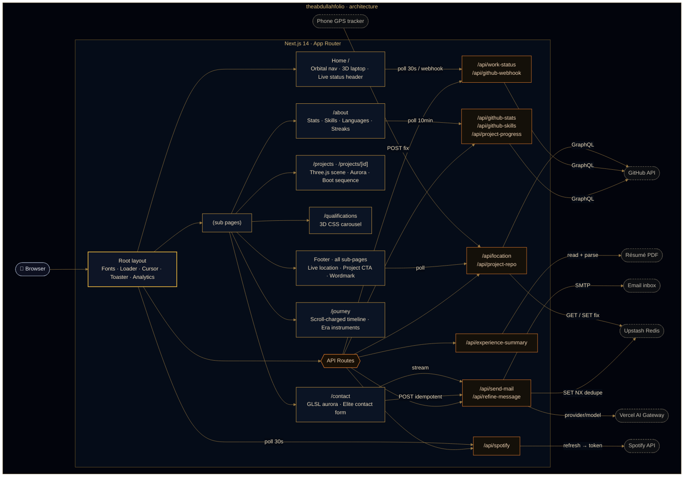

<a id="top"></a>

<div align="center">
  
  <h1>theabdullahfolio</h1>
  <p><em>A cinematic, 3D-powered developer portfolio built with Next.js 14</em></p>
</div>

<!-- HERO-BADGES:START -->
<p align="center">
  
  
  
  
  
  
</p>
<!-- HERO-BADGES:END -->

<!-- QUALITY-BADGES:START -->
<p align="center">
  
  
  
  
  
  
</p>
<!-- QUALITY-BADGES:END -->

---

<div align="center">
  <a href="https://ma.codes/">
    
  </a>
</div>

---

## ✨ Overview

**theabdullahfolio** is a cinematic developer portfolio that blends **Three.js 3D scenes**, **Framer Motion orchestration**, and **Next.js 14 App Router** into a single, performance-tuned experience. Every page tells a story — from the trigonometric orbital navigation ring on the home screen to the procedurally generated laptop keyboard in each project detail view.

Built without a UI template or design kit, this project demonstrates deep frontend engineering: generative 3D graphics, real-time GitHub data via GraphQL, physics-based spring animations, an AI-assisted contact form with an offline-durable, idempotent send path, and hardened Content Security Policy headers — all deployed on the edge.

---

## 🎯 Highlights

| Feature | Detail |
|---------|--------|
| **Orbital Navigation** | Trigonometric button ring on one viewport-derived ellipse — a fixed `0.204` tilt at every width, sized so the outermost button always clears the screen edge, anchored to the laptop's **measured base** and raised 15% of the laptop's own height above it (`ORBIT_RAISE`) so it circles the artwork's lower body at the same pose on every viewport, and depth-sorted per frame so the ring passes *behind* the laptop on the far half of each lap and in front of it on the near half; staggered reveal, two-column fallback below 480px. **The ring is an instrument, not just an ornament** (issue #105): wheel/touchpad over the ring or the laptop spins it, the ring band takes an angular touch-drag, the laptop doubles as a vertical scrubber — hover-driven on any hover-capable pointer (a desktop mouse, or an iPad the moment a trackpad/Magic Keyboard attaches, via a live `(hover: hover) and (pointer: fine)` query), drag-driven on touch — and `←` / `→` from any focused button turns it exactly one button slot. **The ring has real physics**: release a drag while still moving and it coasts on momentum with exponential friction (launch speed = an EMA of the hand's own deg/s at release; a held release never flicks), stopping dead the moment a button is hovered; touch drags tick a haptic detent at every 45° slot crossing where the hardware supports it. The ambient spin pauses while the visitor is engaged and eases back in after a 1.5s quiet period. The gesture is signposted twice over: the site cursor grows breathing ↑ ↓ chevrons over the laptop (`data-cursor="scrub"`, with a native `ns-resize` fallback for reduced-motion users), and a one-time dismissible tip (`localStorage`-remembered, auto-dismissed on first interaction, `role="status"`) leads with the laptop gesture in plain words beside an animated cursor-over-laptop pictogram — worded per capability, so a touch-only tablet is told to slide and drag, never to hover — and not rendered at all below 480px, where the two-column layout has no orbit to teach (nor does a column tap burn the remembered dismissal) |
| **3D Project Viewer** | Interactive Three.js scene — procedural laptop model with canvas-generated keyboard texture, 40+ mesh objects, auto-rotate orbit controls |
| **Aurora Parallax** | Multi-layer scroll + mouse-tilt parallax with `useScroll()` / `useTransform()` depth mapping |
| **Cinematic Boot Sequence** | Typewriter-style terminal messages with `clipPath` chunk reveals and sequential timing |
| **Animated GitHub Stats** | Live GraphQL API → fast-start/slow-finish count-ups, a breathing SVG rank arc, hover-spotlight metric rows, and a per-stat change banner (e.g. "Total Stars +5 \| Total Commits +50"); a "Live GitHub Metrics" label that hides on stale/fallback data; diff-based change detection with 10-min polling |
| **Interactive Language Breakdown** | Most-used-languages card with two-way bar↔list spotlight, rank + `PRIMARY` labelling, and a per-repo breakdown popover — opened by hover, keyboard focus, or tap — showing each repo's share of the language with a fast-start/slow-finish count-up; responsive list: top 5 in a single column (mobile → `lg`), up to 10 in two columns at `xl`+ |
| **Live Skills Grid** | About-page icon grid built **entirely from a live GitHub crawl** — repo languages plus dependency manifests across 7 ecosystems — resolved to skillicons.dev / Simple Icons icons, with a per-skill "used in repositories" popover (hover / keyboard / tap), a per-device skills-change banner, and an owner-only, private-name-safe crawl |
| **Completed Projects Breakdown** | "Projects shipped" card with an animated per-category proportional bar (derived from the project data), a `\|`-separated count legend that wraps stacked→side-by-side responsively, count-ups that replay on every viewport entry — and the whole card is a click-to-open trigger for the **Project Progress popup**: live per-project completion percentages derived from each repo's GitHub issue board (one batched GraphQL call, 12 h multi-layer cache, ≥2 syncs/day), a portfolio-wide completion donut, category bars, expandable per-project issue pipelines (closed / in-progress / backlog) with issue-board links, a live "last sync" age, and a full dialog a11y baseline (focus trap, Escape/backdrop close, focus restoration, iOS-safe scroll lock) |
| **Years in the Craft** | Experience figure derived live from the earliest GitHub repo **and** software roles parsed from the résumé PDF, with a Personal vs Employment split bar and a click-to-open category breakdown modal |
| **Current Streak** | Server-accurate streak from the GitHub contribution calendar (future-day-padding aware, "Present"-stable across midnight), shown in a git-commit-node progress ring with a staggered card entrance and a per-device change banner that fires only on real movement |
| **Elite Contact Form** | Molten submit-CTA state machine (idle → sending → sent/held), a sliced-letter magnetic "SEND MESSAGE!" label, fire-gradient fields, a streaming AI **"Refine my message"** rewrite, an offline send queue with auto-retry, draft autosave/restore, and an idempotent Nodemailer + Upstash-Redis send path |
| **Route-wide Colophon** | An editorial footer on every sub-page — a "Wet Ink" signature identity block, a split-flap *departures board* route index, a live-terminal links column, a **live-location** plate (real town + local time, coordinates never exposed), a self-drawing git-graph "view this project" CTA, and a giant guitar-string wordmark that plays an original melody as you strum it |
| **Now Playing (Spotify)** | A floating live-music badge that expands into a console on hover — currently-playing (or last-played) track with an album-derived accent, a progress ring that advances **locally** from the server-anchored position, and a CSS equaliser; server-side token exchange (no secret reaches the browser), with a demo track when unconfigured |
| **3D Qualifications Carousel** | CSS perspective transforms, `translateZ` depth, `rotateY`, sepia overlay, category filtering, a centre-out staggered card entrance (banner second-beat) that replays on every filter switch, and a crisp cinematic lantern-corridor scene brought to life by a full-bleed ambient video loop (rippling water, flickering lanterns; reduced-motion / Save-Data gated to the still) |
| **Aurora Fields** | Full-viewport WebGL domain-warped-fBm aurora (amber→ember, `mix-blend: screen`) on the Contact and About pages — cursor-bending, scroll-reactive on About, and reduced-motion-gated to a static image |
| **Custom Cursor** | Site-wide ember dot + spring-lagged ring that swells and leans toward interactive elements; disabled on touch / reduced-motion |
| **Cinematic Emblem Loader** | A self-forging SVG crest — stroking rings, an engraved MUHAMMAD / ABDULLAH name arc, and an MA flame monogram that ignites and radial-wipes into the page (first-visit gated, pointer-reactive) |
| **Smart 404 Recovery** | Levenshtein "Did you mean …?" suggestion that maps a near-miss URL to the closest real route |
| **Security Headers** | Full CSP policy, `frame-ancestors 'none'`, `upgrade-insecure-requests` (production builds only) via `next.config.mjs` |

---

## 🛠 Tech Stack

### Core

<!-- STACK-CORE:START -->
<p>
  
  
  
</p>

| Technology | Version | Role |
|------------|---------|------|
| [Next.js](https://nextjs.org/) | `^14.2` | App Router, server components, API routes, metadata API |
| [React](https://react.dev/) | `^18` | UI primitives, hooks, concurrent features |
| [Tailwind CSS](https://tailwindcss.com/) | `^3.3` | Utility-first styling, custom ember / amethyst / night theme |
<!-- STACK-CORE:END -->

### 3D & Animation

<!-- STACK-3D:START -->
<p>
  
  
  
  
</p>

| Technology | Version | Role |
|------------|---------|------|
| [Three.js](https://threejs.org/) | `^0.162` | WebGL 3D scene rendering |
| [@react-three/fiber](https://docs.pmnd.rs/react-three-fiber) | `^8.18` | React reconciler for Three.js |
| [@react-three/drei](https://github.com/pmndrs/drei) | `^9.122` | OrbitControls, Environment presets, HTML overlays |
| [Framer Motion](https://www.framer.com/motion/) | `^11.18` | AnimatePresence, scroll transforms, spring physics, stagger orchestration |
<!-- STACK-3D:END -->

### Data & Integration

<!-- STACK-DATA:START -->
| Technology | Version | Role |
|------------|---------|------|
| GitHub GraphQL API | — | Live stats, language breakdown, contribution data |
| Spotify Web API | — | Live now-playing track for the floating widget — server-side refresh-token exchange (no secret reaches the browser) |
| [Nodemailer](https://nodemailer.com/) | `^7.0` | SMTP email delivery for the contact form |
| [react-hook-form](https://react-hook-form.com/) | `^7.61` | Form state management and validation |
| [AI SDK (`ai`)](https://sdk.vercel.ai/) | `^7.0` | `streamText` routed through the **Vercel AI Gateway** for the contact form's "Refine my message" rewrite (no provider SDK) |
| [@upstash/redis](https://upstash.com/docs/redis) | `^1.38` | Serverless Redis backing the idempotent contact-send store + the footer's latest live-location fix |
| [tz-lookup](https://github.com/darkskyapp/tz-lookup) | `^6.1` | Offline coordinates→IANA-timezone lookup for the footer's live-location clock |
| [@vercel/analytics](https://vercel.com/analytics) | `^2.0` | Real-user performance monitoring |
| [@vercel/speed-insights](https://vercel.com/docs/speed-insights) | `^2.0` | Core Web Vitals tracking |
<!-- STACK-DATA:END -->

### UI & Utilities

<!-- STACK-UI:START -->
| Technology | Version | Role |
|------------|---------|------|
| [Lucide React](https://lucide.dev/) | `^0.344.0` | Primary icon system |
| [React Icons](https://react-icons.github.io/react-icons/) | `^5.5` | Extended icon library |
| [Sonner](https://sonner.emilkowal.ski/) | `^1.7` | Toast notification system |
| [clsx](https://github.com/lukeed/clsx) | `^2.1` | Conditional class name utility |
| [tailwind-merge](https://github.com/dcastil/tailwind-merge) | `^3.6` | Conflict-free Tailwind class merging — the `cn()` helper in `src/lib/utils.js` |
| [Sharp](https://sharp.pixelplumbing.com/) | `^0.34` | Server-side image optimisation pipeline |
<!-- STACK-UI:END -->

---

## 🏗 Architecture

A single **Next.js 14 App Router** application. Server components and route handlers run on the edge; a Three.js + Framer Motion layer renders in the browser. Every dynamic surface — stats, skills, experience, live status, contact — is backed by a **cached, fail-open API route**, so the UI never blocks on an upstream and never renders empty.



### Cross-cutting concerns

| Layer | Approach |
|---|---|
| **Rendering** | Three.js WebGL canvas · Framer Motion DOM orchestration · Tailwind utility system |
| **Data** | GitHub GraphQL (live, multi-layer cached) · Spotify Web API (now-playing, server-side token exchange) · Nodemailer SMTP · Upstash Redis (send idempotency + live-location fix) · AI Gateway (message refine) · `tz-lookup` (offline timezone) · `localStorage` (draft · queue · loader gate) |
| **Performance** | Route-based code splitting · `next/dynamic` for Three.js · Sharp image pipeline · `unstable_cache` + CDN `s-maxage` / `stale-while-revalidate` |
| **Security** | Full CSP · `frame-ancestors 'none'` · `upgrade-insecure-requests` (prod only) · server-only tokens · username allowlist · HMAC-verified webhooks |

---

## 📁 Project Structure

Feature-grouped and directory-annotated — each folder owns one surface of the site.

```text
theabdullahfolio/
├── public/                     # Static assets — logo, backgrounds, résumé PDF
├── src/
│   ├── app/                    # App Router — pages, layouts, API routes
│   │   ├── (sub pages)/        # /about · /projects · /projects/[id] · /qualifications · /contact · /journey · /my-past
│   │   ├── api/                # 14 route handlers (see API surface below)
│   │   ├── data.js             # Central project + navigation data store
│   │   └── globals.css         # Theme tokens · keyframes · glow utilities
│   ├── components/
│   │   ├── navigation/         # Orbital nav ring — trig positioning, one fitted ellipse, per-frame depth, wheel/drag/scrub/keyboard control + first-visit tip
│   │   ├── home/               # Live maintenance header · engraved role line · causeway scene layers
│   │   ├── about/              # Live GitHub stat / streak / language / skills cards + diff banners
│   │   ├── journey/            # Scroll-charged career timeline — self-drawing serpentine spine + curve-riding comet, ghost-year odometer, scroll-wound time-true clock dial, overlap atlas (lane-packed Gantt of concurrent roles, sticky lane labels, NOW-clamped bars), per-card tenure readouts, end-cap tally + CV hand-off, and its own ⌘K palette action set
│   │   ├── projects/           # Category-filtered project grid (AnimatePresence)
│   │   ├── project-detail/     # Three.js laptop scene · aurora parallax · boot sequence
│   │   ├── contact/            # Elite contact form · GLSL aurora · AI refine · fire fields
│   │   ├── qualifications/     # 3D CSS certificate carousel
│   │   ├── not-found/          # 404 recovery — glitch text + Levenshtein "did you mean?"
│   │   ├── footer/             # Route-wide editorial colophon — live location · project CTA · guitar wordmark
│   │   ├── spotify/            # "Now Playing" widget — live track, marquee, progress ring, equaliser
│   │   ├── sound/              # Root-layout audio provider + footerless-route stop toggle
│   │   ├── pageTransition/     # "Ember Passage" inter-page transition (90k-ember GPU swarm → monogram)
│   │   └── loaderWrapper/      # First-visit emblem-seal intro loader
│   ├── hooks/                  # Reusable hooks — animation, live-data signals, form + offline queue
│   ├── lib/                    # Client helpers — contact send, cn(), media-query subscribe, fluid-scale calc()
│   ├── utils/                  # Rank calc · diff engines · skill/icon maps · manifest parsers
│   │   └── experience/         # Résumé-PDF parsing + pure-JS DOMMatrix polyfill
│   └── data/                   # Bundled GitHub-stats fallback snapshot
├── scripts/                    # Node-version-guarded launchers for dev / build / start / lint
│   └── scene/                  # One-off generate · bake · measure · audit tools for the scene assets
├── assets/source/              # Ungraded artwork the bake scripts read from (build input — not served)
├── .github/                    # CI · README sync · issue templates · CODEOWNERS
├── next.config.mjs             # CSP headers · image pipeline · PDF output-file tracing
├── tailwind.config.js          # Ember / amethyst / night palette
└── vercel.json                 # Daily cron schedule (cache warm-up)
```

### API surface

| Route | Purpose |
|---|---|
| `/api/github-stats` | GraphQL aggregator — stats, streaks, languages, most-active repo (multi-layer cached) |
| `/api/github-skills` | Multi-ecosystem repo crawl → icon-mapped skills grid (budget-bounded, cached) |
| `/api/project-progress` | Per-project completion % from each repo's GitHub issue board — one batched, aliased GraphQL call for the whole portfolio (rate-limit cost 1), 12 h cache + SWR, degrades to a static structural fallback |
| `/api/project-repo` | Live metadata (branch · commits · last push) for the one repo the site is built from — feeds the footer CTA (pinned, cached, fails soft) |
| `/api/location` | Live-location signal for the footer — `POST` ingests a GPS fix (dual-token auth), `GET` returns `{ town, tz, live }` only (never coordinates) |
| `/api/spotify` | Now Playing data for the floating widget — server-side refresh-token exchange → display-only fields (never a token); edge-cached, fails soft to `{ isPlaying: false }`. A cached access token that Spotify rejects (`401`) is refreshed and the read replayed once, so a token revoked mid-life can't wedge the widget until its KV entry expires; upstream failures are logged with the endpoint and status behind the `502` |
| `/api/spotify/auth` | **Dev-only**, loopback-gated one-time helper that mints the Spotify refresh token — hard-`404`s in production/preview |
| `/api/experience-summary` | Résumé-PDF parse → years-in-the-craft + Personal/Employment split |
| `/api/work-status` | Live maintenance-header state (repo activity + Projects v2 board) |
| `/og/home` · `/og/home-square` | The homepage's share card, rendered on demand ([#88](https://github.com/MA1002643/theabdullahfolio/issues/88)) — live signals (build focus, contributions, town) typeset into a dark ember card; CDN-cached 1 h + SWR, fails soft to the pure identity composition. Sections, `/projects/[id]`, `/journey` and `/my-past` ship build-time cards via `opengraph-image.js` file conventions instead |
| `/api/github-webhook` | HMAC-verified cache-bust on `push` / `pull_request` / `issues` |
| `/api/send-mail` | Nodemailer SMTP + Upstash-Redis idempotent send claim |
| `/api/refine-message` | AI "Refine my message" stream via the Vercel AI Gateway (contact + guestbook editorial modes) |
| `/api/guestbook` | Guestbook wall — `GET` serves one cursor-paged, newest-first page (`?limit=` ≤ 50, `?cursor=`) plus the wall's separately-counted total; `POST` / `DELETE` are session-gated, identity from the OAuth session only (`/reactions`, `/presence` alongside) |
| `/api/daily-warmup` · `/api/repo-refresh` | Cron orchestrator + cache warmer (bearer-authenticated) |

---

## 🚀 Getting Started

### Prerequisites

- **Node.js** 22.x (≥ 22.13.0) or 24.x — LTS majors only: the unit-test stack (vitest → Vite 8, jsdom 29) declares `^22.13.0` within the 22 line, the AI SDK's gateway dependency (`@ai-sdk/gateway`) requires Node 22+, non-LTS majors (e.g. Homebrew's auto-bumped Node 25) crash the Next 14 dev server, and `.npmrc` sets `engine-strict=true`, so any Node outside the `engines` range fails `npm ci`
- **npm** / **yarn** / **pnpm**
- A [GitHub Personal Access Token](https://github.com/settings/tokens) — see [GitHub Stats Integration](#github-stats-integration) below for the exact scopes required
- SMTP credentials — Gmail [App Password](https://support.google.com/accounts/answer/185833) recommended

### Installation

```bash
# 1. Clone
git clone https://github.com/MA1002643/theabdullahfolio.git
cd theabdullahfolio

# 2. Install dependencies
npm install

# 3. Configure environment
cp .env.example .env.local
# Open .env.local and fill in your tokens
```

### Environment Variables

```env
# GitHub Stats API
GITHUB_TOKEN=your-github-personal-access-token
NEXT_PUBLIC_GITHUB_USERNAME=MA1002643

# Contact Form (Nodemailer SMTP)
SMTP_HOST=smtp.gmail.com
SMTP_PORT=587
SMTP_USER=your-email@gmail.com
SMTP_PASS=your-app-password
RECEIVER_EMAIL=recipient@example.com
# Optional
# SMTP_SECURE=true                # force TLS on/off (auto when SMTP_PORT=465)
# ABSTRACT_API_KEY=...            # email reputation check via abstractapi.com

# Contact-send idempotency store (Upstash for Redis — optional; route fails OPEN)
# Provision "Upstash for Redis" via the Vercel Marketplace (injects the KV_* names);
# a native Upstash setup uses UPSTASH_REDIS_REST_URL / _TOKEN. Use the WRITE token.
# When unset, /api/send-mail still sends — just without dedupe.
# KV_REST_API_URL=https://your-db.upstash.io
# KV_REST_API_TOKEN=your-upstash-rest-write-token

# AI "Refine my message" (Vercel AI Gateway — optional; feature hides when unset)
# On Vercel, `vercel env pull` provides VERCEL_OIDC_TOKEN automatically; for local
# dev set a gateway key instead. REFINE_MODEL overrides the default model slug.
# AI_GATEWAY_API_KEY=your-vercel-ai-gateway-key
# REFINE_MODEL=anthropic/claude-haiku-4.5

# Route-wide footer — project CTA + contact email (issue #30; all optional)
# NEXT_PUBLIC_PROJECT_REPO defaults to "theabdullahfolio"; set it (with
# NEXT_PUBLIC_GITHUB_USERNAME above) so a fork retargets the "view this project"
# CTA and its live /api/project-repo caption with no code change.
# NEXT_PUBLIC_CONTACT_EMAIL overrides the public address the footer displays.
# NEXT_PUBLIC_PROJECT_REPO=theabdullahfolio
# NEXT_PUBLIC_CONTACT_EMAIL=you@example.com

# Footer live-location ingest (issue #30; optional — the footer shows the home
# city until a phone tracker feeds /api/location, and reuses the KV_* store above).
# Two SEPARATE write secrets, split by how the tracker authenticates so the
# URL-exposed query token is never the primary header secret:
# LOCATION_INGEST_TOKEN=your-header-ingest-secret         # Authorization: Bearer / Basic
# LOCATION_INGEST_QUERY_TOKEN=your-separate-query-token   # ?token= (URL-only trackers)

# Now Playing widget — live Spotify presence (issue #42; all optional — the widget
# stays HIDDEN in production when unset, and shows a bundled demo track in dev).
# SERVER-ONLY (never NEXT_PUBLIC_): /api/spotify exchanges the refresh token
# server-side and returns only display data. The one-time token setup runs LOCALLY
# via /api/spotify/auth (which 404s in production) — see .env.example or that route's
# header comment for the full flow. Spotify BANS "localhost" redirect URIs — use the
# loopback IP 127.0.0.1. Reuses the KV_* store above when present (pure optimisation).
# SPOTIFY_CLIENT_ID=your-spotify-client-id
# SPOTIFY_CLIENT_SECRET=your-spotify-client-secret
# SPOTIFY_REFRESH_TOKEN=your-refresh-token-from-the-auth-flow
# SPOTIFY_DEMO=true            # force the demo track on in a prod/preview deploy

# Guestbook — GitHub sign-in + message store (issue #40). READING the wall
# works with none of these set; POSTING needs the three AUTH_* vars (Auth.js
# v5 reads the AUTH_* names directly). A GitHub OAuth App takes ONE callback
# URL, so create two apps: dev → http://localhost:3000/api/auth/callback/github,
# prod → https://ma.codes/api/auth/callback/github.
# AUTH_GITHUB_ID=your-github-oauth-app-client-id
# AUTH_GITHUB_SECRET=your-github-oauth-app-client-secret
# Google sign-in (second provider). ONE Google OAuth client covers dev AND
# prod — Google accepts multiple redirect URIs on a single client; add both
# http://localhost:3000/api/auth/callback/google and
# https://ma.codes/api/auth/callback/google.
# AUTH_GOOGLE_ID=your-google-oauth-client-id
# AUTH_GOOGLE_SECRET=your-google-oauth-client-secret
# AUTH_SECRET=generate-with-openssl-rand-base64-32
# Storage picks the KV_* Upstash store above automatically when present
# (guestbook:* keys); GUESTBOOK_DRIVER=json pins the dev-only file store
# (data/guestbook.json — never on Vercel, where the filesystem is ephemeral).
# GUESTBOOK_ADMIN names the one GitHub username allowed to DELETE messages.
# GUESTBOOK_DRIVER=redis
# GUESTBOOK_ADMIN=MA1002643
```

### Guestbook (`/guestbook`)

An interactive neon message wall (issue #40): visitors sign in with **GitHub or Google**, leave a 2–150-character message — optionally with a hand-drawn **ink signature** captured on a canvas, or one of four preset marks offered as real buttons beneath the pad (the keyboard-operable route to a signature, and the whole panel on a device with no pointer), either stored as a strictly-validated SVG path — and react (🔥 🚀 ❤️, one per person per message, server-enforced). Reading is public; writing is session-gated with author identity taken from the OAuth session only, a server-side rate limit (1 message / user / 5 min; anonymous presence heartbeats are separately capped at 30 per client IP per minute, keyed by a hash so no address is stored — over budget is a 429 and the id is not counted; reactions are capped at 30 per user per minute — over budget is a 429 with `Retry-After`, checked after validation and before the write, so nothing is stored), and a profanity/URL filter. A flag-gated "elite layer" (`src/lib/flags.js`) adds card tilt, live presence, the shared **⌘K command palette** (`src/components/commandPalette/` — built to be mounted sitewide later), optional UI sounds (off by default), a manual motion toggle that stills every layer at once — `motion.*` animations through `MotionConfig`, every component's own reduced-motion branch through a project `useReducedMotion` hook that reads that config as well as the OS query (Framer's own reads the OS alone), the aurora mount through an `enabled` prop, and the guestbook's CSS animations through a `data-motion` attribute on the page's wrapper, each beside the OS preference — and a grain finish — each killable with a one-line flip. (One variant ships with its flag off so the page matches the sitewide patterns exactly: the scramble-decode headline — the title and subtitle play the shared `PageTitle` ignite instead. The backdrop is the same static still + cursor-reactive aurora as `/about`.)

**Setup**

1. Create two GitHub OAuth Apps at [github.com/settings/developers](https://github.com/settings/developers) (one callback URL each — dev `http://localhost:3000/api/auth/callback/github`, prod `https://ma.codes/api/auth/callback/github`) and set `AUTH_GITHUB_ID` / `AUTH_GITHUB_SECRET` / `AUTH_SECRET` per environment. For Google, one OAuth client in [console.cloud.google.com](https://console.cloud.google.com) suffices (Google allows multiple redirect URIs — add the `…/api/auth/callback/google` form of both URLs) → `AUTH_GOOGLE_ID` / `AUTH_GOOGLE_SECRET`. Reading the wall needs no auth at all; identity only gates posting and reacting. Every author is keyed by a **stable identity key** minted at sign-in from the OAuth account — `github:<account id>` or `google:<sub>` (`src/lib/guestbook/identity.js`) — and that key, never the login, is what ownership, the rate limiters and the reactions hash compare: a GitHub rename changes the card's @handle and nothing else, and whoever later claims the old login inherits nothing. The key never leaves the server; the public API ships `author.username` (the GitHub login, display data) for GitHub authors only, omits it for Google authors (cards display the name and link nowhere), and ownership — what the bin button needs — travels as a per-viewer `isOwn` boolean the route decides from the session.
2. Storage self-selects: with the `KV_*` Upstash vars present it uses Redis (`guestbook:*` keys); locally `GUESTBOOK_DRIVER=json` keeps messages in the gitignored-by-content `data/guestbook.json`. The API route never touches `fs` directly — both drivers implement one contract (`src/lib/guestbook/store.js`), unit-tested in `tests/unit/store.test.js`. Forcing `GUESTBOOK_DRIVER=redis` without the Redis vars refuses to start with an error naming them, rather than falling back to the file store (which on Vercel would accept messages and lose them on the next cold start) — and a **production** server with neither the Redis vars nor an explicit driver refuses in the same way, rather than silently serving that file store; the only production route onto it is asking for it by name (`GUESTBOOK_DRIVER=json`, which the e2e suite sets on purpose and which logs a warning). `next build` is exempt: it evaluates route modules under `NODE_ENV=production` without serving anything. The json driver is single-process by design — its rate limit reserves posting slots in process memory so two concurrent posts by one user cannot both slip through, and its mutations run one at a time through an in-process queue and land by atomic temp-file rename, so concurrent posts, deletes and reactions cannot overwrite one another; a data file it cannot read or parse is an error (the request fails and the file is left as it was), never an empty wall for the next write to replace — only a missing file means "no messages yet" — and it logs a warning if it finds itself serving under `NODE_ENV=production`.
3. Signed-in visitors can always delete **their own** message (the bin button on their card); set `GUESTBOOK_ADMIN` to your GitHub username — or, rename-proof, to your identity key `github:<account id>` (your numeric GitHub user id, shown by `https://api.github.com/users/<login>`; in this form the login is never consulted) — and the site recognises you as the wall's moderator — your session carries `isAdmin`, the bin button appears on **every** card, and `DELETE /api/guestbook?id=…` accepts delete-any. Both ownership and admin are re-derived from the session server-side (`src/lib/guestbook/admin.js`) — the client flag is display-only.

**Reading the wall** — `GET /api/guestbook` is cursor-paged: it returns one newest-first page (`?limit=`, default 8, hard-capped at 50), the wall's total `count` (an O(1) `ZCARD`, read separately so nothing has to load the wall to size it) and an opaque `nextCursor` (`null` on the last page; a *malformed* cursor is a `400` — cursors are validated for **shape only**, not authenticated: a cursor is an unsigned position into public data, so a hand-built one reaches nothing that paging would not, and no secret is needed to mint or verify one). Reactions are fetched for the page's ids only. Every write answers with `count` as well — `POST` 201 is the public message plus the wall's size read just after the store, `DELETE` 200 is `{ ok, count }` — so the client settles its total from the write itself instead of guessing whether a page fetched in flight already included the change (a newest page would list a new mark; an older page can only count it). A cursor is the *position* of a page's last message (`createdAt` ms + id, the order a Redis ZSET walks in `REV` mode — ties broken by id, so a same-millisecond pair of posts is never skipped at a page edge), not an offset, so it stays exact as new marks land and old ones are deleted. The client holds a newest-first *prefix* of the wall, never the whole thing: the first fetch is two leaves, each page flip extends the prefix (plus one leaf ahead, so *next* is instant), the 30-second live poll re-reads the newest page and merges it — reading on down, page by page, when more than a page has landed since the last poll, until the new pages reach the prefix (bounded at five), and past that bound restarting the prefix from the top with the contiguous run it fetched, so a burst can never leave a hole the continuation cursor would skip forever (arrivals glow, a card deleted elsewhere leaves, reaction counts refresh), and a `#msg_…` deep link walks older pages until its mark appears (bounded at ten requests). The page rail always shows the whole wall from the server's count, loaded or not — and is itself a constant five DOM nodes at any count, its graduations a repeated CSS tile that thins to every k-th page past 28 gaps — so payload, Redis commands, polling cost and the control's own DOM are flat in the wall's size (`src/lib/guestbook/paging.js`, `cursor.js`, `src/hooks/useGuestbookMessages.js`).

**Tests** — `npm test` (vitest: timeAgo, the signature-path grammar, the signature field's keyboard-operable preset marks, the rate limiter, the driver contract including paging, the paging order + cursor codec + poll merge, and the paged `GET` route driven end-to-end over the json driver) and `npm run test:e2e` (Playwright smoke: read-only view renders, sign-in CTA visible, unauthenticated POST → 401, and — against a stubbed list route that honours `limit`/`cursor` — the page-at-a-time fetch and the deep-link walk; builds first — the config boots a production server on port 3100 with the Redis credential variables explicitly emptied so no heartbeat or limiter write can reach the live store, and refuses to adopt a server already on that port unless `E2E_REUSE_SERVER=1` is set, the opt-in for iterating on specs against one you started yourself with the same env). Both suites gate every push and pull request in CI (`.github/workflows/ci.yml`: lint → unit → build → Playwright against the job's own build output, with Chromium installed in the job and the HTML report uploaded as an artifact on failure).

### GitHub Stats Integration

The `/about` cards — **Most Used Languages**, **GitHub Stats**, **Streaks**, and the **Most Active Repository** — run live off your own PAT via `/api/github-stats`; the **Skills grid** is powered by a companion `/api/github-skills` crawl. Both are cached, username-allowlisted, and fail open to a bundled snapshot so the page never renders empty.

**Setup**

1. **Create a token** at [github.com/settings/tokens](https://github.com/settings/tokens) — a fine-grained PAT with read-only `Metadata` + `Contents` (recommended), or a classic PAT with `public_repo`. Set it as `GITHUB_TOKEN` in `.env.local`; it's server-only (no `NEXT_PUBLIC_` prefix).
2. **Set `NEXT_PUBLIC_GITHUB_USERNAME`** — both routes serve data *only* for this username (case-insensitive). Any other `?username=` returns `403`, closing a token / rate-limit exhaustion vector.

**Caching** — four layers keep the GitHub API off the request hot path:

| Layer | TTL |
|---|---|
| Most-active-repo `unstable_cache` (expensive scoring query) | 24 hr |
| Display-data `unstable_cache` (user · stats · streaks · repo) | 10 min |
| CDN `s-maxage` / `stale-while-revalidate` / `stale-if-error` | 10 min / 5 min / 24 hr |
| `localStorage` last-good payload | until next successful fetch |

<details>
<summary><strong>Engineering deep-dive</strong> — repo selection · fallbacks · live diffing · skills crawl & privacy</summary>
<br />

**Most-active-repo selection** — no hardcoded repo. `/api/github-stats` scores every repo you contributed to in the last year (PRs/reviews ×5, commits ×4, issues ×3, ambient history ×1) and features the top-scorer, including externally-owned OSS. The profile-README repo is always excluded. Selection sits behind its own 24-hr cache since scoring is expensive and changes slowly.

**Fallbacks** — on total GitHub failure the route serves [src/data/github-stats-fallback.json](src/data/github-stats-fallback.json) (`X-Cache-Status: FALLBACK`, HTTP 200, `_fallback: true`); the client keeps whatever real data it already had rather than overwriting it. A narrower **languages-only** fallback (`languagesFallback: true`, no `_fallback`) covers a languages-query timeout so the card never blanks — the client treats it as a *soft default* that populates a cold card but never overwrites a returning visitor's fresher `localStorage`. To refresh the bundled snapshot, write to a tempfile first, then move it into place — a direct `curl > …fallback.json` truncates the file to 0 bytes before curl writes, and `next dev` HMR then imports the empty file:

```bash
curl "http://localhost:3000/api/github-stats?username=YOUR_USERNAME" -o /tmp/fallback.json
python3 -m json.tool /tmp/fallback.json > src/data/github-stats-fallback.json
rm /tmp/fallback.json
```

**Invalidation & cron** — both cache layers expire on their own; force a refresh via `revalidateTag("github-stats")` / `revalidateTag("most-active-repo")`, a redeploy, or the daily `/api/daily-warmup` cron (`vercel.json`, `0 1 * * *` UTC) — a thin orchestrator that calls `/api/repo-refresh` and `/api/work-status?bust=1`. Consolidated into one cron because Hobby plans cap cron count; both stay individually invokable. All warm-up routes authenticate against `Authorization: Bearer ${CRON_SECRET}` (Vercel attaches it automatically), and the optional server-only `BASE_URL` overrides the warm-up fetch target.

**Live diffing & change banners** — on each 10-min poll, `statsDiff.js` / `streakDiff.js` / `skillsDiff.js` / `languageDiff.js` compare snapshots and, on real movement, surface a signed-delta banner (e.g. `Total Stars +5 | Total Commits +50`) that auto-hides (~4.5s) and is gated on viewport visibility. Messages reconcile every poll so a non-stat change never replays a stale delta. All fingerprints are computed **client-side** so they keep working on fallback data and can't drift from the server. A **"Live GitHub Metrics"** / **"· live from GitHub"** label appears only when data is genuinely live, hiding on fallback/stale data.

**Interactive language & per-repo breakdown** — each language row two-way spotlights with the stacked bar, is rank-numbered with a `PRIMARY` tag, and opens a body-portaled popover of `repos: [{ name, url, percentage }]` (each repo's share of *that* language's bytes, capped at 12) via hover / keyboard-focus / tap. Responsive: top 5 in one column through `lg`, up to 10 in two columns at `xl`+.

**Skills crawl** — built **entirely from a live crawl** (no hardcoded list). Detects **languages** inline from GraphQL and **dependencies** from manifests at any depth (`package.json`, `requirements.txt` / `pyproject.toml` / `Pipfile`, `go.mod`, `Cargo.toml`, `Gemfile`, `composer.json`, `pubspec.yaml`, `pom.xml` / `build.gradle[.kts]` — `manifestParsers.js`). Names resolve through the server-only `skillsIconMap.js` (skillicons.dev → Simple Icons fallback against a ~3.4k-slug catalog); unmapped names are dropped, never rendered broken. Grouped into five buckets, each with a fully ARIA-exposed "used in repositories" popover.

**Privacy & resilience** — the crawl uses `ownerAffiliations: [OWNER]`, so it never enumerates repos you only collaborate on. Private repos you own are crawled for *detection* but their names are withheld (the disclosure-safe id is `null` when `isPrivate`), so a private name never reaches the public payload. Results are 10-min `unstable_cache`d (key `github-skills-v3`) behind `s-maxage=600, stale-while-revalidate=300, stale-if-error=86400`, with a `localStorage` last-good and a **budget-bounded** crawl (shared `AsyncLocalStorage` deadline + per-call / cumulative / pagination caps) that retains partial results under the serverless time limit.

</details>

### Commands

```bash
npm run dev      # Dev server → http://localhost:3000
npm run build    # Production build
npm run start    # Serve production build locally
npm run lint     # ESLint check
```

All four go through a launcher rather than calling `next` directly, because `engine-strict` only enforces `engines.node` at **install** time — nothing stopped an already-installed repo from being *run* on an unsupported Node. Each command re-execs Next under the newest nvm-installed 22.x/24.x when the invoking runtime is outside the range (`scripts/supported-node.mjs`), which matters most for `build`: it drives the same webpack cache serialization that the Node 25 V8 bug corrupts. On Vercel and CI the platform already honours `engines`, so the check is a no-op and nothing is re-execed. `dev` additionally owns the single-server port gate (`scripts/dev.mjs`) and is the only one that refuses to start when no supported Node exists — `build`/`start`/`lint` warn and continue, so a machine without nvm still behaves as it always did.

**Scene asset scripts** (`scripts/scene/`) are deliberately *not* npm scripts — they are one-off tools that generate, bake and audit the backdrops in `public/background/`, run by hand and never at build time. Run them from the repo root (`node scripts/scene/detect-lights.mjs`); they stage intermediates in a gitignored `./.scene-work` (override with `SCRATCH=`), resolve ffmpeg from the `ffmpeg-static` devDependency (override with `FFMPEG=`), and read ungraded artwork from `assets/source/`. See [`scripts/scene/README.md`](scripts/scene/README.md) for the full index.

---

## 📨 Contact Form

The `/contact` page pairs a cinematic front-end with a resilient, idempotent delivery pipeline — built on `react-hook-form`, posting to `/api/send-mail`, and degrading gracefully when its optional services (Upstash Redis, the AI Gateway) aren't configured, so it works out of the box on local dev.

**Front-end anatomy** (`src/components/contact/`)

| Piece | What it does |
|---|---|
| **Molten submit CTA** (`Form.jsx`) | One pill morphs in place across `idle → sending → sent/held` — a grey "SENDING…" swept by a turbulent molten-orange `feTurbulence` / `feDisplacementMap` wavefront driven by **real** request progress, a self-stroking "✓ SENT" on delivery, a self-drawing "✦ HELD" when parked offline. An always-mounted label locks the footprint. |
| **Sliced-letter magnetic label** (`SliceLabel.jsx` + `useMagneticPull`) | "SEND MESSAGE!" letters part along one sweeping blade on hover — a single `progress` motion value drives blade + letters so hover can't desync — while the button leans toward the cursor. Precise-pointer / non-reduced-motion only. |
| **Gradient fire fields** (`FireInput.jsx` / `FireTextarea.jsx`) | Typed text is painted with the fire-amber gradient via a sibling overlay mirroring value + scroll, working around WebKit/Blink/iOS `background-clip: text` bugs. Notched floating labels + an "ember charge-up" while sending. |
| **Intro reveal + aurora** (`ContactIntro.jsx`, `AuroraBackground.jsx`) | Copy de-blurs word-by-word, held until the loader lifts. Behind it, a full-viewport GLSL domain-warped-fBm aurora bends toward the cursor at `mix-blend: screen` — a client-only `next/dynamic` import so `three` never enters the critical bundle (static image is the reduced-motion fallback). |

<details>
<summary><strong>AI "Refine my message"</strong> — streaming rewrite via the Vercel AI Gateway</summary>
<br />

A quiet ember affordance under the message field streams an AI rewrite of the visitor's note **token by token** into a ghosted panel they can accept or discard. The guestbook composer shares the same endpoint and panel via an optional `mode` in the body — `guestbook` swaps in a casual one-line editorial contract (≤150 chars, single line, never add links) with its own length gates and token cap, while modeless requests keep the contact contract untouched.

- **Server** (`refine-message/route.js`) — AI SDK (`ai@7`) `streamText` through the **Vercel AI Gateway** with a plain `"provider/model"` string (no provider SDK, no per-provider key). Defaults to `anthropic/claude-haiku-4.5`, overridable via `REFINE_MODEL`.
- **Auth is server-only** — resolves `AI_GATEWAY_API_KEY` or the auto-injected `VERCEL_OIDC_TOKEN`; when neither is present the route returns `503` and the client **hides the feature**, so keyless local dev is unaffected.
- **Guards** — the untrusted message is wrapped in `<message>` delimiters (prompt-injection guard); a per-IP rate limit, a body-size cap, and length checks gate abuse; error logs record only `name` + `statusCode`, never the SDK's free-text body.
- **Client** (`useMessageRefine`) reads the plain UTF-8 stream with a `ReadableStream` reader — no client-side AI dependencies.

</details>

<details>
<summary><strong>Offline queue, draft autosave & idempotent send</strong> — never silently lose a message</summary>
<br />

A dropped connection, a timed-out response, or a closed tab all recover:

- **Shared send** — the live form and the background queue both go through `postContactMessage` (`src/lib/contact.js`), returning a discriminated `{ ok | errors | network | aborted }` result (15 s timeout). Transport failures (offline / drop / timeout / any `5xx` / a retryable `409`) are queued and retried; a validation `4xx` is surfaced to the user.
- **Offline queue** (`useOfflineQueue`) — unreachable sends are parked in `localStorage` and drained on reconnect with capped exponential backoff, durable across a tab close; the CTA morphs to "✦ HELD". It lives **above** the form's post-send remount so its pending state survives each send.
- **Draft autosave** (`useFormDraft`) — all four fields debounce-save to `localStorage` and restore behind a "Keep / Clear" banner (7-day TTL, cleared on a successful send). Restore and AI-accept write through `setNativeValue` so react-hook-form **and** the gradient overlays repaint from one event.
- **Idempotent server** (`/api/send-mail`) — a stable per-message `Idempotency-Key` lets the server dedupe via an atomic Upstash `SET NX` `PENDING` claim promoted to `SENT` only after delivery: an already-sent retry dedupes to `200`, an in-flight retry gets a retryable `409`, and only the attempt that won the claim (`claimOwned`) may release/promote it — so **no duplicate email goes out**. The header-supplied key is shape-validated and namespaced under `contact:idempotency:`. Bounded SMTP timeouts (≈40 s worst case) stay inside the 120 s `PENDING` TTL. **When the store is unreachable or unconfigured, the route fails open** (sends without dedupe).

</details>

<details>
<summary><strong>Contact-form environment variables</strong></summary>
<br />

| Variable | Required | Purpose |
|---|---|---|
| `SMTP_HOST` · `SMTP_PORT` · `SMTP_USER` · `SMTP_PASS` · `RECEIVER_EMAIL` | yes | Nodemailer SMTP delivery. A Gmail [App Password](https://support.google.com/accounts/answer/185833) is recommended. |
| `SMTP_SECURE` | no | Force TLS on/off (defaults on when `SMTP_PORT=465`). |
| `ABSTRACT_API_KEY` | no | Email-reputation check — deliverability + disposable-address block — via abstractapi.com. |
| `KV_REST_API_URL` · `KV_REST_API_TOKEN` | no | Upstash Redis (WRITE token) for send idempotency. Also accepts `UPSTASH_REDIS_REST_URL` / `_TOKEN`. Unset → sends without dedupe. |
| `AI_GATEWAY_API_KEY` | no | Vercel AI Gateway credential for message refine (or `VERCEL_OIDC_TOKEN` on Vercel). Unset → the refine feature hides. |
| `REFINE_MODEL` | no | Overrides the refine model (default `anthropic/claude-haiku-4.5`). |

</details>

---

## ⚡ Performance & Security

<details>
<summary><strong>Content Security Policy</strong> — applied to every route via <code>next.config.mjs</code></summary>
<br />

```text
default-src         'self'
script-src          'self' 'unsafe-eval' 'unsafe-inline' https://va.vercel-scripts.com
style-src           'self' 'unsafe-inline' https://fonts.googleapis.com
font-src            'self' https://fonts.gstatic.com data:
img-src             'self' data: blob: https:
connect-src         'self' https:
frame-src           'self'
object-src          'none'
base-uri            'self'
form-action         'self'
frame-ancestors     'none'
upgrade-insecure-requests   # production only — real WebKit honours it even on
                            # http://localhost, which rendered the dev server
                            # unstyled on any real phone / iOS Simulator
```

</details>

<details>
<summary><strong>Performance Optimisations</strong></summary>
<br />

| Optimisation | Implementation |
|---|---|
| **Image pipeline** | Sharp — automatic WebP / AVIF conversion |
| **Font loading** | `next/font` self-hosted Inter (body) + Varela Round + Montserrat (loader emblem), zero layout shift |
| **Code splitting** | Route-based automatic splitting; Three.js loads on `/projects/[id]`, and lazily via client-only `next/dynamic` for the Contact / About aurora so it never enters the critical bundle |
| **API caching** | `/api/github-stats` wrapped in two `unstable_cache` layers — 24-hr for the most-active-repo selection, 10-min for the display-data refresh; both invalidated by tag on demand via the daily `/api/repo-refresh` cron. CDN response is also `s-maxage=10min` / `stale-while-revalidate=5min` / `stale-if-error=24hr`, with a bundled JSON snapshot served on total upstream failure. `/api/github-skills` adds its own 10-min `unstable_cache` (key `github-skills-v3`) behind the same CDN policy, with a budget-bounded crawl that retains partial results under a shared wall-clock deadline |
| **Analytics** | Vercel Speed Insights + Web Analytics for real-user Core Web Vitals |

</details>

---

## 🎨 Design System

| Token | Value | Usage |
|-------|-------|-------|
| `night-950` | `#01050b` | Page backgrounds |
| `night-900` | `#030c18` | Card backgrounds |
| `ember-neon` | `#eab53e` | Primary neon accent, borders, glows |
| `ember-core` | `#b16612` | Inner glow core |
| `neon-700` | `#ff6d05` | Neon ripples, aurora warmth, CTA highlights |
| `amethyst-neon` | `#fc83ff` | Secondary accent — now only the contact form's "Message Me" heading |
| iris ramp | `#8fe8dc` → `#bcd2ff` → `#ddccff` → `#ffc3dd` | Homepage role line, printed — `.hero-role`, swept ACROSS the line. Fallback `#dfe6ff` without `background-clip: text`. Floor stop is periwinkle — 5.60:1 desktop, 5.52:1 phone; measured stop-by-stop in `globals.css` |
| plate inks | six-stop hue wheel, three inks 0.16 turns apart | The engraved ground behind that line — iris-printed, mean alpha 0.086, `homeRoleEngraving.js` |
| latent ink | the ground's hue + 0.5 turns | The word carried inside the ground — a contrasting ink so it reads without zooming, `homeRoleEngraving.js` |
| `ember-halo` | `#fcf699` | Outer glow halos |
| `foreground` | `rgb(225 225 225)` | Body text |
| `muted` | `rgb(115 115 115)` | Secondary / placeholder text |

**Custom CSS utilities:** `text-glow-stroke-neon` · `text-glow-stroke-purple` *(no consumers since the homepage role line was re-cut as an engraving — kept, but dead)* · `hero-role` · `hero-role-plate` · `hero-role-ground` · `custom-bg` · `custom-bg-abt` · `glitter-text` · `icon-glow` · `behind-glow` · `borderline` · `control-island`

---

## 🎬 Animation Inventory

<details>
<summary><strong>View the custom animation inventory</strong></summary>
<br />

| Animation | Technique | Location |
|-----------|-----------|----------|
| Orbital rotation | `requestAnimationFrame` + trigonometry, frame-time based (9°/s on every display, where the old per-frame constant doubled on 120Hz panels); user input (wheel / drag / laptop scrub / arrow keys) writes a target the loop chases exponentially, so discrete inputs glide and the ambient spin stops and resumes eased; a moving drag release launches real momentum (`v · e^(−dt·friction)`, capped 540°/s) that any newer input silently takes authority over; the rAF loop is skipped entirely under `prefers-reduced-motion` (the ring holds its resting angle — user input still rotates it, applied instantly; flicks never fire) | `navigation/index.jsx` |
| Hero laptop float | `float-laptop` keyframe — a **vection-calibrated** bob (`translateY` 6px / `scale` 1.02) with an ember `drop-shadow` pulsed in sync, tuned low so the static title doesn't appear to drift; stilled under reduced motion | `tailwind.config.js` + `app/page.js` |
| Floating laptop (3D) | `useFrame` sin-wave (Three.js render loop) | `project-detail/laptop-model.jsx` |
| Aurora parallax | `useScroll` + `useTransform` + mouse tilt | `project-detail/aurora-bg.jsx` |
| Boot sequence | Sequential `clipPath` chunk reveals | `project-detail/boot-on-sequence.jsx` |
| Molten submit CTA | `feTurbulence` / `feDisplacementMap` wavefront + self-stroking checkmark, driven by real request progress | `contact/Form.jsx` |
| Sliced-letter magnetic label | Single `progress` motion value drives a sweeping blade + per-letter split; spring magnetic pull toward the cursor | `contact/SliceLabel.jsx` + `hooks/useMagneticPull.js` |
| Contact intro reveal | Word-by-word de-blur held until the loader lifts (`useLoaderRevealed`) | `contact/ContactIntro.jsx` |
| Stat counters | `requestAnimationFrame` fast-start/slow-finish count-up (simultaneous, reduced-motion aware) | `about/StatsCard.jsx` |
| SVG rank arc | `stroke-dashoffset` sweep + breathing radial glow | `about/StatsCard.jsx` |
| GitHub stat change banner | per-character reveal, ~4.5s auto-hide gated on viewport | `about/StatsCard.jsx` + `about/UpdateBanner.jsx` |
| Language count-up & bar sheen | `animate()` fast-start/slow-finish curve + one-shot shimmer sweep on viewport entry | `about/LanguagesCard.jsx` |
| About count-ups (years, projects total, %s, category counts) | Shared `useViewportCountUp` — `animate()` count-up that replays on viewport entry with a debounced, flicker-immune out-of-view reset | `about/index.jsx` |
| Experience & projects split bars | Proportional segment widths that re-fill on each viewport entry (`animate` gated on the card's in-view signal) | `about/index.jsx` |
| GitHub Stats / Languages card entrance | Spring card lift + per-character blur-in title + metric-row slide-in stagger; replays on each viewport entry via the reversible `settledInView` flag, reduced-motion aware | `about/StatsCard.jsx` + `about/LanguagesCard.jsx` |
| Streak card entrance | Staggered left-to-right section cascade (Total Contributions → Current Streak ring → Longest Streak), replaying on each viewport entry | `about/StreakStatsCard.jsx` |
| Streak progress ring | `stroke-dashoffset` one-shot fill sweep (current ÷ longest) on entry, with a git-commit node and `animateToTarget` count-ups | `about/StreakStatsCard.jsx` |
| Aurora fields | Scroll- & cursor-reactive GLSL domain-warped-fBm aurora, `mix-blend: screen`, reduced-motion-gated | `contact/AuroraBackground.jsx` · `about/AboutAuroraDust.jsx` |
| Custom cursor | Ember dot + spring-lagged ring that swells and sticks toward interactive elements | `CustomCursor.jsx` |
| Emblem-seal loader | Self-stroking rings + engraved name arc + igniting molten flood → radial reveal wipe | `loaderWrapper/EmblemSeal.jsx` |
| Stagger reveals | `staggerChildren` Framer Motion variants | Multiple components |
| 3D carousel | CSS `perspective` + `translateZ` + `rotateY`, with a centre-out staggered entrance (ring delay = wheel distance, banners lag their cards) replayed per category switch | `qualifications/Carousel.jsx` |
| Ambient scene video | Full-bleed looping video of the lantern-corridor scene (water ripple + flame flicker, locked camera) layered between the still frame and the page dimmer; loader-reveal deferred, reduced-motion / Save-Data / error gated back to the still | `qualifications/SceneVideo.jsx` |
| Ambient workshop scene | Full-bleed looping scene of the enchanted-forest workshop brought to life (candle, lantern and chandelier flame flicker, light spill and drifting dust motes, locked camera). Generated by a **two-pass** MiniMax H3 i2v: pass 1 `ignite` is harvested only for its settled end state — where the crystal fixtures resolve into real candle chandeliers — and pass 2 `hold` regenerates from that frame, because the model reads "already blazing" as an instruction to ignite and ramps exposure for the whole clip. Residual drift is fitted as a temporal trend and divided out (global +5.8 → +0.16), flicker restored by a temporal unsharp mask, bloom for spill, loop cut at a searched best-matching frame pair so the wrap (1.2) is smaller than the clip's own largest natural step (1.3), poster exported from the loop's own first frame. Delivered as **three tiers** — full video / procedural `SceneEmbers` canvas (Save-Data, `deviceMemory ≤ 4`, `hardwareConcurrency ≤ 4`, and the error fallback) / still (reduced motion) — over a 720p·1080p·1440p resolution ladder (602 KB → 5.0 MB) picked in JS, paused on `visibilitychange` and off-screen. The enclosed lanterns are **relit** rather than replayed — the model redraws their glazed interiors every frame, so the still's structure is kept and driven by the video's low-frequency brightness (left lantern temporal std 4.25 → 2.24), while naked candle flames and the chandelier keep their real motion. The loop is assembled in `scripts/scene/close-loop.mjs` rather than by ffmpeg's `xfade` (whose transition never completed, leaving the final frame mid-blend), and encoded at flat QP — x264's default `ipratio` makes the loop's first frame visibly cleaner than the one before it, which reads as a periodic "refresh" with no content behind it. Finally the **table candles were given a little genuine life**: the delivered loop lights the room beautifully but its flames hardly move — candle cores vary by a temporal std of ~1.9/255 against ~0.2 at a no-flame control, near the codec's own dither and sub-perceptual once the 0.88 opacity and the scrim have taken their cut. So each table flame's own filmed pixels are warped a touch per frame: scaled about its wick, leaning a whisper with height, and changing brightness across its body. **The amplitude is the whole design.** A first pass ran ~6x hotter and was rejected on sight, rightly — at that size flames slide sideways like flags and throb in unison, which reads as an effect applied to a photograph rather than as a lit room. A real candle in still interior air barely translates; it holds station and changes shape. Lateral travel is therefore ~1.5px, height +/-10%, brightness +/-11%, each scaled per flame off its own seed so some sit near still and some work. It is deliberately a **straight warp**, not a background/emission decomposition: three attempts at the latter each failed visibly (an erosion background ate the wax and banded every candle; a morphological opening fixed that but dragged the carved gold filigree behind the candles; gating emission on brightness excluded the carving but also excluded the flame's own halo, leaving a thin ragged spike; growing the core back over the halo restored the body but pulled so much glow through the round-trip that the flame went hazy). At ~1.5px none of that is needed — resample the image directly, with the displacement weighted by a FLAME ALPHA (bright pixels tight around this flame's own core) rather than by a geometric mask, and tapered to zero just past the flame tip. That weighting is what holds the room still: weighting by the mask alone moved everything inside it, so the carved column and shelf rail behind these candles travelled with the fire; weighting by flame alpha means background samples itself and does not move at all (measured: 363,595 background pixels displaced before, 529 after — a 687x reduction — while flame motion held at 3.57 -> 3.30). Because it stays a straight resample with no background/emission split, the banding, thin-spike and haze failures are structurally impossible rather than merely tuned away. 89 flames across the three tables, found by hot-core blob detection filtered on size, upright aspect and ring contrast, then classified by table region and reviewed on a debug overlay before anything was encoded. Every time signal is a sum of INTEGER harmonics of the loop length, so the animation closes exactly on itself and the seamless loop needed no re-cut (wrap 3.017 -> 2.994). Flame temporal std **1.88 -> 3.57**. **Everything hanging is untouched, by construction and by measurement** — the crystal chandelier and every lantern on a chain fall outside the table regions, and a raw frame diff finds ZERO changed pixels above the canopy line (v < 0.35), with all out-of-region change confined to within 20px of a table edge. All three rungs land at or below the sizes they replace (5.05 MB / 1.67 MB / 423 KB) | `projects/SceneVideo.jsx` · `projects/SceneEmbers.jsx` · `scripts/scene/gen-projects-scene.mjs` · `scripts/scene/bake-scene-frames.mjs` · `scripts/scene/close-loop.mjs` · `scripts/scene/finish-projects-scene.sh` · `scripts/scene/find-loop-point.mjs` · `scripts/scene/seam-check.mjs` · `scripts/scene/detect-table-flames.mjs` · `scripts/scene/bake-table-flames.mjs` · `scripts/scene/bake-table-flames.sh` |
| Workshop-scene camera drift | The fixed backdrop drifts a few pixels against the pointer and the scroll, so the page reads as content in front of a room rather than pasted onto a picture. Renders nothing: writes `--scene-dx` / `--scene-dy` on `<html>` and lets CSS transform all three backdrop layers together, so a frame costs two `setProperty` calls and no React re-render; the rAF loop parks itself once the drift settles. A 1.045 overscan keeps the translate off the viewport edge. Disabled under reduced motion and on coarse pointers | `projects/SceneParallax.jsx` · `globals.css` |
| MA seal ignition on arrival | A spark runs the seal's outer ring like a fuse, blooms, and hands over to the mark baked into the artwork — then the canvas unmounts (~2.4 s) and costs nothing for the rest of the visit. Projected through the same `object-fit: cover` maths as the other layers and carrying `.projects-backdrop`, so it inherits their box, overscan and drift exactly | `projects/SceneSealIgnite.jsx` |
| MA seal printed into the workshop rug | The artwork's generated arcane sigil (two glowing rings around a tree medallion, baked into the raster — not a texture, SVG or geometry) replaced by the **MA seal** through a fitted ground-plane homography (camera ~15° above the floor; perspective term taken from the rug rectangle, since the sigil's two rings sit too close in radius to condition it). The sigil's light is split into a radial pool, which is kept so the weave and surrounding objects stay lit by the same source, and ring structure, which is removed; the seal is added back as emissive `ember.neon`→`ember.halo` light modulated by the weave's own local brightness, then stamped identically into every video frame | `scripts/scene/bake-rug-seal.mjs` · `scripts/scene/bake-scene-frames.mjs` · `background/logo.png` |
| Art-directed backdrop scrim | Radial ellipse dimmer — opaque behind the reading column, falling to 42% at the edges — so legibility is paid for only where text sits and the scene stays vivid in the margins; percentage radii re-aim it per viewport (full-screen on phones, edge-only on wide desktops) | `.projects-scrim` (`globals.css`) |
| Homepage causeway scene | The hero backdrop's own lanterns, their doubles in the still water and the cold vanishing-point mist repainted as additive glows riding two-octave seeded value noise, plus fireflies drifting over the water at the frame edges. **This layer is procedural and zero-byte** — it loops by construction, stays crisp at any viewport, and cannot fail a decode, which is what earns a glow canvas its place on the site's LCP-critical entry page. That is a claim about `HomeSceneGlow` alone, not about the route: the causeway's water and its lantern flames *are* video, and their cost and fallbacks are the two rows below. The 15 lantern positions are **measured** off the shipped plate by `scripts/scene/detect-lights.mjs` (blobs thresholded on warmth `R−B`, not luminance, so the bright-but-cold mist is not mistaken for a flame; then filtered on a near-clipped flame core, which rejects wet-stone specular and water smear) rather than eyeballed, because a few px of drift near the horizon would show as a glow missing its lantern. Tiered **full / lite / still** — the lite rung (Save-Data, `deviceMemory ≤ 4`, `hardwareConcurrency ≤ 4`) drops the mist, the reflections and 9 of 14 fireflies and falls to 20fps. Reflections are drawn vertically stretched, since still water smears a point light | `home/HomeSceneGlow.jsx` · `home/homeSceneLights.js` · `scripts/scene/gen-home-hero.mjs` · `scripts/scene/detect-lights.mjs` |
| Homepage art-directed scrim | Three vertical bands where **the middle one is deliberately the lightest**: the vanishing-point mist sits directly behind the floating laptop, and leaving it open is what rim-lights the laptop against the depth — darkening the centre uniformly, the obvious move, is exactly what would waste the composition. Replaces a bottom-up gradient that put black at the bottom while the headline sat at the top | `.home-scrim` (`globals.css`) |
| Homepage lake and lanterns in motion | An ambient loop composited into the still through **two** masks — the lake, and a window around each of the eleven lantern flames — so every pixel of geometry the eye can check (stone, post housings, trees, sky) comes from the photograph while the water and the fire come from the video. **Restored after being withdrawn**: that withdrawal rested on invented structure covering "most of the near-field water", which does not survive re-derivation — the metric could not separate *these pixels changed* (the entire point of water) from *an edge appeared where the plate has none*. Scored on gradient energy the frame carries that the plate does not, the causeway comes back at 11.3–16.9 and the lanterns at 11.9–12.1 while OPEN WATER sits at **0.8–2.7**: the invention is concentrated in exactly the structure the mask removes. The rebuilt bake takes its geometry from the rig's own `waterGaps` (the posts standing IN the lake were the hole the duplicate lanterns came through) and then cuts itself further by the **ghost map**, multiplying the mask down wherever the clip invents edge energy so a hot spot hands itself back with no rectangle authored around it. Frames are graded to match the regraded plate and carry its 0.9 baked in, so the still-to-video swap is invisible rather than a 10% pop. Verified on the shipped loop: stone **0.00**, post housings 0.05–0.07, trees and sky 0.00, water 0.62–1.20, flame windows **16.3–17.2**, and the wrap measuring 0.87× the clip's own largest natural step (0.66× inside the flames) — the payoff being the lantern reflections breaking up and re-forming, and the fire actually burning. 614 KB / 302 KB, 18.1% of the frame in water plus 0.43% in flame windows | `home/HomeSceneWater.jsx` · `home/HomeSceneVideo.jsx` · `scripts/scene/bake-causeway-water.mjs` · `scripts/scene/ghost-hunt.mjs` · `scripts/scene/scene-verify.mjs` |
| Homepage lanterns actually burning | Every lantern on the causeway burns with **filmed** fire, for +21 KB. The flames were originally left to a shader on the reasoning that `/projects` buys the same effect with a 1.8–5 MB video the LCP-critical entry route cannot spend — the premise was right and the conclusion wrong, because this route was **already** shipping a clip for its lake, and the flames were missing from it only because they live inside the post keep-outs that stop the model swimming the housings. Cutting flame-sized windows back into that same mask costs 21 KB, not another megabyte. Two things had to hold first. The model **walks** the near lanterns up to 51 px — most of a lantern's own width — but the walk is slow and fire is fast, so a ±12-frame moving average of the flame's own centroid *is* the walk: subtracting it re-registers the flame on the wick the plate photographed and leaves every bit of the flicker (mean offset 13.2 → 1.4 px and 14.8 → 2.6 px; the glazing bars ride back with it, which is why the window is FIRE_BOX-wide rather than cut to the flame). And the water's 1 s crossfade is the wrong way to close a *fire* loop — a full second of double exposure is the "candles rebuilding themselves" artefact — so each flame gets its **own loop length**, chosen as the longest whose seam an 8-frame fade can absorb (`seam ≤ natural × F²`, straight from the fade's arithmetic: over F frames each frame moves 1/F of the way across the mismatch, and both sides are mean *squared* differences). The two foreground flames land on the full 4 s, the small posts on 2 s and 1.33 s, so nothing in the scene repeats all at once. A raw seam score cannot make that choice — it falls geometrically as the loop shortens (23× a natural step at 4 s, 4× at 1 s) purely because a shorter loop offers more places to cut, and a soft length penalty duly put every flame on a 1 s loop. Filmed flames measure **17.3** temporal std against 0.02 for the frozen plate, and the plate's own flames are re-baked from the loop's first frame — the same reason `/projects` rebuilds its poster from its loop — so the still-to-video swap (8.1–9.1 RMS) stays *under* one frame of the fire's own motion (12.5–18.0). The WebGL warp stays as the fallback for when the clip cannot play, and mounts strictly instead of the video rather than alongside it, since it writes opaque pixels into these same windows: one small quad per lantern warps that lantern's OWN photographed flame with turbulence that **scrolls upward** (the phase runs against height, so a disturbance is born at the wick and reaches the tip a moment later — the difference between burning and wobbling), and modulates only its warm pixels. Nothing synthetic is drawn over it: an fbm fire pass was tried on top and rejected, because at the size these flames occupy on screen added detail reads as noise laid over a photograph. Flame geometry is **measured** (`scripts/scene/measure-flames.mjs`), not authored: two traps had to be cleared first — a warm-and-bright threshold swallows the lit housing and stone cap (141x165px for a flame the eye reads at 40x77), and a bounding box spans the gap to the separate burner blob below — yielding a tight ratio rule of half-width 0.46r, tip 0.92r above centre, base 0.68r below, aspect ≈1.8. The relight this replaced drew two radial gradients from the single scalar `r` the rig carried, and a circle is not a flame at any tuning. Each lantern's glow rides 34% of the same `flameFlicker` seed its fire burns on, so light and flame breathe together instead of peaking apart (left uncoupled now that the filmed flames run their own loops — tying a canvas to another layer's decode buys a correlation invisible at this alpha under the scrim) | `scripts/scene/bake-causeway-water.mjs` · `home/HomeSceneVideo.jsx` · `home/homeScenePlateShader.js` · `home/HomeSceneLivePlate.jsx` · `scripts/scene/measure-flames.mjs` · `scripts/scene/swap-check.mjs` |
| Homepage role line — latent security engraving | "SOFTWARE ENGINEER" is printed like a value document: solid type over an engraved ground, with the words carried a **second** time as a latent image, and revealed by a press coming into register. **The size is untouched** — 1rem / 1.2 / 1.4 / 1.6 across the same four breakpoints, 300 weight, 4px tracking, verified on computed style at 1440 / 1024 / 768 / 390. (Those four values and those four measurements still stand. The later hero dead-band pass, two rows below, ramps this line *between* the third and fourth of them — 19.2px at 640 rising to 22.4px at 768 — so it is the 640–767px plateau that moved, not any breakpoint value. The vertical-fit pass then moved the four values out of the markup and into the `--role-w` ladder in `globals.css`, unchanged, so a viewport-*height* cap could be applied to them with `min()`; on a short viewport the line is additionally capped, reaching 14px at 375px tall. The plate re-prints off its own ResizeObserver either way.) That constraint is the feature, not a courtesy: at a 300 weight a stem is **~1.4 device-independent pixels**, which rules out every surface treatment there is, because a bevel, a reflection, an emboss and a brushed anisotropy all need interior area to shade and a 1.4px stroke is two antialiased edges with nothing between them. So the effect uses no stem area at all. **Three colour separations** of one-device-pixel guilloche are superposed, differing by fractions of a percent in pitch and fractions of a degree in angle. Where two coincide the ink covers one line; where they interleave it covers two, in two colours — a moiré fringe hundreds of pixels long over a field whose lines are one pixel wide. The word is cut into the separations as a **phase step in thirds of a pitch, different for each ink** — the arrangement that maximally interleaves three line sets, so whatever the inks are doing outside the letterforms, inside them they are as far from coinciding as three sets can get. That step is the largest signal the physics offers and it costs nothing, but at this type size it still asks a reader to lean in, so the word is additionally printed **half a turn around the hue wheel** from the ground and struck 1.3x harder. The split between those two is deliberate and was measured the hard way: hue is nearly free, while weight is literally more light under the printed line — struck hard enough to read instantly (a gain of 0.85) it took every ramp stop from ~6.2:1 down to **~3.2:1**, straight through the AA floor, because the latent's upper line passes behind the printed one. So legibility is bought mostly in hue and only a little in weight, with the ramp's middle stops lightened and the ground's density dropped to 0.086 to pay for the rest. Colour is **iris printing** (Regenbogendruck) — each ink samples a curated six-stop hue wheel at its own offset plus a sweep advancing across the plate, so the hue is what the fringe is *made of*, not a gradient laid over it. One counter-intuitive number decides whether that reads as colour at all: spacing the inks evenly around the wheel makes them **sum to neutral**, printing a flawless grey field out of three saturated inks, so they are clustered into a 0.16-turn arc — which is also what a split fountain does, its inks being neighbours in the duct rather than opposites. **The arrival is the press coming into register.** The separations land grossly misregistered, beat at a period of a few pixels, and converge on a damped oscillator that overshoots and rings into place; because the moiré period goes as the reciprocal of the misregistration, the fringes rush outward and lock — chaos resolving into order — and the resting design is the converged end of that same curve, so there is **no crossfade and no seam** between the arrival and the idle state. The sheet is blind-embossed before it is inked, the three inks arrive 160ms apart, and the ink is held to 62% while the field is dense so the arrival cannot flare. The printed line is struck last and **out of register itself**, two colour ghosts converging into the letterforms — the same event at a different scale. That strike is a CSS animation rather than a canvas one on purpose: it is the only thing between the reader and an invisible heading, so it runs on the compositor and completes whether or not another frame is ever painted. At rest the fringe drifts (~13s a turn, wandering on the causeway’s own `flicker()`) and the pointer tilts the plate — X sweeps the fringe, Y opens the angle between the engravings. **It sharpens as the type shrinks**: pitch is constant in CSS pixels so the fringe is the same size everywhere, while the line inside it stays one DEVICE pixel and gets finer as the display gets denser. **The printed line is never the latent line, structurally** — the `<h2>` is ordinary text, the canvas is a sibling *behind* it (`z-index: 1`) and never draws a pixel of the words meant to be read, so no-JS, a refused context and a lost context all leave a finished line with nothing to hand over; a cleared reserve (glyphs dilated 0.1em) keeps hairlines off that 1.4px stem. Cheap by construction: each separation’s phase field is **separable**, Φ(x,y) = P(x) + Q(y), so a frame costs O(W+H) trigonometry into lookup tables and an inner loop with no transcendentals, and the inks resolve to one colour per column per separation — **59.9fps median through the reveal**, 3 long tasks in 13s including page load and plate build. Ink is specified as the plate’s mean alpha and divided by the coverage its pitch produces, holding the ground’s tone steady as the grating changes between devices. Contrast is measured against the backdrop **as shipped** (plate on, only the heading hidden, because a light ground lifts what sits under the type): brightest pixel 0.0733 at 1440×900 and 0.0751 at 390×844, putting every ramp stop between **5.52:1 and 5.98:1** across both viewports. The plate is **centred on the printed line**, not hung below it — the printed line sits in the gap between the two ghost lines, so any vertical bias puts it nearer one of them; measured, the gap above and below matches within **0.4px** at every breakpoint and DPR. Equal pads also mean the plate cannot be trimmed on one side to fit, so it overhangs 1.225em above the heading with nothing reserved for it in layout — and the line's old flat `mt-1` left that edge **8px inside the hero name's ink** on a phone, hairlines printing under ABDULLAH. The headroom is now `margin-top: 1.3em` on `.hero-role`, in the role line's own em so it tracks the plate: the name sets `leading-none` and yields only 0.149 of its size as descender slack, and the name-to-role ratio runs 2.6x to 3.125x across the breakpoints, so a pixel value can only be correct at one of them. Measured clear air, name's ink to plate edge: **8.9px at 390 rising to 16.9px at 1440** — 0.52–0.66em of the role line everywhere. Under `prefers-reduced-motion` the plate still prints, as exactly **one** frame, fully registered and phase-aligned to maximum latent contrast, with the heading at full opacity and the strike never armed. No new dependency, no new asset, no WebGL context | `home/HomeRoleLatent.jsx` · `home/homeRoleEngraving.js` · `.hero-role` (`globals.css`) |
| Portrait phones — re-framed, not re-tuned | The hero read 51% brighter and half as deep on a phone, and the cause is the ASPECT RATIO, not any mobile rendering path: the same iPhone in **landscape** measures within 2.8% of desktop. `object-fit: cover` on a 16:9 plate scales it to fill a portrait viewport's HEIGHT, so a 440×956 screen sees **25% of the photograph's width** where a 1440×900 desktop sees 86% — and the discarded 75% is exactly the dark framing (tree canopy, shadowed banks, unlit water, the two foreground lanterns the vignette exists to dim), leaving the brightest column in the picture. Hence "flatter" as a separate symptom from "brighter": the shadows lift far more than the highlights (p10 3.0→7.9 against p90 42.3→52.7), so dynamic range more than halves, 14.1×→6.6×. Suspects ruled out by measurement rather than assumption: no `background-attachment: fixed` anywhere; the nav buttons' backdrop blur survives iOS (autoprefixer emits `-webkit-backdrop-filter`; live computed value `blur(6px) saturate(0.75)`); the ladder picks the 1080p clip; the low-power tier needs ≤4 cores and the device reports 6; the plate is untagged sRGB, which WebKit treats as sRGB; and the scrim re-aims itself correctly (mean alpha 0.646 desktop vs 0.630 phone) — it was doing the same work on 51% brighter material. The fix is therefore the crop, and it is **one dial**: every backdrop layer shares `.home-backdrop`, and the canvases derive their transform from `coverProjection(clientW, clientH)` at paint time, so shrinking that box to a **65% band** re-frames plate, video and glow rig together, with no new assets and nothing to de-sync. Visible photo width goes 26%→42% and mean luminance to 17.6 against desktop's 17.0 — brightness parity, which is why the scrim is left entirely alone. Dynamic range needs a different tool, because the scrim is a MULTIPLY and p90/p10 is invariant under one (a heavier vignette measured 34% below desktop and bought 0.7×): a `contrast(1.25) brightness(1.16)` tone curve on the two PHOTOGRAPHIC layers only — the glow canvas is excluded, since a contrast curve pulls an additive light's low end toward black. Rendered pixels at 440×956: mean 35.0→27.2, p10 8.1→3.7, p90 66.5→60.9, **dynamic range 8.2×→16.4× against desktop's 15.7×**. Travelling with it: `100svh` on the shell (iOS `100vh` is the toolbar-HIDDEN height, so the darkest end of the base gradient sat permanently below the fold), and the contact shadow's ratio to the laptop restored from 0.61× to 0.88× (the laptop is sized in %, the shadow was in fixed px, so they diverged as the viewport narrowed). It also fixes a pre-existing AA failure: SOFTWARE ENGINEER measured **2.98:1** against the brightest mist behind it and now reads 5.26:1. Everything is inside `@media (max-width: 639.98px) and (orientation: portrait)` — the exact complement of Tailwind's `sm` — with the four overridden values tokenised on `.home-backdrop` at their existing defaults; desktop verified byte-identical, **0 differences across 200 computed-style comparisons on 10 hero elements at 1440×900**. The band owns the plate's `sizes` too: under the same media condition the declaration switches to `max(100vw, 115.6svh)` (65% × 16/9), because `178vh` describes the full-height box the plate stopped painting — measured 1701 declared against 1104 painted at 440×956, which the browser was paying for by the srcset rung (`w=1920`/190 KB where `w=1200`/86 KB covers the band at 1×, and the source-capped top rung where `w=2048` covers it at 2×) | `globals.css` · `app/page.js` · `scripts/scene/hero-crop-audit.mjs` |
| Hero cohesion — scene as environment, not co-star | The production hero worked because its background was near-black and empty, so the neon-orange UI owned the frame. The causeway is a co-star: bright teal, perspective lines converging behind the laptop, two lanterns at exactly the nav ring's height. `.home-scrim` gains a **stage well** (dark ellipse under the laptop/nav cluster, centred at 62% since the cluster sits below frame-middle) and an **edge vignette** (transparent across the middle 55%, closing into the corners — which is what dims the two competing lanterns, by POSITION, leaving the causeway's receding lights their full run). The well is an ellipse and not a raised floor on purpose: the scrim's centre band is the lightest *deliberately*, so the vanishing-point mist can rim-light the laptop. `.custom-bg` gets a real dark substrate — it was `rgb(var(--background) / 0.2)`, invisible *and* harmless over black, but over a photograph it left white glyphs sitting on the brightest part of the frame. The plate is **graded** (`scripts/scene/bake-home-grade.mjs`, baked because the shader resamples this exact file): saturation 0.80, only a nudge cooler, because desaturating a blue image necessarily warms it and chasing both needed a 16% red cut that would have dulled the flames; global darkening dropped after it clipped highlights 255→245. The original is kept as `home-hero-src.webp` and the script always grades from it, so the bake never compounds | `globals.css` · `scripts/scene/bake-home-grade.mjs` · `assets/source/home-hero-src.webp` |
| Hero ripple rings | A feathered radial-gradient band with no stop at full opacity — never a `1px solid` border, which gives an edge real light never has. The **hue is the headline's**: `#ff6d05` falling through `rgba(255,106,0)`, the exact fill and halo of the MUHAMMAD ABDULLAH `h1`, so the rings, the laptop's hover bloom and the name read as one light source. That is a deliberate identity-over-realism call, made against a measurement kept on the record: sampled off the composited frame this orange runs at h25.5°/s72% where the scene's own lantern flames sit at h31.9°/s38%. Alphas carry ~15% higher than the ember version they replaced, since `#ff6d05` is much the darker colour. Geometry deliberately untouched: the `rotateX(80deg)` plane already matches the causeway's, which is why the ellipse sits believably on the stone. Nav buttons keep their hue on purpose — they are controls, and reading as crisp UI is what makes them legible as clickable. **Tuned at the ends of the range**, after the rings were reported as reading like empty space on a phone and on a laptop screen: three tokens (`--ring-gain`, an alpha multiplier that preserves the inner→outer hierarchy; `--ring-band`, which widens the stroke by moving its INNER edge only; and `--ring-outer-gain`, which lifts only the outward ramp's alpha and the `box-shadow` that continues it past the element edge) default to the shipped values and are raised to 1.55/8% below 640px and 1.5/7% at 1280px+, leaving every viewport between them byte-identical. The third token is **phones only** (1.35 below 640px, 1 everywhere else), added because the first two brighten the band without making it easier to *find*: the eye locates a ring by its outer boundary, and that boundary is the 95/96/97% stop — the faintest part of the gradient, measured at or below the smallest desktop reading at every phone width. Its value is the largest one whose radial falloff stays strictly monotonic (at 1.6 the profile plateaus and then cliffs, which is the decal edge the feather exists to prevent), and it lifts the outer decile 13–26% with the core stop untouched. Measured on composited pixels, ring-by-ring against a rings-hidden frame: peak contrast +51–56% and mean +45–58% at both ends. The same measurement found the *inner* ring is not faint but **occluded** — perspective magnifies it to 472px on screen under a 480px laptop at 1440 (171 vs 263 at 375), while at 768, where it projects wider than the laptop, it already measured 2× the others | `.borderline*` (`globals.css`) · `tailwind.config.js` |
| Ground effects anchored to the laptop's base | The three ripple rings and the contact shadow are what tell the eye where the laptop meets the causeway, so their centre has to *be* the centre of the laptop's base. It wasn't: all four were `absolute` with no offsets — which centres them on the **stage** — plus a flat `mt-16`. The stage is not the laptop (`--laptop-w` is a four-rung ladder, the `max-height` bound trims it further when short, and `safe center` moves the artwork between centred and top-aligned inside that box), so they drifted as the viewport shortened. And a second error had always been there: the laptop is drawn **turned**, so its base doesn't centre on its own bounding box. Measured off `laptop.png`'s alpha channel — art runs edge to edge, last solid row 545/548, footprint spanning x 68–783 at y=432 and narrowing to the front corner at (349, 545) — the area-weighted centre is **(0.52, 0.85)**, not (0.5, ·). `app/page.js` now reads `offsetLeft/Top/Width/Height` off the laptop and publishes `--lap-base-x` / `--lap-base-y`; **`offset*` and not `getBoundingClientRect`**, because the laptop carries a permanent float animation and a rect would fold it in, making the rings breathe with the laptop — the opposite of what a contact shadow does. A `ResizeObserver` on the laptop catches every way its box can change, webfont reflow included. The centring uses the independent **`translate`** property rather than `transform`: `animate-ripple-neon` drives `transform` continuously, and an animation beats an inline transform on the property it animates, so a transform-based centring would be dropped for the whole ripple — `translate` composes first, so the ring is centred and *then* tilted about its own centre. **Verified across 132 viewports (360–2560 × 375–1200): worst anchor error 0.50px**, at rendered laptop widths from 117 to 480 — checked against untransformed layout, since a `rotateX(80deg)` element under `perspective` projects its far edge shorter and its rect centre is not its own centre (measuring that way reports a phantom 3–56px error) | `app/page.js` · `globals.css` |
| Laptop contact shadow & hover bloom | A soft elliptical shadow breathing in **antiphase** with the float — spreading and lightening as the laptop rises, tightening and darkening as it settles. Over flat murk the eye never asked where the laptop met the ground; over photographic stone it does. Hover was measured at `drop-shadow(… 0 0 1.81px)` on a ~490px element — a hairline, invisible even before the brighter plate — now scaled to the element (16px/41px) and painted in the headline's `#ff6d05`/`rgba(255,106,0)` so the bloom matches the name and the rings, with the ground shadow widening in response. Under reduced motion the shadow stops breathing but is still drawn: it is grounding, not decoration | `.laptop-contact` · `laptop-hover-glow` (`globals.css`) |
| Hero 640–767px dead band — the plateau interpolated | Tailwind's `sm` is a **128px-wide plateau** on this page: every hero size is frozen at its 640px value until 767, then steps 33–67% at `md`. Two faults compound there. The nav **icon never left the phone** — `w-6` has no `sm:` step, so a 24px glyph sits in a circle that *did* grow to 64px, filling 37% against 55% at `md` and 43% below 640; the button is the only part of the control that scales, so the ring reads as eight empty discs. And the **laptop is a percentage** (`sm:w-[75%]`) where every neighbour is a step, so it is the one element still growing through the band — 76% of the viewport at 767, wide enough to swallow the orbit ring — before snapping to a fixed `22rem` at 768 and losing 226px in one pixel of width. That is why the band reads as shrunken rather than merely small: type and controls held still underneath the one thing still inflating, which is the reference the eye judges them against. The band is now **interpolated**, not re-stepped: `calc(A + (B − A) × (100vw − 640px) / 128)` runs a straight line across the 128px it spans, with every A the value the band already had at 640 and every B the **real `md` value**, so each of the twelve ramps arrives at the exact number Tailwind's `md:` utility takes over with and the cliff stops existing rather than shrinking. Measured at 767 against `md`: button 71.94/72, icon 39.91/40, laptop 352.77/352, title 63.88/64, role 22.38/22.4, rings 279/399/599 against 280/400/600 — all within ~1px, the remainder being the float animation's own 1.02 scale. Three of the twelve are corrections rather than bridges: the icon starts at **28px, not the 24 it inherits**, because what the eye reads is the glyph's share of the disc and 24-in-64 is a *drop* from the phone's 24-in-56 (0.375 against 0.429) — 28/64 continues the phone's proportion; the contact shadow is re-derived from the ratio `md` and `lg` both keep (0.85), the band's flat 210px having been 0.36 of a 584px laptop, the same divergence the portrait-phone row above fixes with `63vw`; and the laptop's `mb-6`→`mb-24` margin is ramped too, since it moves the laptop 32px upward at 768 and, with the width now continuous, was the only thing left jumping. **Specificity, not source order, is what makes these hold** — Tailwind emits JIT *arbitrary-value* utilities at the end of the sheet (`md:w-[22rem]` at byte 279830 against this block's 238859 in the built `layout.css`), so a bare `.laptop` loses to `md:w-[22rem]` on order even though `.home-shell` beats `min-h-screen` on order two rules earlier, `min-h-screen` being a core utility emitted up front. Every selector is therefore element-qualified (`img.laptop`, `h1.home-title`) for 0,1,1; written bare first, the block silently no-op'd on seven of nine rules. `h1.home-title` is a new hook added for exactly this reason: sizing `.text-glow-stroke-neon` instead would have resized the ABOUT ME / CONTACT ME sub-page headers that share it. The orbit reads the button ramp too — `halfButtonWidth` interpolates 33→37 over the same band, hitting continuously the pair of constants it used to step between. Verified on computed style at 639 / 640 / 700 / 767 / 768 / 1024: all twelve ramps exact at both endpoints, nothing outside 640–767.98 moved a pixel, and the ring's outer envelope stays at its 16px gutter throughout | `globals.css` · `app/page.js` · `navigation/index.jsx` |
| Hero vertical fit — height is a constraint too | Every size in this hero is derived from WIDTH, on a shell that was `h-screen overflow-hidden` — so whatever did not fit was not scrolled to, it was **gone**. (That premise is now bounded rather than absolute: see the row below. The caps described here are still what makes the hero fit one screen wherever it can, and they bind first; scrolling is only the floor under them.) Measured overflow of the lowest interactive element past the fold: **+189px at 667×375**, +135 at 736×414, +123 at 1024×600, +19 at 1440×700, fitting only from ~730px of height. Not a phone bug, then: landscape phones, 1366×768 laptops (~640px of viewport after browser chrome) and any desktop window dragged shorter than ~730px. On a 375-tall phone the header and headline alone took **71% of the screen** before the laptop asked for another 300px. The row could not absorb it either — `flex-1` carries `min-height: auto`, so it refused to shrink below its content and grew *downward* off-screen, dragging the orbit's centre 22px with it. The fix is continuous, not a compact "mode" that snaps on, and picks its mechanism per element by what CSS allows. **Boxes take `max-width`/`max-height`** — a cap needs no knowledge of the value it caps, so all four width bands and the dead-band ramps keep their own rules and simply stop at a ceiling; the laptop is `height:auto`, so capping its width shrinks it on the aspect ratio, and being the only non-absolute child of the stage it is also the only one setting the row's height. **Type and margins cannot**: there is no `max-font-size`, and `1em` inside a `font-size` resolves against the *parent*, so there is no way to say "whatever you already are, but no larger" — `min()` is the only tool and it needs the width-derived value as an operand, which is why the headline's four breakpoint values, the 640–767 ramp and the laptop's `mb-6`/`md:mb-24` now live in `--title-w` / `--role-w` / `--laptop-mb` ladders in `globals.css` (same numbers; the utilities were dropped from the markup in the same change so there is exactly one source). One tuned ramp drives the stage — `--hero-cap`, 480px at 740 tall down to 211 at 375 (that lower endpoint is now the arithmetic's, not a reachable one: the ramp bottoms out at `--hero-min`, two rows down, and the shortest stage anything actually gets is 362px) — with the rings, contact shadow and laptop expressed as their `lg` fractions of it (280/480, 400/480, 600/480, 420/480, 64/480), so at the non-binding end every cap reaches its own `lg` value simultaneously and wherever two both bind the composition holds the `lg` proportion exactly. The 211 lower endpoint is the budget solved, not a taste call: at 375 the header takes 81 and the capped headline 131, leaving 163 for the row, which the laptop plus its capped 16px lift exactly fills. **The orbit needed a height term too** — at 667×375 the *ring*, not the laptop, was the binding element, and since `ORBIT_TILT` is owner-fixed at every size a ring that must be shorter must get narrower, so `a` gains a third limit alongside the width term and the 425 cap. That limit is **measured, not predicted**: the ring's centre is read off its own live wrapper rather than derived from header and headline heights this component does not own and which move again when the webfont lands (hence a `document.fonts.ready` re-measure, and a second one on the crossing up out of the two-column layout, where the wrapper does not exist yet to be measured). A `MIN_SEMI_AXIS` floor applies to that term alone — never to the width term — so an absurdly short viewport clips a little rather than stacking eight buttons on one point. **The ring is also dropped to the ground plane's height** (`ORBIT_DROP = 64`, the `mt-16` the ripple rings already carry): the tilt put the orbit in the ripple rings' *plane*, but its centre still sat on the laptop's middle (measured 602 against a laptop centre of 600 at 1440×790, with the ripple rings at 646–680), so the buttons ran across the artwork instead of around its foot. The drop is a **ceiling spent from leftover room** — computed after the ring's full width is paid for — so position is never bought with size: tall viewports take all 64px, a 736×414 phone takes 13, a 926×428 one takes 0. The rendered `y` gains the drop but the per-frame depth sort deliberately reads the **undropped** `yOrbit`: its sign is what splits far-half from near-half, and biasing it would silently park every button in front of the laptop, ending the pass-behind effect with nothing looking wrong. Verified at 375 / 390 / 400 / 414 / 428 / 500 / 600 / 700 / 740 / 760 / 900 / 1024 tall: **every short viewport now clears the fold** (12–31px at the landscape-phone sizes), 1440×900 / 768×1024 / 390×844 return their exact `lg` / `md` / base values untouched, and at exactly 740px tall every cap evaluates to its own `lg` value so the block switches on with nothing to do. Turnaround crowding is *better* than the case #93 already accepts: 48px between adjacent centres against 68px buttons (30%) at 667×375, against 30.4px against 58px (48%) at 480 wide | `globals.css` · `app/page.js` · `navigation/index.jsx` |
| Orbit may never leave the page — scrolling as the floor under the caps | The caps above make the hero fit one screen wherever it can; this is what happens where it cannot. The orbit sizes itself to fit — `verticalSemiAxisLimit` solves `a` out of the room below the ring's centre — but `a` is floored at `MIN_SEMI_AXIS` (132), and must be: without a floor a short enough viewport drives the ring to zero and stacks eight buttons on one point, which is worse than clipping and unrecoverable rather than merely ugly. **Past that floor the ring has stopped shrinking, so the shortfall was paid out of the bottom of an `h-screen overflow-hidden` shell** — measured at **+28px at 1440×340 and 1024×340**, +16 at 1024×380, +11 at 768×340, +3–4 at 1440×420 and 1024×420, clean from ~460px of height up. Every landscape phone (a 390-tall device is ~340 after browser chrome) plus any window dragged under ~490px; the earlier fold-clearance sweep missed it because it ran 375px and up in **portrait**, where the two-column layout has no orbit to clip. (Scroll now starts at `--hero-min` = 580px rather than at that ~490 — see the `--hero-min` row below, which raised the point where the hero stops shrinking. This row's reservation is still what makes the guarantee hold, and still binds first at any width where the row would otherwise be shorter than the ladder.) The page may now be taller than the screen: `h-screen` → `min-h-screen`, and `.hero-row` gains a `min-height` that is the room the navigation is guaranteed. That number is the component's own arithmetic read backwards — the ring's wrapper is `h-1/2` of the row and centred on it, so centre-to-foot is exactly half the row's height, and the lowest button's edge sits `b + halfButton` below the centre with `b = MIN_SEMI_AXIS × ORBIT_TILT = 26.93px` once floored: `2 × (26.93 + halfButton + 16)`, a **144 / 152→160 / 160 / 168px** ladder tracking `halfButtonWidth`'s own 29 / 33→37 / 37 / 41 rungs. Below 480px the two-column nav needs more, not less — four 40px buttons with `space-y-4`, centred 2vh high — hence `208px + 4vh`. The row is the document's last box, so room reserved there is always scrollable-to: the clipping is removed, not moved outward one box. **Three shell utilities are load-bearing.** `overflow-hidden` → `overflow-clip`, because `hidden` makes the element a scroll container and would swallow the growth into a nested scroller — the ring reachable only by scrolling inside the hero, with no scrollbar to say so — where `clip` leaves the growth on the document. The clip stays on **both** axes: the decoration overhangs in every direction (the backdrop's `scale(1.045)`, the ripple rings past the row) and none of it may lengthen the page — left visible vertically it added **20–25px of phantom scroll at every height**. `w-screen` → `w-full`, since `100vw` includes a scrollbar gutter this page can now have. `<main>` `h-full` → `grow`, since `height: 100%` pins it to the shell and puts the reservation straight back outside a fixed box. One trap worth naming: Tailwind's `flex-1` is `flex: 1 1 0%`, and a **percentage** basis against an indefinite height falls back to `content`, so the row reported the laptop's *uncapped* intrinsic height (~507px with its lift) during intrinsic sizing even though `max-height: 100%` shrinks it in real layout — that was the real source of the phantom scroll, and `flex-basis: 0px` is definite. Verified with the ellipse recovered **exactly** rather than sampled (buttons 0 and 2 are 90° apart, so `a = hypot(x₀, x₂)` at any phase; `max abs(x)` under-reports by up to 7.6% and would have hidden a near miss): 13 widths from 320 to 1920 × 340–1100 tall, **zero off-screen cases** with the 16px `EDGE_GUTTER` honoured to 16–17px in the floored regime; **nothing scrolls at ≥500px of height**; ring centre and drop byte-identical to the pre-change sweep wherever the hero already fit (1440×900 cY 657 drop 64, 1440×740 cY 577 drop 19, 1024×820 cY 617 drop 59); two-column nav contained 320×480 through 479×900; and of 44 real device sizes exactly three scroll — 932×430, 844×390, 667×375 | `app/page.js` · `globals.css` |
| Hero caps get a floor — `--hero-min` | The caps two rows up shrink the hero to fit a viewport it cannot otherwise fit. That was the only option while the page could not scroll; once it can, unbounded shrinking is first pointless and then harmful — at 844×390 the ramp had the laptop at **129px** and the orbit pinned to `MIN_SEMI_AXIS` with eight buttons piled on a 264px ellipse. Nothing off-screen, just crushed. So every height-derived size is re-expressed as a fraction of one named quantity, `--hero-h` = `max(100vh, var(--hero-min))` — `73.7svh` → `0.737 × var(--hero-h)` and likewise for the title, role and lift ramps and `--hero-gap` — which is an **identity above the floor and a hold below it**, so the composition stops shrinking *together* rather than some parts freezing while others collapse. The shell's own height moves there too (`min-height: var(--hero-h)`; no `min-h-screen` on the markup), so the page height has one source instead of a utility plus an override. **580px was swept, not chosen.** Crowding is measured as the ring's tightest adjacent-button separation — eight buttons 45° apart, so the tightest pair straddles the left/right turnaround at `2b·sin(22.5°) = 0.765b` — against the button's own width, where the desktop ring (1440×900, a=425) sits at **81%** and a landscape phone was getting ~30%. Swept at 480 / 540 / 580 / 620 / 660 / 700 against both crowding and the scroll it costs: 480 → 43% at 844×390; **580 → 74%**; 620 → 78% but charges 1440×580 +40px, 1280×600 and 1024×600 +20px; 700 → +120px on a 1440×580. 580 is the largest floor that costs **nothing at any height that fits today** (those three still render without a scrollbar, `max(100vh, 580px)` being merely their own height), and it is also where the narrowest landscape phones stop improving — at 667 and 736 wide the ring hits its WIDTH cap (a=284, a=316), so height past 580 buys them nothing. Result at 844×390: a=132 → **369**, i.e. limited by the viewport's width exactly as a desktop is; laptop 129 → 240px; 190px of scroll to reach it. **The room is only usable because the ring stopped measuring the viewport**: `verticalSemiAxisLimit` used `window.innerHeight − centreY`, which is the room below the ring's centre only while the row's foot *is* the viewport's foot — true under `h-screen`, false once the page can be taller than the screen, where it reads short and goes negative once the centre passes the fold. It now takes the orbit wrapper's own height, which is `h-1/2` of the hero row and centred on it and so is exactly that distance — verified as `rowH / 2` to within **0.005px** at three viewports, with wrapper centre and row centre agreeing to 0.02px. An identity where the page fits (ring centre 657.46 / 577.46 / 622.26 at 1440×900, 1440×740, 768×900 — unchanged), correct where it does not, and its `Math.min` gains a real second operand: the upper bound is now the distance to the top of the **row**, the headline's own edge, not the top of the screen | `globals.css` · `app/page.js` · `navigation/index.jsx` |
| Ground rings close inside the hero — `--ring-fit` | The orbit was taught to stay on the page; the **ground** rings never were, and they reach further down than anything else in the hero. On a 13" MacBook Pro in full-screen Chrome (1440×790) the outermost ripple ran **80px past the bottom edge**, the middle one 14px — while the nav buttons cleared it by 16 and the laptop by 25. Two blind spots: the ripple rings are decorative, so they sat outside the orbit's fit arithmetic by construction, and the `max-height: 740px` cap block that would have shrunk them **switches on below where this happens**, so at 790 they sit at their full `lg` 600px, uncapped. **The rings shrink until they close; the page does not grow.** A first pass lengthened the page instead — wrong, and worth recording why: making the missing arc scrollable-to leaves the FIRST view cut exactly as before, so it bought a scrollbar on every laptop and fixed nothing visible. It was also chosen on a bad number. Dividing the room by the 600px ring's own ratio (152.8 / 600 = 0.255) says a 74px gap fits a 290px ring, which made shrinking look ruinous — but the ring's reach is **not proportional to its size**: it is projected through `perspective(600px) rotateX(80deg)`, the divisor relaxes as the ring shrinks, and solving properly gives **418px**. The straight-line estimate under-rated the achievable ring by 30%. So the fit multiplies the ring's **box**, not its painted result — worth 22 points on its own (at 1440×790, fitting by box needs 60% where fitting by painted size needs 38% for identical clearance). One factor drives all three so they keep their spacing: capping each against the same room would pull the outer two onto one circle, and they ripple in phase, so three rings would read as two. The size ladders move out of the markup into `--ring-size` (all existing values, 640–767 ramp included) because a utility cannot be multiplied — the same move the laptop and both type ladders already made. **Two defects found by testing, not reading.** The factor was first divided by `min(ladder, cap)` while CSS multiplies the ladder alone, so wherever the short-viewport cap was active the ring rendered larger than allowed — 1–6px clearance instead of 16 at 900×700, 768×700, 1024×640, 844×390. And a **cold load** at 1440×813 and 900×700 settled on a stale factor (0.739 vs 0.686; 0.862 vs 0.834): the `ResizeObserver` watched only the laptop, but at any height where the laptop is width-bound — most laptops — the headline re-flowing on webfont load, or the maintenance header changing height when its data lands, moves the base while the laptop's box does not change a pixel. The stage is observed too now, plus a `document.fonts.ready` re-measure, matching what the orbit already does. Verified across 23 viewports (1920×1080 → 667×375), sampling a whole 3s ripple at each: **every ring closes, none cut**, clearance landing on the 16px gutter wherever the fit binds and the factor untouched at 1.000 on 1920×1080, 1512×982, 1440×900, both tablets and every portrait phone — with **no scrollbar on any of them**. Cold loads settle on the final factor on first paint; repeated resizes show no creep; arriving at a size from above and below gives the identical factor | `app/page.js` · `globals.css` |
| Hover label flips rather than shrinking the ring | `EDGE_GUTTER` reserves 16px under the ring's lowest button; the label wants **23** — `top-full -mt-1 py-1` on a 20px line is a 28px box starting 1px inside the button's border. So hovering the bottom-most button clipped it at 1440×700, 1024×800, 768×700, 1440×620 and both landscape phones: 5–10px of the box and, at 1440×700, **4px of the glyphs themselves** (the label has no background, so most of what was cut was transparent padding — but not all of it). Paying for the room out of the ring would cost `23 / ORBIT_TILT` = **113px of `a`** wherever the height term binds — a 12% smaller ring at every such size, to fix a tooltip. So the label moves instead: one threshold, `labelFlipY = halfRow − halfButton − LABEL_DROP`, computed with the rest of the geometry rather than per frame, and the buttons past it render `bottom-full -mb-1` — the exact reflection of `top-full -mt-1`, negative on **both** sides (with `bottom: 100%` a positive margin would push the label further away; `-mb-1` lands its near edge 1px inside the button's border exactly as `-mt-1` does), so the text sits level with the circle's edge whichever way it points and its distance from the glyph it names never changes. It cannot flicker mid-hover because hovering already pauses the rotation, freezing `y` for exactly as long as a label is on screen — and keyboard focus reveals the label too (`group-focus-visible`) while holding the same pause through the same gate, so a tabbed-to button reads identically to a hovered one. Verified: **every label now fits at all eight sizes measured, box and glyphs, where six clipped before**, and the fix is inert where it should be — 0 of 8 flipped at 1920×1080, 1440×900, 768×900 and 480×600, and only 1–2 (always the lowest buttons) where the room genuinely runs out. Labels were checked horizontally too, on the ring's left and right extremes at five widths down to 480: the widest, "Qualifications", stays on screen everywhere | `navigation/index.jsx` · `navigation/NavButton.jsx` |
| Laptop may never touch the role line | Reported from a 13" MacBook Pro: the laptop sitting **on** the banknote plate and over the word ENGINEER. Swept, it was **12 of 18** viewports, with the printed text itself overlapped at four (1440×790 −15, 1440×700 plate −40/text −13, 1024×600 −36/−12, 736×414 −19/−3). A 13" MBP is 1440×900 scaled, landing at 790–820 of viewport after browser chrome — the deepest part of the hole. **Two causes.** The plate is an absolutely positioned canvas *deliberately bigger than its heading* (1.225em of overhang each side, measured 293–386 against type at 323–358); the upper overhang was reserved by `.hero-role`'s top margin, the lower one only by an assumption written down at the time — "the plate's matching bottom overhang costs nothing because the next thing down is the laptop's own empty half of the hero" — which is exactly what fails when the hero is short. It is now reserved symmetrically in the same em. And the cluster **overflowed upward**: `flex-1` carries `min-height: auto`, so a row too short to hold the laptop refused to shrink and spilled its centred content equally *both* ways — both earlier passes checked only the bottom fold, which is how a defect this wide survived two rounds of measurement. **The bound is now structural, not a ramp**: the laptop is `width: auto` + `max-width` + `max-height`, the one configuration in which CSS shrinks a replaced element to satisfy both limits *and* preserves its aspect ratio (CSS 2.1 §10.4 — with a definite `width` a `max-height` squashes, and with `object-fit: contain` it letterboxes a box that never shrinks). `max-height` is a percentage of `.hero-stage`, the stage is `height: 100%` of the row, and the row carries an explicit `min-height` at every height — any explicit value defeats `flex-1`'s `min-height: auto`; since the scroll pass it is `var(--nav-min-h)`, the navigation's reservation, not `0` — plus `--hero-gap` as `padding-block`, so the laptop cannot be taller than the space between the headline and the fold. The width ladder became `--laptop-w` because `width` had to go `auto`. **The gap is bought by moving the cluster down, not by shrinking the art.** An earlier cut wrote the bound as `calc(100% - var(--laptop-lift))` and visibly shrank the laptop — wrong, because the lift is `margin-bottom`, *empty space below the artwork*, so reserving height for it cost 148px of laptop (332 against a full 480) to make room for nothing. The bound is now a plain `max-height: 100%`, the lift overflows the bottom of the stage where it is invisible, and the one keyword stopping that overflow leaving via the **top** instead is `align-items: safe center` on the stage: plain `center` centres the laptop's *outer* box, lift included, lifting the artwork half a lift back onto the plate, while `safe` keeps the centring whenever the outer box fits and falls back to start-alignment when it does not. `flex-start` would guarantee the same gap but would pin the laptop to the top of the row at tall viewports, moving it ~48px off the ring's centre on a desktop that was never broken. Two traps recorded in place: a `--laptop-w: 75%` rung for `sm` looks right and would silently kill the 640–767 ramp (the ladder sits later in the file, and `sm:w-[75%]` was only ever reachable in that exact range); and the plate's ResizeObserver is coalesced at 120ms, so probing 110ms after a resize measures the *previous* viewport's canvas — a false 5px minimum that reads 38px once settled. **Verified: 132 grid viewports (360–2560 × 375–1200) with zero overlaps and the laptop never clipped, minimum plate gap 19px and text gap 35px, plus 28 real device/window sizes with zero failures** — every reported MacBook case now clears by 42–54px *at full laptop size* (1440×790 renders 467px against a 480 base, where the first cut gave 332) | `globals.css` · `app/page.js` |
| Glowing project name | Bloom ring scale + random flicker interval | `project-detail/glowing-project-name.jsx` |
| Neon ripples | `animate-ripple-neon` on `rotateX(80deg)` plane; animation stopped under reduced motion (the `rotateX` perspective is preserved) | `app/page.js` |
| Footer "Wet Ink" identity reveal | CSS-keyframe signature cascade (drawing rule → `clip-path` ink-down name → sparking role → self-drawing git-graph CTA), keyed off `data-revealed` | `footer/FooterIdentity.jsx` |
| Footer split-flap departures board | Per-tile ordinal scramble that settles on reveal; live route reads NOW BOARDING with a pulse (SSR-safe, CLS-free) | `footer/FooterManifest.jsx` |
| Footer terminal type-out | Command/output "session" that types on reveal with a blinking ember caret (height-reserved, SSR-safe) | `footer/ElsewhereTerminal.jsx` |
| Footer email decipher | Per-glyph cipher scramble that locks left→right into the real address on reveal (single rAF, text/colour only) | `footer/DecipherEmail.jsx` |
| Per-glyph hover-swap links | Face/clone rolls stacked inside each char box; pure CSS `transition-delay` stagger + colour lift | `footer/HoverText.jsx` |
| Guitar-string wordmark | Scanline-sampled letters plucked into pinned-end standing waves on one rAF; each pluck sounds an original Web Audio note | `footer/FooterWordmark.jsx` + `footer/pluckSynth.js` |
| Ember Passage page transition | The page comes apart into ~90k GPU embers — nearest the point CLICKED first — which swarm through a warm-cored darkness and converge onto the MA monogram, hold it as a living, breathing constellation of firelight, then blast outward to reveal the destination. No simulation: each ember's whole trajectory is a pure function of `(start, target, seed, t)` evaluated in the vertex shader, so it needs no ping-pong float textures, no per-frame uploads, and one draw call over a static buffer. Slow routes simply hold on the formed mark instead of showing a spinner. Reduced motion and any browser without WebGL get the mark at rest and never create a GL context. The mark burns the homepage headline's own `#ff6d05` and nothing else — guaranteed by the renderer rather than by tuning, since the swarm accumulates *brightness* into an offscreen field and the ink is multiplied through once at the end, so no amount of additive stacking can shift the hue | `pageTransition/EmberPassageOverlay.jsx` · `emberSwarm.js` · `emberSwarmShader.js` · `emberField.js` · `passagePalette.js` |
| Now Playing widget | Hover-expand console, scrolling title marquee, locally-advancing progress ring, CSS-only equaliser bars; entrance snaps under reduced motion | `spotify/NowPlaying.jsx` + `spotify/{Marquee,ProgressRing,SpotifyBars}.jsx` |

</details>

---

## 📦 Deployment

Optimised for **Vercel** — zero additional configuration required.

```bash
# Via Vercel CLI
npx vercel --prod
```

Or connect the GitHub repository to [vercel.com](https://vercel.com) for automatic preview + production deployments on every push.

> **Required:** Set all environment variables in the Vercel dashboard under **Settings → Environment Variables** before your first production deploy.

### Function bundling notes — `/api/experience-summary`

The Experience Summary route parses the résumé PDF (`public/Muhammad_Abdullah_CV.pdf`) with `pdf-parse` / `pdfjs-dist`. It runs fine locally, but three Vercel-specific bundling gotchas must stay handled — otherwise the deployed function silently returns `employment: null` and the Years-in-the-Craft / Career Snapshot panels render `0+ months`.

<details>
<summary><strong>The three bundling gotchas &amp; how they're solved</strong></summary>
<br />

1. **Static asset under `public/`** — Vercel ships `public/` to the static layer, *not* the function filesystem. `next.config.mjs` lists the PDF in `experimental.outputFileTracingIncludes["/api/experience-summary"]` so `@vercel/nft` copies it into the bundle; the route reads it via `process.cwd()`-relative `fs.readFile`.
2. **`pdfjs-dist` fake worker** — `pdfjs-dist` dynamically imports its worker bundle at runtime, which `@vercel/nft` can't statically trace (→ `Cannot find module …/pdf.worker.mjs`). `pdf-parse` v2 loads the **legacy** build, so `outputFileTracingIncludes` also traces `pdfjs-dist/legacy/build/pdf.worker.mjs` + `.min.mjs`.
3. **Pure-JS `DOMMatrix` polyfill** — `pdfjs-dist` would otherwise `require("@napi-rs/canvas")`, whose native `.node` binary can't be traced (→ "DOMMatrix is not defined"). Instead the parser installs a **pure-JS `DOMMatrix`** on `globalThis` before `pdfjs` loads (`src/utils/experience/domMatrixPolyfill.js`); the canvas require then fails as a harmless warning. `pdf-parse` is marked in `serverComponentsExternalPackages` so Next leaves it as a runtime `require` rather than mangling its ESM globals.

**Health check** — a healthy deploy returns `employment: { months, display, roles }` with `pdfStatus: null`. `pdfStatus: { message: "DOMMatrix is not defined" }` means the polyfill isn't installing before `pdfjs`; `Cannot find module …/pdf.worker.mjs` means the traced worker path drifted with a `pdfjs-dist` bump — extend `outputFileTracingIncludes` and redeploy.

</details>

---

## 🛰️ Live Maintenance Header

The home page renders a real-time development status header that reads activity from every repo in the tracked-repo allow-list (`src/utils/workTrackedRepos.js`) **and** each tracked repo's linked Projects v2 board (`users/MA1002643/projects/2·3·4·5·7·8·9·10·11·12·13` — AfaaqX, ma.codes, vigil, Tailorhawk, muhammadabdullah-portfolio, Culina, Colophon, Dhun, Plenary, Auxo, and Clearway). The allow-list is the sole authority on scope — a board card pointing at an untracked repo is dropped, and no env var can widen coverage. It degrades to a deterministic maintenance message when GitHub is unreachable or unconfigured.

The chip displays one of five states, ordered by precedence:

| State | Chip label | When it fires |
| --- | --- | --- |
| `SHIPPING` | **SHIPPING** + green pulsing dot | Board items moved to **Done** whose issue/PR closed in the last 48h |
| `LIVE` | **LIVE** + green pulsing dot | Any commit, PR, or issue updated in the last 2 hours |
| `IN_PROGRESS` | **IN PROGRESS** | Board has cards in **In Progress**, or there are open PRs |
| `PLANNING` | **PLANNING** | Open issues exist, but no open PRs and no recent activity |
| `IDLE` | **MAINTENANCE** | No `SHIPPING`/`LIVE` signal, no open PRs or issues, no **In Progress** cards |

When `SHIPPING` and active In Progress work overlap, the message rotates between "Just shipped #X …" and "Actively working on N tasks — #Y …" every 10 seconds.

<details>
<summary><strong>Environment variables &amp; token scopes</strong></summary>
<br />

| Variable | Required | Purpose |
| --- | --- | --- |
| `GITHUB_TOKEN` | yes | Read-only PAT for `/api/work-status` (open PRs, issues, recent commits). Fine-grained or classic. Without it, the header falls back to the deterministic message. |
| `GITHUB_PROJECT_TOKEN` | recommended | Separate **classic** PAT (`read:project` + `public_repo`) for the Projects v2 query; falls back to `GITHUB_TOKEN`. Needed because fine-grained PATs can't read user-owned projects today. |
| `GITHUB_WEBHOOK_SECRET` | yes (prod) | HMAC secret for `/api/github-webhook` `X-Hub-Signature-256` validation; unsigned/invalid deliveries are rejected. |
| `CRON_SECRET` | yes (prod) | Bearer token for the cron-protected routes (`/api/daily-warmup`, `/api/work-status?bust=1`, `/api/repo-refresh`); Vercel attaches it automatically on scheduled requests. Missing → 401 (or 500 for the routes that refuse to start unset), blocking traffic amplification. |
| `BASE_URL` | no | Server-only override for the warm-up fetch target. Falls back to `https://${VERCEL_URL}` then `http://localhost:3000`. |
| `WORK_STATUS_AI_ENABLED` | no | `true` rewrites the deterministic message via OpenAI before returning. Default off. |
| `OPENAI_API_KEY` | if AI enabled | Required when `WORK_STATUS_AI_ENABLED=true`; the AI path always falls back to the deterministic message on error. |

**Token scopes**

- **Fine-grained `GITHUB_TOKEN`** — Contents: Read, Issues: Read, Pull requests: Read, Metadata: Read. Scope to `theabdullahfolio` only.
- **Classic `GITHUB_PROJECT_TOKEN`** — `read:project` + `public_repo` (or `repo` if private). User-owned Projects v2 boards aren't reachable via fine-grained PATs today, hence the second token.

</details>

<details>
<summary><strong>Webhook setup &amp; refresh strategy</strong></summary>
<br />

**Webhook** — in `Settings → Webhooks` on `theabdullahfolio`:

1. **Payload URL:** `https://<your-domain>/api/github-webhook`
2. **Content type:** `application/json` *(critical — `x-www-form-urlencoded` breaks HMAC verification)*
3. **Secret:** must match `GITHUB_WEBHOOK_SECRET` byte-for-byte
4. **Events:** `push`, `pull_request`, `issues` (optionally `issue_comment`)

The webhook validates the signature, ignores events from other repos, and busts the in-memory cache so the next poll is fresh. *(Projects v2 column moves don't fire repo webhooks — they're picked up via the 30s cache TTL + client polling instead.)*

**Refresh** — four layers keep the header fresh on Vercel:

- **Server cache** — in-memory, 30s; one GitHub fetch per 30s window per region regardless of traffic.
- **Webhook** — invalidates the cache immediately on real events.
- **Client polling** — every 30s while visible, every 15 min when hidden (Page Visibility API); the 30s rate aligns with the cache so board moves surface within ~30s.
- **Cron fallback** — `/api/daily-warmup` (daily) hits `/api/work-status?bust=1` as a backstop for delayed webhook delivery. Consolidated under one schedule because Hobby plans cap cron count.

**Query shape** — a cache miss costs one aliased **portfolio** query across every tracked repo (4 pts) plus one **paginated query per project board**, run five-at-a-time (1 pt each, 13 for the current eleven boards). The boards used to share a single aliased query at 1 pt, but GraphQL cost scales with the `first:` caps while latency scales with the number of item subtrees resolved: eleven boards in one round-trip measured 4.8–8.7 s against the route's fetch timeout and aborted more often than not, taking every board's signal with it. Per-board queries measure ~2 s for all eleven, page past the 100-item cap that was silently truncating the two largest boards, and isolate failures to the board that caused them. Fetch timeouts are sized per query from measured cost — 10 s for the portfolio read (2.7–3.2 s typical), 6 s for a board page (~1 s).

Worst-case usage is therefore ~120 cache misses/hour × 17 pts ≈ **2,040 pts/hr (~41 % of the 5,000-pt/hr limit)**, up from ~7–12 % when the boards shared one query; both reads report their own `rateLimit`, and the tighter of the two feeds the soft/hard guard (200/50 pts remaining). On upstream error the endpoint serves the last good payload (`X-Cache-Status: STALE`) before degrading to the deterministic message.

</details>

<details>
<summary><strong>UI choreography</strong></summary>
<br />

A single status bar above the hero, with three layered animation systems:

- **Container entrance** — `whileInView` 0 → 1 scale pop-in; re-fires on viewport entry so returning to `/` replays it.
- **Loading skeleton** — shimmer-sweep placeholder matched to the live dimensions (no layout shift), crossfading to real content via `AnimatePresence`.
- **Pulsing dot** — a green `live-dot` (`#22c55e`) breathing every 2.8s with holds at both extremes; active during `SHIPPING` / `LIVE`.

Counters (PRs / Issues / Pushes 24h) animate 0 → target with a piecewise curve (linear to 75%, cubic ease-out for the last 25%; 1.1–2.2s scaled to the delta). The "Updated Xs ago" stamp uses an adaptive tick rate (1s → 30s → 1 min → 1 hour). All looping animation stops under `prefers-reduced-motion: reduce`.

</details>

## 🧭 Route-wide Footer (Colophon)

Every sub-page — `/about`, `/journey`, `/qualifications`, `/projects`, `/contact`, `/my-past` — shares one editorial footer, rendered **once** in the `(sub pages)` layout as a `contentinfo` sibling of `<main>` (issue [#30](https://github.com/MA1002643/theabdullahfolio/issues/30)). It is composed as an asymmetric **5 / 4 / 3 masthead** from the site's existing neon-orange glass design system, so it reads as part of the same universe as the hero rather than bolted on. All motion is transform / opacity / colour only (no layout, no CLS) and every entrance honours `prefers-reduced-motion`.

| Region | What it is |
| --- | --- |
| **Identity** | Name, role, and positioning line revealed with a "Wet Ink" signature cascade; the one mandatory **View this project on GitHub** CTA (a self-drawing git graph with an honest `❯ main · N commits · pushed <rel>` caption from `/api/project-repo`); and one honest availability signal ("open to new roles"). |
| **Index** | A route-aware split-flap **departures board**, laid out as two column-major columns so six routes never run long — each route's ordinal scrambles and settles, and the current route reads **NOW BOARDING** under its destination. Rows stay real `<TransitionLink>`s (SPA transition, keyboard-focusable, `aria-current`). |
| **Elsewhere** | GitHub / LinkedIn / Résumé staged as a live **terminal** that types itself out, plus the contact micro-block (the email resolves out of a cipher on reveal). |
| **Live location** | The **Ember Meridian** plate — the owner's real current town + local time from `/api/location`, with a **LIVE** pulse only when the GPS fix is fresh; falls back to the home city when the tracker is off. |
| **Wordmark** | A giant half-sunk **guitar-string** wordmark: hover plucks a string (pinned-end standing wave) and sounds the next note of an original melody, so sweeping the cursor strums a phrase. |

<details>
<summary><strong>Live-location — data flow &amp; privacy model</strong></summary>
<br />

The footer's town + clock are fed by a phone tracker (OwnTracks / Overland / an iOS Shortcut) posting fixes to `/api/location`. The design keeps coordinates off the wire and out of the client entirely:

- **`GET /api/location` returns only `{ town, tz, live }`** — never latitude/longitude. The home city (Bolton) is the SSR-safe default; a fresh fix swaps in after mount.
- **~1 km privacy floor** — coordinates are rounded (2 dp) **before** the third-party reverse-geocode request *and* before storage, so no finer fix ever leaves the process or reaches the geocoder's logs. The geocode fetch is `cache: 'no-store'` so a location-derived response is never retained in the framework Data Cache.
- **Freshness guard** — a fix older than `STALE_AFTER_MS` (12 h), or one with a future timestamp (forward clock skew, bounded by a small tolerance), is treated as stale and the plate quietly drops the LIVE flag and shows home.
- **Offline timezone** — the IANA zone is derived from coordinates with `tz-lookup` (no network); `Intl` does all DST/offset work, so the clock is correct for any city with nothing hardcoded.
- **Fails soft** — when Upstash KV isn't configured the ingest short-circuits to `503` (before any geocode) and the footer simply shows the home city.

| Variable | Required | Purpose |
| --- | --- | --- |
| `LOCATION_INGEST_TOKEN` | for live location | Primary write secret, presented via `Authorization: Bearer` (Shortcuts / curl) or HTTP Basic (OwnTracks). |
| `LOCATION_INGEST_QUERY_TOKEN` | for URL-only trackers | **Separate** secret for the `?token=` path (Overland and other trackers that can't send headers), so the log-exposed URL credential is never the primary header token and can be rotated independently. Leave unset to disable URL-based ingestion. |
| `KV_REST_API_URL` / `KV_REST_API_TOKEN` | for live location | Upstash KV (the same store the contact form uses) holds the latest fix. When unset, `GET` just serves the home city. |
| `NEXT_PUBLIC_PROJECT_REPO` | no | Repo name behind the project CTA + `/api/project-repo` caption (defaults to `theabdullahfolio`); with `NEXT_PUBLIC_GITHUB_USERNAME`, retargets a fork with no code change. |
| `NEXT_PUBLIC_CONTACT_EMAIL` | no | Overrides the public contact address the footer displays (defaults to the address baked into `footer-data.js`). |

</details>

<details>
<summary><strong>Reveal choreography &amp; reduced motion</strong></summary>
<br />

The footer is rendered **once** and **persists** across client-side navigations, so a naïve `useInView(once)` observer would latch on a transient off-screen flicker during a route swap and leave entrances "spent" where nobody sees them. Instead every block shares `useFooterReveal` — a re-arming, loader-gated observer that fires only when a meaningful portion of the block is on screen **and** the intro loader has lifted, then resets once it is fully out of view (two-threshold hysteresis so a partial scroll-away never blanks a still-visible block). The result: each entrance replays exactly when the visitor scrolls it into view, every time.

Under `prefers-reduced-motion: reduce` every block is shown already at rest — the signature is written, the departures board settled, the terminal already run, the wordmark's strings still (a hover still rings a note) — with nothing moving. All decorative, animated glyphs are `aria-hidden`, and each link exposes its real, unsplit text via an `sr-only` node so its accessible name is always correct regardless of how far an animation has progressed.

</details>

## 🙏 Acknowledgements

- [Poimandres](https://github.com/pmndrs) — `@react-three/fiber` & `@react-three/drei`
- [Framer](https://www.framer.com/motion/) — animation engine
- [Lucide](https://lucide.dev/) — icon system
- [Shields.io](https://shields.io/) — README badges
- [Mermaid](https://mermaid.js.org/) — architecture diagrams

## 📄 Licence

This project is proprietary software. All rights reserved by **Muhammad Abdullah**. See [LICENSE](LICENSE) for full terms. No part of this codebase may be copied, reused, or redistributed without express written permission.

---

<p align="center">
  <strong>© 2026 Muhammad Abdullah</strong><br>
  Developed with 💙 using Next.js, React and JavaScript<br>
  <a href="#top"></a>
</p>
